## 1. 先来看一个互联网java工程师的招聘JD
collapsed:: true
	- 1. 大学本科及以上学历,5年以上Java服务端开发经验
	- 2.Java基础扎实,了解常用的设计模式,了解io、多线程、集合等基础框架
	- 3.熟悉Spring/SpringMVC/MyBatis或其他JAVA框架
	- 4.掌握Mysql或PostgreSQL,对数据库优化有丰富经验
	- 5.熟悉缓存、消息队列、消息等中间件并在工作中合理应用
	- 6.熟悉Dubbo/Spring Cloud或其他服务治理架构者优先
	- 7.学习能力强,有较强的问题分析和处理能力,具有团队合作精神
	- 前4个是基础的
- ## 2. 面试官对于消息队列的7个连环炮
  collapsed:: true
	- ### 情景举例
		- #### 情景
		  collapsed:: true
			- 面试官：你好
			- 候选人：你好
			- 大家寒暄一下。。。
			- （面试官在你的简历上面看到了，呦，有个亮点，就是你在项目里用过MQ，比如说你用过ActiveMQ）
			-
			- 面试官：
				- 你在系统里用过消息队列吗？（面试官在随和的语气中展开了面试）
			- 候选人：
				- 用过的（此时感觉没啥）
			- 面试官：
				- 那你说一下你们在项目里是怎么用消息队列的？
			- 候选人：
				- 巴拉巴拉，我们啥啥系统发送个啥啥消息到队列，别的系统来消费啥啥的
				- （很多同学在这里会进入一个误区，就是你仅仅就是知道以及回答你们是怎么用这个消息队列的，用这个消息队列来干了个什么事情？）
				- 比如我们有个订单系统，订单系统会每次下一个新的订单的时候，就会发送时一条消息到ActiveMQ里面去，后台有个库存系统负责获取了消息然后更新库存。
			- 面试官：
				- 那你们为什么使用消息队列啊？
				- （你的订单系统不发送消息到MQ，直接订单系统调用库存系统一个接口，咔嚓一下，直接就调用成功能了，库存就更新了）
			- 候选人：
				- 额。。。（楞了一下，为什么？我没怎么仔细想过啊，老大让用就用了），硬着头皮胡言乱语了几句
				- （面试官此时听你楞了一下，然后听你胡言乱语了几句，开始心里觉得有点儿那什么了，怀疑你之前就压根儿没思考过这问题）
			- 面试官：
				- 那你说说用消息队列都有什么优点和缺点？
				- （面试官此时心里想的是，你的MQ在项目里为啥要用？你没考虑过，那我稍微简单点儿，我问问你消息队列你之前有没有考虑过如果用的话，优点和缺点分别是啥？）
			- 候选人：
				- 这个。。。（确实平时没怎么考虑过这个问题啊。。。胡言乱语了）
			-
			- （面试官此时心里已经更觉得你这哥儿们不行，平时都没什么思考）
			-
			- 面试官：
				- kafka、activemq、rabbitmq、rocketmq都有什么区别？
				- （面试官问你这个问题，就是说，绕过比较虚的话题，直接看看你对各种MQ中间件是否了解，是否做过功课，是否做过调研）
			- 候选人：
				- 我们就用过activemq，所以别的没用过。。。区别，也不太清楚
			- （面试官此时却是觉得你这哥儿们平时就是瞎用，根本就没什么思考，觉得不行）
			-
			- 面试官：
				- 那你们是如何保证消息队列的高可用啊？
			- 候选人：
				- 这个。。。我平时就是简单走api调用一下，不太清楚消息队列怎么部署的。。。
			- 面试官：
				- 如何保证消息不被重复消费啊？如何保证消费的时候是幂等的啊？
			- 候选人：
				- 啥？（mq不就是写入和消费就可以了，哪来这么多问题）
			- 面试官：
				- 如何保证消息的可靠性传输啊？要是消息丢失了怎么办啊？
			- 候选人：
				- 我们没怎么丢过消息啊。。。
			- 面试官：
				- 那如何保证消息的顺序性？
			- 候选人：
				- 顺序性？什么意思？我为什么要保证消息的顺序性？
			- 面试官：
				- 如何解决消息队列的延时以及过期失效问题？消息队列满了以后该怎么处理？有几百万消息持续积压几小时，说说怎么解决？
			- 候选人：
				- 不是，我这平时没遇到过这些问题啊，就是简单用用，知道mq的一些功能
			- 面试官：
				- 如果让你写一个消息队列，该如何进行架构设计啊？说一下你的思路
			- 候选人：
				- 。。。。。我还是走吧。。。。
			-
			- 我个人的意见，包括我常年在BAT公司里面干了很多年，各种同学都面过，一种比较类似的一种面试风格。就是一般我们不是发散的，我们是从点铺开，比如说我们会可能跟你聊聊高并发话题，就这个话题里面跟你聊聊缓存、MQ等等东西吧。
			- 对于每个小话题，比如说MQ，我们会从浅入深，这个上面的这个面试套路其实是蛮典型的，如果你确实说自己会MQ，你出去面试，去一些大公司面试，有些面试官可能就是这种风格，就是一步一步深挖
			- 其实上面是一个非常典型的关于消息队列的技术考察过程，好的面试官一定是从你做过的某一个点切入，然后层层展开深入考察，一个接一个问，直到把这个技术点刨根问底，问到最底层。
			- 如果没有刻意的对这种面试方式锻炼一下，出去面试碰到难一点的面试，大多会手忙脚乱，基本面试以失败为告终。
			- 但是如果你把这些常见问题都掌握了，哪怕是面试官没问到你这么深入，他问你一个消息队列问题，你就自己给他说出自己的一整套见解，那么恭喜你，就是plus加分项了
		- #### 面试官心理分析
		  collapsed:: true
			- 其实面试官主要是想看看：
			- 第一，你知道不知道你们系统里为什么要用消息队列这个东西？
			  logseq.order-list-type:: number
				- 我之前面试就见过大量的候选人，说自己项目里用了redis、mq，但是其实他并不知道自己为什么要用这个东西。其实说白了，就是为了用而用，或者是别人设计的架构，他从头到尾没思考过。
				  logseq.order-list-type:: number
				- 没有对自己的架构问过为什么的人，一定是平时没有思考的人，面试官对这类候选人印象通常很不好。因为进了团队担心你就木头木脑的干呆活儿，不会自己思考。
				  logseq.order-list-type:: number
			- 第二，你既然用了消息队列这个东西，你知道不知道用了有什么好处？
			  logseq.order-list-type:: number
				- 系统中引入消息队列之后会不会有什么坏处？你要是没考虑过这个，那你盲目弄个MQ进系统里，后面出了问题你是不是就自己溜了给公司留坑？你要是没考虑过引入一个技术可能存在的弊端和风险，面试官把这类候选人招进来了，基本可能就是挖坑型选手。
				  logseq.order-list-type:: number
				- 就怕你干1年挖一堆坑，自己跳槽了，给公司留下后患无穷
				  logseq.order-list-type:: number
			- 第三，既然你用了MQ，可能是某一种MQ，那么你当时做没做过调研啊？
			  logseq.order-list-type:: number
				- 你别傻乎乎的自己拍脑袋看个人喜好就瞎用了一个MQ，比如kafka。甚至都从没调研过业界到底流行的MQ有哪几种？每一个MQ的优点和缺点是什么？每一个MQ没有绝对的好坏，但是就是看用在哪个场景可以扬长避短，利用其优势，规避其劣势。
				  logseq.order-list-type:: number
				- 如果是一个不考虑技术选型的候选人招进了团队，面试官交给他一个任务，去设计个什么系统，他在里面用一些技术，可能都没考虑过选型，最后选的技术可能并不一定合适，一样是留坑
				  logseq.order-list-type:: number
			- 额外的友情提示
			  logseq.order-list-type:: number
				- 同学啊，如果你看到这里，连activemq、rabbitmq、rocketmq、kafka是什么都不知道？连个hello world demo都没写过？那你。。。
				  logseq.order-list-type:: number
				- 通过网上查阅技术资料和博客，用于快速入门，是比较合适的，但是如果要比如系统梳理你的面试技术体系，或者是系统的深入的研究和学习一些东西，看博客实际上是不太合适的
				  logseq.order-list-type:: number
				- 那也没事，我们这个课程的定位是不会去讲这些的，建议你马上暂停一下课程，然后上百度搜一下，这4个东西是什么？每个东西找一个教你hello world的博客，自己跟着做一遍。我保证你1个小时之内就可以快速入门这几个东西。
				  logseq.order-list-type:: number
				- 等你先知道这几个东西是什么，同时写过hello world之后，你再来继续看我们的课程
				  logseq.order-list-type:: number
- ## 3. 知其然而知其所以然：如何进行消息队列的技术选型？
  collapsed:: true
	- ### 1. 为什么使用消息队列
	  collapsed:: true
		- #### 题目
		  collapsed:: true
			- 为什么使用消息队列啊？消息队列有什么优点和缺点啊？kafka、activemq、rabbitmq、rocketmq都有什么区别以及适合哪些场景？
		- 其实就是问问你消息队列都有哪些使用场景，然后你项目里具体是什么场景，说说你在这个场景里用消息队列是什么
		- 面试官问你这个问题，期望的一个回答是说，你们公司有个什么业务场景，这个业务场景有个什么技术挑战，如果不用MQ可能会很麻烦，但是你现在用了MQ之后带给了你很多的好处。
		- 先说一下消息队列的常见使用场景吧，其实场景有很多，但是比较核心的有3个：解耦、异步、削峰。
		- #### 解偶
			- 现场画个图来说明一下，A系统发送个数据到BCD三个系统，接口调用发送，那如果E系统也要这个数据呢？那如果C系统现在不需要了呢？现在A系统又要发送第二种数据了呢？A系统负责人濒临崩溃中。。。再来点更加崩溃的事儿，A系统要时时刻刻考虑BCDE四个系统如果挂了咋办？我要不要重发？我要不要把消息存起来？头发都白了啊。。。
			- 不使用MQ的场景
				- 
			- 使用MQ的场景
				- ####  消息存储转发
				- 消息队列作为一个中间件，负责存储生产者发送的消息，并在合适的时机将消息转发给消费者。
				- 即使消费者暂时不可用，消息也会被存储在队列中，直到消费者恢复并处理消息。
				- ####  多对多通信
				- 一个生产者可以发送消息给多个消费者（通过发布/订阅模式），所以多个消费者的时候不会存在消息被B消费了，CDE就没办法消费的情况。
				- 一个消费者也可以从多个生产者接收消息。
				- 这种模式进一步降低了系统的耦合度。
				- 
		- #### 异步
		  collapsed:: true
			- 解耦：现场画个图来说明一下，A系统发送个数据到BCD三个系统，接口调用发送，那如果E系统也要这个数据呢？那如果C系统现在不需要了呢？现在A系统又要发送第二种数据了呢？A系统负责人濒临崩溃中。。。再来点更加崩溃的事儿，A系统要时时刻刻考虑BCDE四个系统如果挂了咋办？我要不要重发？我要不要把消息存起来？头发都白了啊。。。
			-
			- 面试技巧：你需要去考虑一下你负责的系统中是否有类似的场景，就是一个系统或者一个模块，调用了多个系统或者模块，互相之间的调用很复杂，维护起来很麻烦。但是其实这个调用是不需要直接同步调用接口的，如果用MQ给他异步化解耦，也是可以的，你就需要去考虑在你的项目里，是不是可以运用这个MQ去进行系统的解耦。在简历中体现出来这块东西，用MQ作解耦。
			-
			- 异步：现场画个图来说明一下，A系统接收一个请求，需要在自己本地写库，还需要在BCD三个系统写库，自己本地写库要3ms，BCD三个系统分别写库要300ms、450ms、200ms。最终请求总延时是3 + 300 + 450 + 200 = 953ms，接近1s，用户感觉搞个什么东西，慢死了慢死了。
			-
			- 一般互联网类的企业,对用户的直接的操作,一般要求是每个请求都必须在==200ms==以内完成
			- 
				-
				- 
		- #### 削峰
		  collapsed:: true
			- 削峰：每天0点到11点，A系统风平浪静，每秒并发请求数量就100个。结果每次一到11点~1点，每秒并发请求数量突然会暴增到1万条。但是系统最大的处理能力就只能是每秒钟处理1000个请求啊。。。尴尬了，系统会死。。。
			- 没使用消息队列
				- 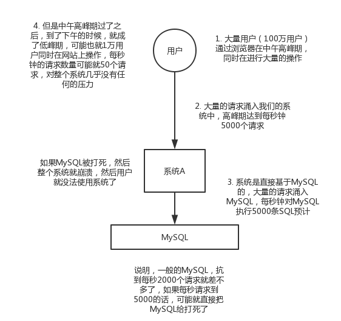
			- 使用了消息队列
				- 
		- #### 面试技巧
		  collapsed:: true
			- 你需要去考虑一下你负责的系统中是否有类似的场景，就是一个系统或者一个模块，调用了多个系统或者模块，互相之间的调用很复杂，维护起来很麻烦。但是其实这个调用是不需要直接同步调用接口的，如果用MQ给他异步化解耦，也是可以的，你就需要去考虑在你的项目里，是不是可以运用这个MQ去进行系统的解耦。在简历中体现出来这块东西，用MQ作解耦。比如我有一个系统需要解偶、我有一个系统需要异步、我有一个系统需要削峰之类的。
	- ### 2.消息队列有什么优点和缺点
	  collapsed:: true
		- #### 优点
			- 优点上面已经说了，就是在特殊场景下有其对应的好处，解耦、异步、削峰
		- #### 缺点
			- ==系统可用性降低==：系统引入的外部依赖越多，越容易挂掉，本来你就是A系统调用BCD三个系统的接口就好了，人ABCD四个系统好好的，没啥问题，你偏加个MQ进来，万一MQ挂了咋整？MQ挂了，整套系统崩溃了，你不就完了么。
			  logseq.order-list-type:: number
			- ==系统复杂性提高==：硬生生加个MQ进来，你怎么保证消息没有重复消费？怎么处理消息丢失的情况？怎么保证消息传递的顺序性？头大头大，问题一大堆，痛苦不已
			  logseq.order-list-type:: number
			- ==一致性问题==：A系统处理完了直接返回成功了，人都以为你这个请求就成功了；但是问题是，要是BCD三个系统那里，BD两个系统写库成功了，结果C系统写库失败了，咋整？你这数据就不一致了。
			  logseq.order-list-type:: number
			- 
			- 所以消息队列实际是一种非常复杂的架构，你引入它有很多好处，但是也得针对它带来的坏处做各种额外的技术方案和架构来规避掉，最好之后，你会发现，妈呀，系统复杂度提升了一个数量级，也许是复杂了10倍。但是关键时刻，用，还是得用的。。。
	- ### 3. kafka、activemq、rabbitmq、rocketmq对比
	  collapsed:: true
		- 常见的MQ其实就这几种，别的还有很多其他MQ，但是比较冷门的，那么就别多说了。
		- 作为一个码农，你起码得知道各种mq的优点和缺点吧，咱们来画个表格看看。
		- | 特性 | ActiveMQ | RabbitMQ | RocketMQ | Kafka |
		  | 单机吞吐量 | 万级，吞吐量比RocketMQ和Kafka要低了一个数量级 | 万级，吞吐量比RocketMQ和Kafka要低了一个数量级 | 10万级，RocketMQ也是可以支撑高吞吐的一种MQ | 10万级别，这是kafka最大的优点，就是吞吐量高。 一般配合大数据类的系统来进行实时数据计算、日志采集等场景 |
		  | topic数量对吞吐量的影响 |   |   | topic可以达到几百，几千个的级别，吞吐量会有较小幅度的下降 这是RocketMQ的一大优势，在同等机器下，可以支撑大量的topic | topic从几十个到几百个的时候，吞吐量会大幅度下降 所以在同等机器下，kafka尽量保证topic数量不要过多。如果要支撑大规模topic，需要增加更多的机器资源 |
		  | 时效性 | ms级 | 微秒级，这是rabbitmq的一大特点，延迟是最低的 | ms级 | 延迟在ms级以内 |
		  | 可用性 | 高，基于主从架构实现高可用性 | 高，基于主从架构实现高可用性 | 非常高，分布式架构 | 非常高，kafka是分布式的，一个数据多个副本，少数机器宕机，不会丢失数据，不会导致不可用 |
		  | 消息可靠性 | 有较低的概率丢失数据 |   | 经过参数优化配置，可以做到0丢失 | 经过参数优化配置，消息可以做到0丢失 |
		  | 功能支持 | MQ领域的功能极其完备 | 基于erlang开发，所以==并发能力很强，性能极其好，延时很低== | MQ功能较为完善，还是分布式的，扩展性好 | 功能较为简单，主要支持简单的MQ功能，在大数据领域的实时计算以及日志采集被大规模使用，是事实上的标准 |
		  | 优劣势总结 | 非常成熟，功能强大，在业内大量的公司以及项目中都有应用 偶尔会有较低概率丢失消息 而且现在社区以及国内应用都越来越少，官方社区现在对ActiveMQ 5.x维护越来越少，几个月才发布一个版本 而且确实主要是基于解耦和异步来用的，较少在大规模吞吐的场景中使用  | erlang语言开发，性能极其好，延时很低； 吞吐量到万级，MQ功能比较完备 而且开源提供的管理界面非常棒，用起来很好用 社区相对比较活跃，几乎每个月都发布几个版本分 在国内一些互联网公司近几年用rabbitmq也比较多一些 但是问题也是显而易见的，RabbitMQ确实吞吐量会低一些，这是因为他做的实现机制比较重。 而且erlang开发，国内有几个公司有实力做erlang源码级别的研究和定制？如果说你没这个实力的话，确实偶尔会有一些问题，你很难去看懂源码，你公司对这个东西的掌控很弱，基本职能依赖于开源社区的快速维护和修复bug。 而且rabbitmq集群动态扩展会很麻烦，不过这个我觉得还好。其实主要是erlang语言本身带来的问题。很难读源码，很难定制和掌控。 | 接口简单易用，而且毕竟在阿里大规模应用过，有阿里品牌保障 日处理消息上百亿之多，可以做到大规模吞吐，性能也非常好，分布式扩展也很方便，社区维护还可以，可靠性和可用性都是ok的，还可以支撑大规模的topic数量，支持复杂MQ业务场景 而且一个很大的优势在于，阿里出品都是java系的，我们可以自己阅读源码，定制自己公司的MQ，可以掌控 社区活跃度相对较为一般，不过也还可以，文档相对来说简单一些，然后接口这块不是按照标准JMS规范走的有些系统要迁移需要修改大量代码 还有就是阿里出台的技术，你得做好这个技术万一被抛弃，社区黄掉的风险，那如果你们公司有技术实力我觉得用RocketMQ挺好的 | kafka的特点其实很明显，就是仅仅提供较少的核心功能，但是提供超高的吞吐量，ms级的延迟，极高的可用性以及可靠性，而且分布式可以任意扩展 同时kafka最好是支撑较少的topic数量即可，保证其超高吞吐量 而且kafka唯一的一点劣势是有可能消息重复消费，那么对数据准确性会造成极其轻微的影响，在大数据领域中以及日志采集中，这点轻微影响可以忽略 这个特性天然适合大数据实时计算以及日志收集 |
		-
		- 综上所述，各种对比之后，我个人倾向于是：
		- 一般的业务系统要引入MQ，最早大家都用ActiveMQ，但是现在确实大家用的不多了，没经过大规模吞吐量场景的验证，社区也不是很活跃，所以大家还是算了吧，我个人不推荐用这个了；
		-
		- 后来大家开始用RabbitMQ，但是确实erlang语言阻止了大量的java工程师去深入研究和掌控他，对公司而言，几乎处于不可控的状态，但是确实人是开源的，比较稳定的支持，活跃度也高；
		-
		- 不过现在确实越来越多的公司，会去用RocketMQ，确实很不错，但是我提醒一下自己想好社区万一突然黄掉的风险，对自己公司技术实力有绝对自信的，我推荐用RocketMQ，否则回去老老实实用==RabbitMQ吧，人是活跃开源社区==，绝对不会黄
		-
		- 所以中小型公司，技术实力较为一般，技术挑战不是特别高，用RabbitMQ是不错的选择；大型公司，基础架构研发实力较强，用RocketMQ是很好的选择
		-
		- 如果是==大数据领域的实时计算、日志采集等场景==，用Kafka是业内标准的，绝对没问题，社区活跃度很高，绝对不会黄，何况几乎是全世界这个领域的事实性规范
- ## 4. 引入消息队列之后该如何保证其高可用性
  collapsed:: true
	- 面试题：如何保证消息队列的高可用啊？
	- ### 面试官心理分析
	  collapsed:: true
		- 如果有人问到你MQ的知识，高可用是必问的，因为MQ的缺点，我刚才已经说过了，有好多，导致系统可用性降低，等等。所以只要你用了MQ，接下来问的一些要点肯定就是围绕着MQ的那些缺点怎么来解决了。
		-
		- 要是你傻乎乎的就干用了一个MQ，各种问题从来没考虑过，那你就杯具了，面试官对你的印象就是，只会简单实用一些技术，没任何思考，马上对你的印象就不太好了。这样的同学招进来要是做个20k薪资以内的普通小弟还凑合。如果招进来做薪资20多k的高工，那就惨了，让你设计个系统，里面肯定一堆坑，出了事故公司受损失，团队一起背锅。
		-
		- 去年的事儿，非常大的互联网公司，非常核心的系统，就是疏忽了MQ，没考虑MQ如何保证高可用，如果MQ挂了怎么办，导致几个小时系统不可用，公司损失几千万，team背锅，你闹的祸，你老大帮你一起背锅
	- ### 面试题剖析
		- 这个问题这么问是很好的，因为不能问你kafka的高可用性怎么保证啊？ActiveMQ的高可用性怎么保证啊？一个面试官要是这么问就显得很没水平，人家可能用的就是RabbitMQ，没用过Kafka，你上来问人家kafka干什么？这不是摆明了刁难人么。
		- 所以有水平的面试官，问的是MQ的高可用性怎么保证？这样就是你用过哪个MQ，你就说说你对那个MQ的高可用性的理解。
		-
		- #### 1. RabbitMQ的高可用性
		  collapsed:: true
			- RabbitMQ是比较有代表性的，因为是基于主从做高可用性的，我们就以他为例子讲解第一种MQ的高可用性怎么实现。
			- rabbitmq有三种模式：单机模式，普通集群模式，镜像集群模式
			- 1）==单机模式==
			  collapsed:: true
				- 就是demo级别的，一般就是你本地启动了玩玩儿的，没人生产用单机模式
			- 2）==普通集群模式==
			  collapsed:: true
				- 意思就是在多台机器上启动多个rabbitmq实例，每个机器启动一个。但是你创建的queue，只会放在一个rabbtimq实例上，但是每个实例都同步queue的元数据(数据地址)。完了你消费的时候，实际上如果连接到了另外一个实例，那么那个实例会从queue所在实例上拉取数据过来。
				-
				- 这种方式确实很麻烦，也不怎么好，没做到所谓的分布式，就是个普通集群。因为这导致你要么消费者每次随机连接一个实例然后拉取数据，要么固定连接那个queue所在实例消费数据，前者有数据拉取的开销，后者导致单实例性能瓶颈。
				-
				- 而且如果那个放queue的实例宕机了，会导致接下来其他实例就无法从那个实例拉取，如果你开启了消息持久化，让rabbitmq落地存储消息的话，消息不一定会丢，得等这个实例恢复了，然后才可以继续从这个queue拉取数据。
				-
				- 所以这个事儿就比较尴尬了，这就没有什么所谓的高可用性可言了，这方案主要是提高吞吐量的，就是说让集群中多个节点来服务某个queue的读写操作。
				- 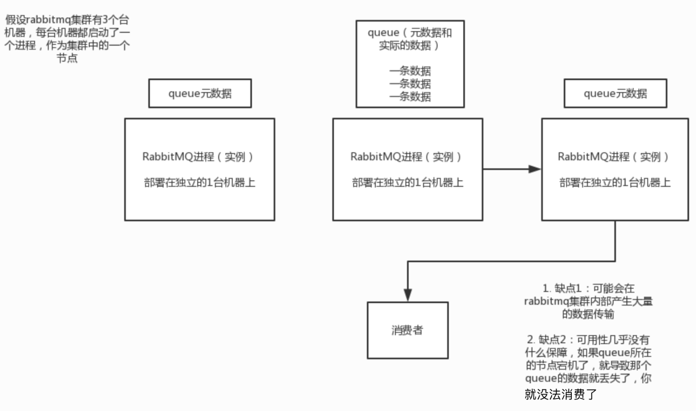{:height 546, :width 674}
			- 3）==镜像集群模式==
			  collapsed:: true
				- 这种模式，才是所谓的rabbitmq的高可用模式，跟普通集群模式不一样的是，你创建的queue，无论元数据还是queue里的消息都会存在于多个实例上，然后每次你写消息到queue的时候，都会自动把消息到多个实例的queue里进行消息同步。
				-
				- 这样的话，好处在于，你任何一个机器宕机了，没事儿，别的机器都可以用。坏处在于，第一，这个性能开销也太大了吧，消息同步所有机器，导致网络带宽压力和消耗很重！第二，这么玩儿，就没有扩展性可言了，如果某个queue负载很重，你加机器，新增的机器也包含了这个queue的所有数据，并没有办法线性扩展你的queue
				-
				- 那么怎么开启这个镜像集群模式呢？我这里简单说一下，避免面试人家问你你不知道，其实很简单rabbitmq有很好的管理控制台，就是在后台新增一个策略，这个策略是镜像集群模式的策略，指定的时候可以要求数据同步到所有节点的，也可以要求就同步到指定数量的节点，然后你再次创建queue的时候，应用这个策略，就会自动将数据同步到其他的节点上去了。
				- 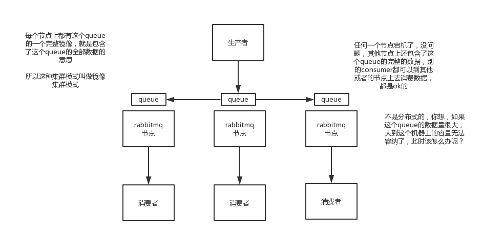
		-
		- #### 2. kafka的高可用性
			- kafka一个最基本的架构认识：多个broker组成，每个broker是一个节点；你创建一个topic，这个topic可以划分为多个partition，每个partition可以存在于不同的broker上，每个partition就放一部分数据。
			- 这就是天然的分布式消息队列，就是说一个topic的数据，是分散放在多个机器上的，每个机器就放一部分数据。
			- 实际上rabbitmq之类的，并不是分布式消息队列，他就是传统的消息队列，只不过提供了一些集群、HA的机制而已，因为无论怎么玩儿，rabbitmq一个queue的数据都是放在一个节点里的，镜像集群下，也是每个节点都放这个queue的完整数据。
			-
			- kafka 0.8以前，是没有HA机制的，就是任何一个broker宕机了，那个broker上的partition就废了，没法写也没法读，没有什么高可用性可言。
			-
			- kafka 0.8以后，提供了HA机制，就是replica副本机制。每个partition的数据都会同步到吉他机器上，形成自己的多个replica副本。然后所有replica会选举一个leader出来，那么生产和消费都跟这个leader打交道，然后其他replica就是follower。写的时候，leader会负责把数据同步到所有follower上去，读的时候就直接读leader上数据即可。只能读写leader？很简单，要是你可以随意读写每个follower，那么就要care数据一致性的问题，系统复杂度太高，很容易出问题。kafka会均匀的将一个partition的所有replica分布在不同的机器上，这样才可以提高容错性。
			-
			- 这么搞，就有所谓的高可用性了，因为如果某个broker宕机了，没事儿，那个broker上面的partition在其他机器上都有副本的，如果这上面有某个partition的leader，那么此时会重新选举一个新的leader出来，大家继续读写那个新的leader即可。这就有所谓的高可用性了。
			-
			- 写数据的时候，生产者就写leader，然后leader将数据落地写本地磁盘，接着其他follower自己主动从leader来pull数据。一旦所有follower同步好数据了，就会发送ack给leader，leader收到所有follower的ack之后，就会返回写成功的消息给生产者。（当然，这只是其中一种模式，还可以适当调整这个行为）
			-
			- 消费的时候，只会从leader去读，但是只有一个消息已经被所有follower都同步成功返回ack的时候，这个消息才会被消费者读到。
			-
			- 实际上这块机制，讲深了，是可以非常之深入的，但是我还是回到我们这个课程的主题和定位，聚焦面试，至少你听到这里大致明白了kafka是如何保证高可用机制的了，对吧？不至于一无所知，现场还能给面试官画画图。要遇上面试官确实是kafka高手，深挖了问，那你只能说不好意思，太深入的你没研究过。
			-
			- 但是大家一定要明白，这个事情是要权衡的，你现在是要快速突击常见面试题体系，而不是要深入学习kafka，要深入学习kafka，你是没那么多时间的。你只能确保，你之前也许压根儿不知道这块，但是现在你知道了，面试被问到，你大概可以说一说。然后很多其他的候选人，也许还不如你，没看过这个，被问到了压根儿答不出来，相比之下，你还能说点出来，大概就是这个意思了。
			- 
	-
	-
- ## 5. 为什么在消息队列里消费到了重复的数据
  collapsed:: true
	- 面试题：
		- 如何保证消息不被重复消费啊（如何保证消息消费时的幂等性）？
	-
	- ### 面试官心里分析
	  collapsed:: true
		- 其实这个很常见的一个问题，这俩问题基本可以连起来问。既然是消费消息，那肯定要考虑考虑会不会重复消费？能不能避免重复消费？或者重复消费了也别造成系统异常可以吗？这个是MQ领域的基本问题，其实本质上还是问你使用消息队列如何保证幂等性，这个是你架构里要考虑的一个问题。
		-
		- 面试官问你，肯定是必问的，这是你要考虑的实际生产上的系统设计问题。
	- ### 面试题剖析
		- 回答这个问题，首先你别听到重复消息这个事儿，就一无所知吧，你先大概说一说可能会有哪些重复消费的问题。
		- 首先就是比如==rabbitmq、rocketmq、kafka，都有可能会出现消费重复消费的问题==，正常。因为这问题通常不是mq自己保证的，是给你保证的。然后我们挑一个kafka来举个例子，说说怎么重复消费吧。
		-
		- kafka实际上有个offset的概念，就是每个消息写进去，都有一个offset，代表他的序号，然后consumer消费了数据之后，每隔一段时间，会把自己消费过的消息的offset提交一下，代表我已经消费过了，下次我要是重启啥的，你就让我继续从上次消费到的offset来继续消费吧。
		- 但是凡事总有意外，比如我们之前生产经常遇到的，就是你有时候重启系统，看你怎么重启了，如果碰到点着急的，直接kill进程了，再重启。这会导致consumer有些消息处理了，但是没来得及提交offset，尴尬了。重启之后，少数消息会再次消费一次。
			- 
		-
		-
		- 其实重复消费不可怕，可怕的是你没考虑到重复消费之后，怎么保证幂等性。
		- 给你举个例子吧。假设你有个系统，消费一条往数据库里插入一条，要是你一个消息重复两次，你不就插入了两条，这数据不就错了？但是你要是消费到第二次的时候，自己判断一下已经消费过了，直接扔了，不就保留了一条数据？
		-
		- 一条数据重复出现两次，数据库里就只有一条数据，这就保证了系统的幂等性
		- 幂等性，我通俗点说，就一个数据，或者一个请求，给你重复来多次，你得确保对应的数据是不会改变的，不能出错。
		- 那所以第二个问题来了，怎么保证消息队列消费的幂等性？
		- 其实还是得结合业务来思考，我这里给几个思路：
		- 比如你拿个数据要写库，你先根据主键查一下，如果这数据都有了，你就别插入了，update一下好吧
		  logseq.order-list-type:: number
		- 比如你是写redis，那没问题了，反正每次都是set，天然幂等性
		  logseq.order-list-type:: number
		- 比如你不是上面两个场景，那做的稍微复杂一点，你需要让生产者发送每条数据的时候，里面加一个全局唯一的id，类似订单id之类的东西，然后你这里消费到了之后，先根据这个id去比如redis里查一下，之前消费过吗？如果没有消费过，你就处理，然后这个id写redis。如果消费过了，那你就别处理了，保证别重复处理相同的消息即可。
		  logseq.order-list-type:: number
		-
		- 还有比如基于数据库的唯一键来保证重复数据不会重复插入多条，我们之前线上系统就有这个问题，就是拿到数据的时候，每次重启可能会有重复，因为kafka消费者还没来得及提交offset，重复数据拿到了以后我们插入的时候，因为有唯一键约束了，所以重复数据只会插入报错，不会导致数据库中出现脏数据。
		- 如何保证MQ的消费是幂等性的，需要结合具体的业务来看。
		- 
	-
- ## 6. 我发到消息队列里面的数据怎么不见了
  collapsed:: true
	- 面试题
		- 如何保证消息的可靠性传输（如何处理消息丢失的问题）？
	- ### 面试官心里分析
	  collapsed:: true
		- 这个是肯定的，用mq有个基本原则，就是数据不能多一条，也不能少一条，不能多，就是刚才说的重复消费和幂等性问题。不能少，就是说这数据别搞丢了。那这个问题你必须得考虑一下。
		-
		- 如果说你这个是用mq来传递非常核心的消息，比如说计费，扣费的一些消息，因为我以前设计和研发过一个公司非常核心的广告平台，计费系统，计费系统是很重的一个业务，操作是很耗时的。所以说广告系统整体的架构里面，实际上是将计费做成异步化的，然后中间就是加了一个MQ。
		-
		- 我们当时为了确保说这个MQ传递过程中绝对不会把计费消息给弄丢，花了很多的精力。广告主投放了一个广告，明明说好了，用户点击一次扣费1块钱。结果要是用户动不动点击了一次，扣费的时候搞的消息丢了，我们公司就会不断的少几块钱，几块钱，积少成多，这个就对公司是一个很大的损失。
	- ### 面试题剖析
		- 这个丢数据，mq一般分为两种，要么是mq自己弄丢了，要么是我们消费的时候弄丢了。咱们从rabbitmq和kafka分别来分析一下吧
		-
		- rabbitmq这种mq，一般来说都是承载公司的核心业务的，数据是绝对不能弄丢的
		- #### 1. rabbitmq
		  collapsed:: true
			- 生产者弄丢了数据
			  logseq.order-list-type:: number
				- 生产者将数据发送到rabbitmq的时候，可能数据就在半路给搞丢了，因为网络啥的问题，都有可能。
				- 方案一（同步）
					- 此时可以选择用rabbitmq提供的事务功能，就是生产者发送数据之前开启rabbitmq事务（channel.txSelect），然后发送消息，如果消息没有成功被rabbitmq接收到，那么生产者会收到异常报错，此时就可以回滚事务（channel.txRollback），然后重试发送消息；如果收到了消息，那么可以提交事务（channel.txCommit）。但是问题是，rabbitmq事务机制一搞，基本上吞吐量会下来，因为太耗性能。
				- 方案二（异步）
					- 所以一般来说，如果你要确保说写rabbitmq的消息别丢，可以开启confirm模式，在生产者那里设置开启confirm模式之后，你每次写的消息都会分配一个唯一的id，然后如果写入了rabbitmq中，rabbitmq会给你回传一个ack消息，告诉你说这个消息ok了。如果rabbitmq没能处理这个消息，会回调你一个nack接口，告诉你这个消息接收失败，你可以重试。而且你可以结合这个机制自己在内存里维护每个消息id的状态，如果超过一定时间还没接收到这个消息的回调，那么你可以重发。
				- 方案对比
					- 事务机制和cnofirm机制最大的不同在于，事务机制是同步的，你提交一个事务之后会阻塞在那儿，但是confirm机制是异步的，你发送个消息之后就可以发送下一个消息，然后那个消息rabbitmq接收了之后会异步回调你一个接口通知你这个消息接收到了。
				-
				- 所以一般在生产者这块避免数据丢失，都是用confirm机制的。
			- rabbitmq弄丢了数据
			  logseq.order-list-type:: number
				- 就是rabbitmq自己弄丢了数据，这个你必须开启rabbitmq的持久化，因为如果不持久化到磁盘，留在内存里，mq挂了后消息就没了。就是消息写入之后会持久化到磁盘，哪怕是rabbitmq自己挂了，恢复之后会自动读取之前存储的数据，一般数据不会丢。除非极其罕见的是，rabbitmq还没持久化，自己就挂了，可能导致少量数据会丢失的，但是这个概率较小。
				-
				- 设置持久化有两个步骤，第一个是创建queue的时候将其设置为持久化的，这样就可以保证rabbitmq持久化queue的元数据，但是不会持久化queue里的数据；第二个是发送消息的时候将消息的deliveryMode设置为2，就是将消息设置为持久化的，此时rabbitmq就会将消息持久化到磁盘上去。必须要同时设置这两个持久化才行，rabbitmq哪怕是挂了，再次重启，也会从磁盘上重启恢复queue，恢复这个queue里的数据。
				-
				- 而且持久化可以跟生产者那边的confirm机制配合起来，只有消息被持久化到磁盘之后，才会通知生产者ack了，所以哪怕是在持久化到磁盘之前，rabbitmq挂了，数据丢了，生产者收不到ack，你也是可以自己重发的。
				-
				- 哪怕是你给rabbitmq开启了持久化机制，也有一种可能，就是这个消息写到了rabbitmq中，但是还没来得及持久化到磁盘上，结果不巧，此时rabbitmq挂了，就会导致内存里的一点点数据会丢失。
			- 消费端弄丢了数据
			  logseq.order-list-type:: number
				- rabbitmq如果丢失了数据，主要是因为你消费的时候，刚消费到，还没处理，结果进程挂了，比如重启了，那么就尴尬了，rabbitmq认为你都消费了，这数据就丢了。
				-
				- 这个时候得用rabbitmq提供的ack机制，简单来说，就是你关闭rabbitmq自动ack，可以通过一个api来调用就行，然后每次你自己代码里确保处理完的时候，再程序里ack一把。这样的话，如果你还没处理完，不就没有ack？那rabbitmq就认为你还没处理完，这个时候rabbitmq会把这个消费分配给别的consumer去处理，消息是不会丢的。
				-
			- 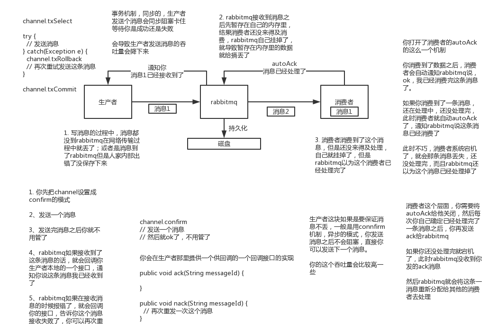{:height 692, :width 1049}
		- #### 2. kafka
		  collapsed:: true
			- 消费端弄丢了数据
			  logseq.order-list-type:: number
				- 唯一可能导致消费者弄丢数据的情况，就是说，你那个消费到了这个消息，然后消费者那边自动提交了offset，让kafka以为你已经消费好了这个消息，其实你刚准备处理这个消息，你还没处理，你自己就挂了，此时这条消息就丢咯。
				-
				- 这不是一样么，大家都知道kafka会自动提交offset，那么只要关闭自动提交offset，在处理完之后自己手动提交offset，就可以保证数据不会丢。但是此时确实还是会重复消费，比如你刚处理完，还没提交offset，结果自己挂了，此时肯定会重复消费一次，自己保证幂等性就好了。
				-
				- 生产环境碰到的一个问题，就是说我们的kafka消费者消费到了数据之后是写到一个内存的queue里先缓冲一下，结果有的时候，你刚把消息写入内存queue，然后消费者会自动提交offset。
				- 然后此时我们重启了系统，就会导致内存queue里还没来得及处理的数据就丢失了
			- kafka弄丢了数据
			  logseq.order-list-type:: number
				- 这块比较常见的一个场景，就是kafka某个broker宕机，然后重新选举partiton的leader时。大家想想，要是此时其他的follower刚好还有些数据没有同步，结果此时leader挂了，然后选举某个follower成leader之后，他不就少了一些数据？这就丢了一些数据啊。
					- 
				-
				- 生产环境也遇到过，我们也是，之前kafka的leader机器宕机了，将follower切换为leader之后，就会发现说这个数据就丢了
				- 所以此时一般是要求起码设置如下4个参数：
				- 给这个topic设置replication.factor参数：这个值必须大于1，要求每个partition必须有至少2个副本
				  logseq.order-list-type:: number
				- 在kafka服务端设置min.insync.replicas参数：这个值必须大于1，这个是要求一个leader至少感知到有至少一个follower还跟自己保持联系，没掉队，这样才能确保leader挂了还有一个follower吧。
				  logseq.order-list-type:: number
				- 在producer端设置acks=all：这个是要求每条数据，必须是写入所有replica之后，才能认为是写成功了
				  logseq.order-list-type:: number
				- 在producer端设置retries=MAX（很大很大很大的一个值，无限次重试的意思）：这个是要求一旦写入失败，就无限重试，卡在这里了
				  logseq.order-list-type:: number
				-
				- 我们生产环境就是按照上述要求配置的，这样配置之后，至少在kafka broker端就可以保证在leader所在broker发生故障，进行leader切换时，数据不会丢失
			- 生产者会不会弄丢数据
			  logseq.order-list-type:: number
				- 如果按照上述的思路设置了ack=all，一定不会丢，要求是，你的leader接收到消息，所有的follower都同步到了消息之后，才认为本次写成功了。如果没满足这个条件，生产者会自动不断的重试，重试无限次。
- ## 7. 怎么保证从消息队列里拿到的数据按顺序执行？
  collapsed:: true
	- 面试题
	  collapsed:: true
		- 如何保证消息的顺序性？
	- ### 面试官心里分析
	  collapsed:: true
		- 其实这个也是用MQ的时候必问的话题，第一看看你了解不了解顺序这个事儿？第二看看你有没有办法保证消息是有顺序的？这个生产系统中常见的问题。
	- ### 面试题剖析
		- 我举个例子，我们以前做过一个mysql binlog同步的系统，压力还是非常大的，日同步数据要达到上亿。mysql -> mysql，常见的一点在于说大数据team，就需要同步一个mysql库过来，对公司的业务系统的数据做各种复杂的操作。
		-
		- 你在mysql里增删改一条数据，对应出来了增删改3条binlog，接着这三条binlog发送到MQ里面，到消费出来依次执行，起码得保证人家是按照顺序来的吧？不然本来是：增加、修改、删除；你楞是换了顺序给执行成删除、修改、增加，不全错了么。
		-
		- 本来这个数据同步过来，应该最后这个数据被删除了；结果你搞错了这个顺序，最后这个数据保留下来了，数据同步就出错了。
		-
		- 先看看顺序会错乱的俩场景
			- rabbitmq：一个queue，多个consumer，消费者写入的顺序不同，这不明显乱了。
			  logseq.order-list-type:: number
				- 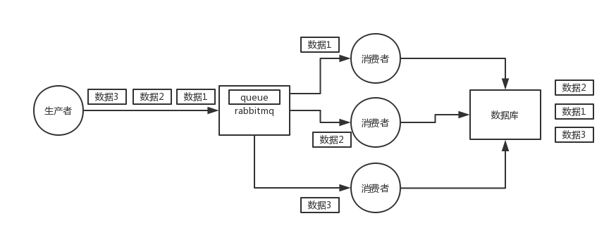
			- kafka：一个topic，一个partition，一个consumer，消费者为了提高吞吐量，通常使用多线程写入数据，这不也明显乱了。
			  logseq.order-list-type:: number
				- 
		- 那如何保证消息的顺序性呢？简单简单
			- rabbitmq：数据都给一个queue。拆分多个queue，每个queue一个consumer，就是多一些queue而已，确实是麻烦点；或者就一个queue但是对应一个consumer，然后这个consumer内部用内存队列做排队，然后分发给底层不同的worker来处理。
			  logseq.order-list-type:: number
				- 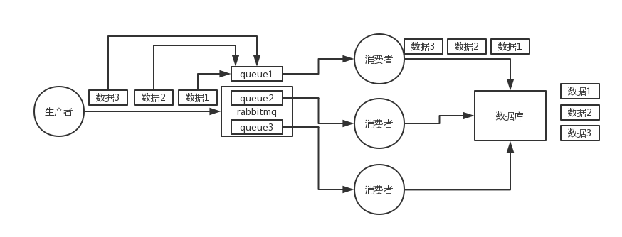
			- kafka：一个topic，一个partition，一个consumer，内部单线程消费，写N个内存queue，然后N个线程分别消费一个内存queue即可。这个内存队列会根据生产者指定的key去排序，key一样的数据 一定是有序的。
			  logseq.order-list-type:: number
				- 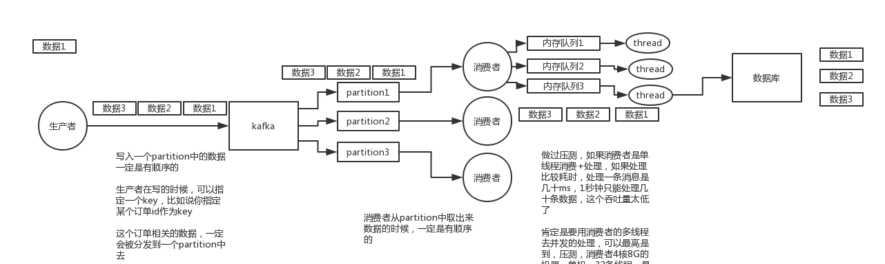
- ## 8. 完了！生产事故！几百万消息在消息队列里积压了几个小时！
  collapsed:: true
	- 面试题
		- 如何解决消息队列的延时以及过期失效问题？消息队列满了以后该怎么处理？有几百万消息持续积压几小时，说说怎么解决？
	-
	- ### 面试官心里分析
		- 你看这问法，其实本质针对的场景，都是说，可能你的消费端出了问题，不消费了，或者消费的极其极其慢。接着就坑爹了，可能你的消息队列集群的磁盘都快写满了，都没人消费，这个时候怎么办？或者是整个这就积压了几个小时，你这个时候怎么办？或者是你积压的时间太长了，导致比如rabbitmq设置了消息过期时间后就没了怎么办？
		- 所以就这事儿，其实线上挺常见的，一般不出，一出就是大case，一般常见于，举个例子，消费端每次消费之后要写mysql，结果mysql挂了，消费端hang那儿了，不动了。或者是消费端出了个什么叉子，导致消费速度极其慢。
	-
	- ### 面试题分析
		- 关于这个事儿，我们一个一个来梳理吧，先假设一个场景，我们现在消费端出故障了，然后大量消息在mq里积压，现在事故了，慌了
		- #### （1）大量消息在mq里积压了几个小时了还没解决
			- 几千万条数据在MQ里积压了七八个小时，从下午4点多，积压到了晚上很晚，10点多，11点多
			- 这个是我们真实遇到过的一个场景，确实是线上故障了，这个时候要不然就是修复consumer的问题，让他恢复消费速度，然后傻傻的等待几个小时消费完毕。这个肯定不能在面试的时候说吧。
			- 一个消费者一秒是1000条，一秒3个消费者是3000条，一分钟是18万条，1000多万条
			- 所以如果你积压了几百万到上千万的数据，即使消费者恢复了，也需要大概1小时的时间才能恢复过来
			-
			- 一般这个时候，只能操作临时紧急扩容了，具体操作步骤和思路如下：
			- 先修复consumer的问题，确保其恢复消费速度，然后将现有cnosumer都停掉
			  logseq.order-list-type:: number
			- 新建一个topic，partition是原来的10倍，临时建立好原先10倍或者20倍的queue数量。写个程序把原来topic里的消息写到新的topic里去。
			  logseq.order-list-type:: number
			- 然后写一个临时的分发数据的consumer程序，这个程序部署上去消费积压的数据，消费之后不做耗时的处理，直接均匀轮询写入临时建立好的10倍数量的queue
			  logseq.order-list-type:: number
			- 接着临时征用10倍的机器来部署consumer，每一批consumer消费一个临时queue的数据
			  logseq.order-list-type:: number
			- 这种做法相当于是临时将queue资源和consumer资源扩大10倍，以正常的10倍速度来消费数据
			  logseq.order-list-type:: number
			- 等快速消费完积压数据之后，得恢复原先部署架构，重新用原先的consumer机器来消费消息
			  logseq.order-list-type:: number
			- 
		- #### （2）这里我们假设再来第二个坑
			- 假设你用的是rabbitmq，rabbitmq是可以设置过期时间的，就是TTL，如果消息在queue中积压超过一定的时间就会被rabbitmq给清理掉，这个数据就没了。那这就是第二个坑了。这就不是说数据会大量积压在mq里，而是大量的数据会直接搞丢。
			-
			- 这个情况下，就不是说要增加consumer消费积压的消息，因为实际上没啥积压，而是丢了大量的消息。我们可以采取一个方案，就是批量重导，这个我们之前线上也有类似的场景干过。就是大量积压的时候，我们当时就直接丢弃数据了，然后等过了高峰期以后，比如大家一起喝咖啡熬夜到晚上12点以后，用户都睡觉了。
			-
			- 这个时候我们就开始写程序，将丢失的那批数据，写个临时程序，一点一点的查出来，然后重新灌入mq里面去，把白天丢的数据给他补回来。也只能是这样了。
			-
			- 假设1万个订单积压在mq里面，没有处理，其中1000个订单都丢了，你只能手动写程序把那1000个订单给查出来，手动发到mq里去再补一次
		- #### （3）然后我们再来假设第三个坑
			- 如果走的方式是消息积压在mq里，那么如果你很长时间都没处理掉，此时导致mq都快写满了，咋办？这个还有别的办法吗？没有，谁让你第一个方案执行的太慢了，你临时写程序，接入数据来消费，消费一个丢弃一个，都不要了，快速消费掉所有的消息。然后走第二个方案，到了晚上再补数据吧。
- ## 9. 如果让你来开发一个消息队列中间件，你会怎么设计架构？
  collapsed:: true
	- 面试题
		- 如果让你写一个消息队列，该如何进行架构设计啊？说一下你的思路
	-
	- ### 2、面试官心里分析
		- 其实聊到这个问题，一般面试官要考察两块：
		- （1）你有没有对某一个消息队列做过较为深入的原理的了解，或者从整体了解把握住一个mq的架构原理
		- （2）看看你的设计能力，给你一个常见的系统，就是消息队列系统，看看你能不能从全局把握一下整体架构设计，给出一些关键点出来
	-
		- 说实话，我一般面类似问题的时候，大部分人基本都会蒙，因为平时从来没有思考过类似的问题，大多数人就是平时埋头用，从来不去思考背后的一些东西。类似的问题，我经常问的还有，如果让你来设计一个spring框架你会怎么做？如果让你来设计一个dubbo框架你会怎么做？如果让你来设计一个mybatis框架你会怎么做？
	-
	- ### 3、面试题剖析
		- 其实回答这类问题，说白了，起码不求你看过那技术的源码，起码你大概知道那个技术的基本原理，核心组成部分，基本架构构成，然后参照一些开源的技术把一个系统设计出来的思路说一下就好
		- 比如说这个消息队列系统，我们来从以下几个角度来考虑一下
		- ==扩容==：首先这个mq得支持可伸缩性吧，就是需要的时候快速扩容，就可以增加吞吐量和容量，那怎么搞？设计个分布式的系统呗，参照一下kafka的设计理念，broker -> topic -> partition，每个partition放一个机器，就存一部分数据。如果现在资源不够了，简单啊，给topic增加partition，然后做数据迁移，增加机器，不就可以存放更多数据，提供更高的吞吐量了？
		  logseq.order-list-type:: number
		- ==持久化==：其次你得考虑一下这个mq的数据要不要落地磁盘吧？那肯定要了，落磁盘，才能保证别进程挂了数据就丢了。那落磁盘的时候怎么落啊？顺序写，这样就没有磁盘随机读写的寻址开销，磁盘顺序读写的性能是很高的，这就是kafka的思路。
		  logseq.order-list-type:: number
		- ==可用性==其次你考虑一下你的mq的可用性啊？这个事儿，具体参考我们之前可用性那个环节讲解的kafka的高可用保障机制。多副本 -> leader & follower -> broker挂了重新选举leader即可对外服务。
		  logseq.order-list-type:: number
		- ==可靠性==：能不能支持数据0丢失啊？可以的，参考我们之前说的那个kafka数据零丢失方案
		  logseq.order-list-type:: number
		-
		- 其实一个mq肯定是很复杂的，面试官问你这个问题，其实是个开放题，他就是看看你有没有从架构角度整体构思和设计的思维以及能力。确实这个问题可以刷掉一大批人，因为大部分人平时不思考这些东西。
- ## 10. 总结一下消息队列相关问题的面试技巧
  collapsed:: true
	- 一般而言，如果一个面试官水平还算不错，会沿着从浅入深的环节深入挖一个点。比如我吧，其实按照这个思路可以一直问下去，除了这里的7个问题之外，甚至能挑着你熟悉的一个mq一直问到源码级别非常底层。我还可能会结合项目来仔细问，我可能会先让你给我详细说说你的业务细节，然后将你的业务跟这些mq的问题场景结合起来，看看你每个细节是怎么处理的。
	-
	- 但是确实因为我们这个是面试突击型课程，不是什么kafka源码剖析课，也不是什么RocketMQ高并发架构项目实战课程，所以只能讲到这个程度。
	-
	- 所以我们这个课程只能让你从大面儿上，基本常见问题可以回答出来。基本上mq这块你能答到这个程度，你基本知识面儿是有了，但是深度是绝对没有的。所以如果一个面试官就问问这些问题，感觉你面儿上过的去了，那就恭喜你了。但是如果碰到我这种难缠的面试官，喜欢深挖底层，细扣项目细节的，那可能确实是不行的。
	-
	- 如果你碰到人家在7个问题之外还死扣着你问的，那你最好是认一下怂，就说你确实没研究那么深过，如果你面的就是个一般的职位，那可能就过去了。就我而言，如果招聘的就是个普通职位，而你能答到这个程度，那么就觉得说的过去了。毕竟说实话，相当大比例的程序员出去面java职位的时候，mq这块还回答不到这个程度呢。你能答好这些，至少比之前一无所知的你好了一些，也比很多没准备过的程序员都好了很多。
	-
	- 最后说一个技巧，要是确实碰一个面试官连这7个问题都没问满，只要他提到mq，你自己就和盘托出一整套的东西，你就说，mq你们之前遇到过什么问题，巴拉巴拉，你们的方案是什么，自己突出自
- ## 11. 体验一下面试官对于分布式搜索引擎的4个连环炮
  collapsed:: true
	- 业内目前来说事实上的一个标准，就是分布式搜索引擎一般大家都用elasticsearch，es，solr，但是确实，这两年大家一般都用更加易用的es。
	-
	- ### lucene
		- 如果你确实真的不连lucene都不知道是什么？我觉得你确实不应该，lucene底层的原理是一个东西，叫做倒排索引。太基础了。
		- 百度，搜索一下lucene入门，了解一下lucene是什么？倒排索引是什么？全文检索是什么？写个lucene的demo程序体验一把。
		-
	- ### elasticsearch
		- 百度，搜索一下：elasticsearch入门，初步至少知道es的一些基本概念，然后包括es的基本部署和基本的使用
	-
	- ### 面试官可能会怎么问？
		- es的分布式架构原理能说一下么（es是如何实现分布式的啊）？
		  logseq.order-list-type:: number
		- es写入数据的工作原理是什么啊？es查询数据的工作原理是什么啊？
		  logseq.order-list-type:: number
		- es在数据量很大的情况下（数十亿级别）如何提高查询性能啊？
		  logseq.order-list-type:: number
		- es生产集群的部署架构是什么？每个索引的数据量大概有多少？每个索引大概有多少个分片？
		  logseq.order-list-type:: number
- ## 12. 分布式搜索引擎的架构是怎么设计的？为啥是分布式的？
  collapsed:: true
	- ### 1、面试题
	  collapsed:: true
		- es的分布式架构原理能说一下么（es是如何实现分布式的啊）？
	- ### 2、面试官心里分析
	  collapsed:: true
		- 在搜索这块，lucene是最流行的搜索库。几年前业内一般都问，你了解lucene吗？你知道倒排索引的原理吗？现在早已经out了，因为现在很多项目都是直接用基于lucene的分布式搜索引擎——elasticsearch，简称为es。
		- 而现在分布式搜索基本已经成为大部分互联网行业的java系统的标配，其中尤为流行的就是es，前几年es没火的时候，大家一般用solr。但是这两年基本大部分企业和项目都开始转向es了。
		- 所以互联网面试，肯定会跟你聊聊分布式搜索引擎，也就一定会聊聊es，如果你确实不知道，那你真的就out了。
		- 如果面试官问你第一个问题，确实一般都会问你es的分布式架构设计能介绍一下么？就看看你对分布式搜索引擎架构的一个基本理解。
		-
	- ### 3、额外的友情提示
	  collapsed:: true
		- 同学啊，如果你看到这里发现自己对es一无所知，没事儿，保持淡定，暂停一下课程。然后上百度搜一下es是啥？本机启动个es？然后写个es的hello world感受一下？然后搜个帖子把es常见的几个操作都执行一遍（聚合、常见搜索语法之类的）？ok了，1~2小时熟悉足够了，回来吧，继续看我们的课程。
	- ### 4、面试题剖析
	  collapsed:: true
		- elasticsearch设计的理念就是分布式搜索引擎，底层其实还是基于lucene的。
		- 核心思想就是在多台机器上启动多个es进程实例，组成了一个es集群。
		-
		- es中存储数据的基本单位是索引，比如说你现在要在es中存储一些订单数据，你就应该在es中创建一个索引，order_idx，所有的订单数据就都写到这个索引里面去，一个索引差不多就是相当于是mysql里的一张表。index -> type -> mapping -> document -> field。
		-
		- index：mysql里的一张表
		- type：没法跟mysql里去对比，一个index里可以有多个type，每个type的字段都是差不多的，但是有一些略微的差别。
		-
		- 好比说，有一个index，是订单index，里面专门是放订单数据的。就好比说你在mysql中建表，有些订单是实物商品的订单，就好比说一件衣服，一双鞋子；有些订单是虚拟商品的订单，就好比说游戏点卡，话费充值。就两种订单大部分字段是一样的，但是少部分字段可能有略微的一些差别。
		-
		- 所以就会在订单index里，建两个type，一个是实物商品订单type，一个是虚拟商品订单type，这两个type大部分字段是一样的，少部分字段是不一样的。
		-
		- 很多情况下，一个index里可能就一个type，但是确实如果说是一个index里有多个type的情况，你可以认为index是一个类别的表，具体的每个type代表了具体的一个mysql中的表
		-
		- 每个type有一个mapping，如果你认为一个type是一个具体的一个表，index代表了多个type的同属于的一个类型，mapping就是这个type的表结构定义，你在mysql中创建一个表，肯定是要定义表结构的，里面有哪些字段，每个字段是什么类型。。。
		- 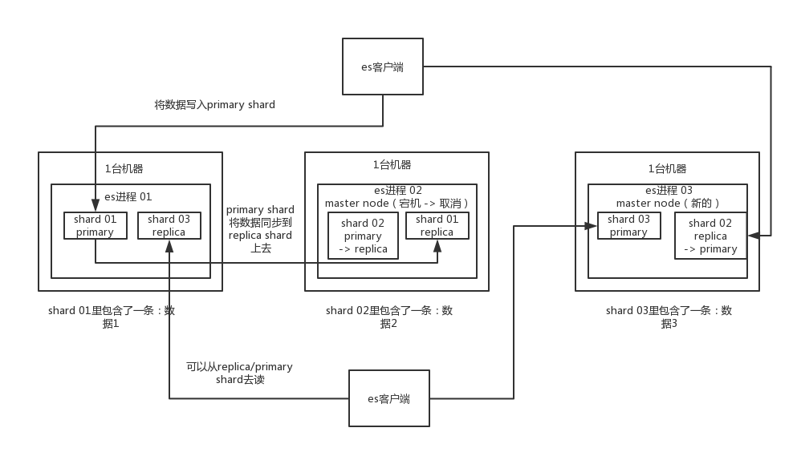
		- mapping就代表了这个type的表结构的定义，定义了这个type中每个字段名称，字段是什么类型的，然后还有这个字段的各种配置
		-
		- 实际上你往index里的一个type里面写的一条数据，叫做一条document，一条document就代表了mysql中某个表里的一行给，每个document有多个field，每个field就代表了这个document中的一个字段的值
		-
		- 接着你搞一个索引，这个索引可以拆分成多个shard，每个shard存储部分数据。
		-
		- 接着就是这个shard的数据实际是有多个备份，就是说每个shard都有一个primary shard，负责写入数据，但是还有几个replica shard。primary shard写入数据之后，会将数据同步到其他几个replica shard上去。
		-
		- 通过这个replica的方案，每个shard的数据都有多个备份，如果某个机器宕机了，没关系啊，还有别的数据副本在别的机器上呢。高可用了吧。
		-
		- es集群多个节点，会自动选举一个节点为master节点，这个master节点其实就是干一些管理的工作的，比如维护索引元数据拉，负责切换primary shard和replica shard身份拉，之类的。
		-
		- 要是master节点宕机了，那么会重新选举一个节点为master节点。
		-
		- 如果是非master节点宕机了，那么会由master节点，让那个宕机节点上的primary shard的身份转移到其他机器上的replica shard。急着你要是修复了那个宕机机器，重启了之后，master节点会控制将缺失的replica shard分配过去，同步后续修改的数据之类的，让集群恢复正常。
		-
		- 其实上述就是elasticsearch作为一个分布式搜索引擎最基本的一个架构设计
- ## 13. 分布式搜索引擎写入和查询的工作流程是什么样的？
- ## 14. 分布式搜索引擎在几十亿数据量级的场景下如何优化查询性能？
- ## 15. 你们公司生产环境的分布式搜索引擎是怎么部署的呢？
- ## 16. 总结一下分布式搜索引擎相关问题的面试技巧
- ## 17. 先平易近人的随口问你一句分布式缓存的第一个问题
  collapsed:: true
	- ### 1、面试题
		- 在项目中缓存是如何使用的？缓存如果使用不当会造成什么后果？
	-
	- ### 2、面试官心里分析
		- 这个问题，互联网公司必问，要是一个人连缓存都不太清楚，那确实比较尴尬
		- 只要问到缓存，上来第一个问题，肯定能是先问问你项目哪里用了缓存？为啥要用？不用行不行？如果用了以后可能会有什么不良的后果？
		- 这就是看看你对你用缓存这个东西背后，有没有思考，如果你就是傻乎乎的瞎用，没法给面试官一个合理的解答。那我只能说，面试官对你印象肯定不太好，觉得你平时思考太少，就知道干活儿。
	-
	- ### 3、面试题剖析
		- 一个一个来看
		- #### （1）在项目中缓存是如何使用的？
			- 这个，你结合你自己项目的业务来，你如果用了那恭喜你，你如果没用那不好意思，你硬加也得加一个场景吧
		- #### （2）为啥在项目里要用缓存呢？
		  collapsed:: true
			- 用缓存，主要是俩用途，高性能和高并发
			- 高性能
			  logseq.order-list-type:: number
			  collapsed:: true
				- 假设这么个场景，你有个操作，一个请求过来，吭哧吭哧你各种乱七八糟操作mysql，半天查出来一个结果，耗时600ms。但是这个结果可能接下来几个小时都不会变了，或者变了也可以不用立即反馈给用户。那么此时咋办？
				- 缓存啊，折腾600ms查出来的结果，扔缓存里，一个key对应一个value，下次再有人查，别走mysql折腾600ms了。直接从缓存里，通过一个key查出来一个value，2ms搞定。性能提升300倍。
				- 这就是所谓的高性能。
				- 就是把你一些复杂操作耗时查出来的结果，如果确定后面不咋变了，然后但是马上还有很多读请求，那么直接结果放缓存，后面直接读缓存就好了。
				- 
			- 高并发
			  logseq.order-list-type:: number
			  collapsed:: true
				- mysql这么重的数据库，压根儿设计不是让你玩儿高并发的，虽然也可以玩儿，但是天然支持不好。mysql单机支撑到2000qps也开始容易报警了。
				- 所以要是你有个系统，高峰期一秒钟过来的请求有1万，那一个mysql单机绝对会死掉。你这个时候就只能上缓存，把很多数据放缓存，别放mysql。缓存功能简单，说白了就是key-value式操作，单机支撑的并发量轻松一秒几万十几万，支撑高并发so easy。单机承载并发量是mysql单机的几十倍。
				- 为什么数据库支撑不了高并发,然后缓存可以支撑高并发呢?
					- 缓存是走内存的，内存天然就可以支撑别说是4000/s，4万/s请求也没问题。但是数据库一般建议并发请求不要超过2000/s
				- {:height 436, :width 809}
		- #### （3）用了缓存之后会有啥不良的后果？
		  collapsed:: true
			- 呵呵。。。你要是没考虑过这个问题，那你就尴尬了，面试官会觉得你头脑简单，四肢也不发达。你别光是傻用一个东西，多考虑考虑背后的一些事儿。
			- 常见的缓存问题有仨（当然其实有很多，我这里就说仨，你能说出来也可以了）
			- 1）缓存与数据库双写不一致
			- 2）缓存雪崩
			- 3）缓存穿透
			- 4）缓存并发竞争
			- 这仨问题是常见面试题，后面我要讲，大家看到后面自然就知道了，但是人要是问你，你至少自己能说出来，并且给出对应的解决方案
- ## 18. 来聊聊redis的线程模型吧？为啥单线程还能有很高的效率？
  collapsed:: true
	- ### 1、面试题
		- redis和memcached有什么区别？
		- redis的线程模型是什么？
		- 为什么单线程的redis比多线程的memcached效率要高得多（为什么redis是单线程的但是还可以支撑高并发）？
	-
	- ### 2、面试官心里分析
		- 这个是问redis的时候，最基本的问题吧，redis最基本的一个内部原理和特点，就是redis实际上是个单线程工作模型，你要是这个都不知道，那后面玩儿redis的时候，出了问题岂不是什么都不知道？
		- 还有可能面试官会问问你redis和memcached的区别，不过说实话，最近这两年，我作为面试官都不太喜欢这么问了，memched是早些年各大互联网公司常用的缓存方案，但是现在近几年基本都是redis，没什么公司用memcached了
	-
	- ### 3、额外的友情提示
		- 同学，你要是现在还不知道redis和memcached是啥？那你赶紧百度一下redis入门和memcahced入门，简单启动一下，然后试一下几个简单操作，先感受一下。接着回来继续听课，我觉得1小时以内你就搞定了。
		- 另外一个友情提示，要听明白redis的线程模型，你需要了解socket网络相关的基本知识，如果不懂。。。那我觉得你java没学好吧。初学者都该学习java的socket网络通信相关知识的。。。
	-
	- ### 4、面试题剖析
		- #### （1）redis和memcached有啥区别
			- 这个事儿吧，你可以比较出N多个区别来，但是我还是采取redis作者给出的几个比较吧
			-
			- 1）Redis支持服务器端的数据操作：Redis相比Memcached来说，拥有更多的数据结构和并支持更丰富的数据操作，通常在Memcached里，你需要将数据拿到客户端来进行类似的修改再set回去。这大大增加了网络IO的次数和数据体积。在Redis中，这些复杂的操作通常和一般的GET/SET一样高效。所以，如果需要缓存能够支持更复杂的结构和操作，那么Redis会是不错的选择。
			-
			- ~~2）~~~~内存使用效率对比：使用简单的key-value存储的话，Memcached的内存利用率更高，而如果Redis采用hash结构来做key-value存储，由于其组合式的压缩，其内存利用率会高于Memcached。~~
			-
			- ~~3）~~~~性能对比：由于Redis只使用单核，而Memcached可以使用多核，所以平均每一个核上Redis在存储小数据时比Memcached性能更高。而在100k以上的数据中，Memcached性能要高于Redis，虽然Redis最近也在存储大数据的性能上进行优化，但是比起Memcached，还是稍有逊色。~~
			-
			- 4）集群模式：memcached没有原生的集群模式，需要依靠客户端来实现往集群中分片写入数据；但是redis目前是原生支持cluster模式的，redis官方就是支持redis cluster集群模式的，比memcached来说要更好
		- #### （2）redis的线程模型
			- {:height 291, :width 1047}
			- #### 1）文件事件处理器
			  collapsed:: true
				- redis基于reactor模式开发了网络事件处理器，这个处理器叫做文件事件处理器，file event handler。这个文件事件处理器，是单线程的，redis才叫做单线程的模型，采用IO多路复用机制同时监听多个socket，根据socket上的事件来选择对应的事件处理器来处理这个事件。
				-
				- 如果被监听的socket准备好执行accept、read、write、close等操作的时候，跟操作对应的文件事件就会产生，这个时候文件事件处理器就会调用之前关联好的事件处理器来处理这个事件。
				-
				- 文件事件处理器是单线程模式运行的，但是通过IO多路复用机制监听多个socket，可以实现高性能的网络通信模型，又可以跟内部其他单线程的模块进行对接，保证了redis内部的线程模型的简单性。
				-
				- 文件事件处理器的结构包含4个部分：多个socket，IO多路复用程序，文件事件分派器，事件处理器（命令请求处理器、命令回复处理器、连接应答处理器，等等）。
				-
				- 多个socket可能并发的产生不同的操作，每个操作对应不同的文件事件，但是IO多路复用程序会监听多个socket，但是会将socket放入一个队列中排队，每次从队列中取出一个socket给事件分派器，事件分派器把socket给对应的事件处理器。
				-
				- 然后一个socket的事件处理完之后，IO多路复用程序才会将队列中的下一个socket给事件分派器。文件事件分派器会根据每个socket当前产生的事件，来选择对应的事件处理器来处理。
			- #### 2）文件事件
			  collapsed:: true
				- 当socket变得可读时（比如客户端对redis执行write操作，或者close操作），或者有新的可以应答的sccket出现时（客户端对redis执行connect操作），socket就会产生一个AE_READABLE事件。
				-
				- 当socket变得可写的时候（客户端对redis执行read操作），socket会产生一个AE_WRITABLE事件。
				-
				- IO多路复用程序可以同时监听AE_REABLE和AE_WRITABLE两种事件，要是一个socket同时产生了AE_READABLE和AE_WRITABLE两种事件，那么文件事件分派器优先处理AE_REABLE事件，然后才是AE_WRITABLE事件。
			- #### 3）文件事件处理器
			  collapsed:: true
				- 如果是客户端要连接redis，那么会为socket关联连接应答处理器
				- 如果是客户端要写数据到redis，那么会为socket关联命令请求处理器
				- 如果是客户端要从redis读数据，那么会为socket关联命令回复处理器
				-
			- #### 4）客户端与redis通信的一次流程
			  collapsed:: true
				- 在redis启动初始化的时候，redis会将连接应答处理器跟AE_READABLE事件关联起来，接着如果一个客户端跟redis发起连接，此时会产生一个AE_READABLE事件，然后由连接应答处理器来处理跟客户端建立连接，创建客户端对应的socket，同时将这个socket的AE_READABLE事件跟命令请求处理器关联起来。
				-
				- 当客户端向redis发起请求的时候（不管是读请求还是写请求，都一样），首先就会在socket产生一个AE_READABLE事件，然后由对应的命令请求处理器来处理。这个命令请求处理器就会从socket中读取请求相关数据，然后进行执行和处理。
				- 接着redis这边准备好了给客户端的响应数据之后，就会将socket的AE_WRITABLE事件跟命令回复处理器关联起来，当客户端这边准备好读取响应数据时，就会在socket上产生一个AE_WRITABLE事件，会由对应的命令回复处理器来处理，就是将准备好的响应数据写入socket，供客户端来读取。
				-
				- 命令回复处理器写完之后，就会删除这个socket的AE_WRITABLE事件和命令回复处理器的关联关系。
			- ---
			- 思考：
				- 如果客户端准备好了，但是数据还没处理完，客户端是不是要一直等待？
				  logseq.order-list-type:: number
					- 不是。redis服务端会等数据处理完成后，并且和响应处理器绑定后，再去判断客户端是否准备好接收数据。
				- 同一个socket，发了A、B、C 3个请求，redis怎么知道把响应数据发给谁？
				  logseq.order-list-type:: number
					- **请求排队**：当你从同一个客户端连接发送多个请求时，这些请求会被依次排队处理。例如，客户端发送了请求 A、B、C。Redis 会先处理请求 A，返回结果后再处理请求 B，依此类推。由于 Redis 是单线程的，处理这些请求的顺序是严格按照请求到达的顺序的。
			-
			- ---
		- #### （3）为啥redis单线程模型也能效率这么高？
			- 1）纯内存操作
			- 2）核心是基于非阻塞的IO多路复用机制
			- 3）单线程反而避免了多线程的频繁上下文切换问题（百度）
- ## 19 redis都有哪些数据类型？分别在哪些场景下使用比较合适呢？
  collapsed:: true
	- ### 1、面试题
		- redis都有哪些数据类型？分别在哪些场景下使用比较合适？
	-
	- ### 2、面试官心里分析
		- 除非是我感觉看你简历，就是工作3年以内的比较初级的一个同学，可能对技术没有很深入的研究过，我才会问这类问题，在宝贵的面试时间里，我实在是不想多问
		- 其实问这个问题呢。。。主要就俩原因。
		-
		- 第一，看看你到底有没有全面的了解redis有哪些功能，一般怎么来用，啥场景用什么，就怕你别就会最简单的kv操作
		- 第二，看看你在实际项目里都怎么玩儿过redis
		-
		- 要是你回答的不好，没说出几种数据类型，也没说什么场景，你完了，面试官对你印象肯定不好，觉得你平时就是做个简单的set和get。
	-
	- ### 3、面试题剖析
		- #### （1）string
			- 这是最基本的类型了，没啥可说的，就是普通的set和get，做简单的kv缓存
		- #### （2）hash
			- 这个是类似map的一种结构，这个一般就是可以将结构化的数据，比如一个对象（前提是这个对象没嵌套其他的对象）给缓存在redis里，然后每次读写缓存的时候，可以就操作hash里的某个字段。
			- ```sell
			  key=150
			  value={
			  	“id”: 150,
			  	“name”: “zhangsan”,
			  	“age”: 20
			  }
			  ```
			- hash类的数据结构，主要是用来存放一些对象，把一些简单的对象给缓存起来，后续操作的时候，你可以直接仅仅修改这个对象中的某个字段的值:
			- ```shell
			  key=150
			  value={
			  	“id”: 150,
			  	“name”: “zhangsan”,
			  	“age”: 21
			  }
			  ```
		- #### （3）list
		  collapsed:: true
			- 有序列表，这个是可以玩儿出很多花样的
			- 微博，某个大v的粉丝，就可以以list的格式放在redis里去缓存
			- ```
			  key=某大v
			  value=[zhangsan, lisi, wangwu]
			  ```
			-
			- 比如可以通过list存储一些列表型的数据结构，类似粉丝列表了、文章的评论列表了之类的东西
			-
			- 比如可以通过lrange命令，就是从某个元素开始读取多少个元素，可以基于list实现分页查询，这个很棒的一个功能，基于redis实现简单的高性能分页，可以做类似微博那种下拉不断分页的东西，性能高，就一页一页走
			-
			- 比如可以搞个简单的消息队列，从list头怼进去，从list尾巴那里弄出来
		- #### （4）set
		  collapsed:: true
			- 无序集合，自动去重
			-
			- 直接基于set将系统里需要去重的数据扔进去，自动就给去重了，如果你需要对一些数据进行快速的全局去重，你当然也可以基于jvm内存里的HashSet进行去重，但是如果你的某个系统部署在多台机器上呢？
			-
			- 得基于redis进行全局的set去重
			-
			- 可以基于set玩儿交集、并集、差集的操作，比如交集吧，可以把两个人的粉丝列表整一个交集，看看俩人的共同好友是谁？对吧
			-
			- 把两个大v的粉丝都放在两个set中，对两个set做交集
		- #### （5）sorted set
			- 排序的set，去重但是可以排序，写进去的时候给一个分数，自动根据分数排序，这个可以玩儿很多的花样，最大的特点是有个分数可以自定义排序规则
			-
			- 比如说你要是想根据时间对数据排序，那么可以写入进去的时候用某个时间作为分数，人家自动给你按照时间排序了
			-
			- 排行榜：将每个用户以及其对应的什么分数写入进去，zadd board score username，接着zrevrange board 0 99，就可以获取排名前100的用户；zrank board username，可以看到用户在排行榜里的排名
			- ```
			  zadd board 85 zhangsan
			  zadd board 72 wangwu
			  zadd board 96 lisi
			  zadd board 62 zhaoliu
			  
			  # 排序结果，根据分数排序
			  96 lisi
			  85 zhangsan
			  72 wangwu
			  62 zhaoliu
			  
			  # 获取排名前3的用户
			  zrevrange board 0 3
			  
			  96 lisi
			  85 zhangsan
			  72 wangwu
			  
			  # 查看zhaoliu的排名
			  zrank board zhaoliu
			  4
			  ```
	-
- ## 20 redis的过期策略能介绍一下？要不你再手写一个LRU？
  collapsed:: true
	- ### 1、面试题
	  collapsed:: true
		- redis的过期策略都有哪些？内存淘汰机制都有哪些？手写一下LRU代码实现？
	- ### 2、面试官心里分析
	  collapsed:: true
		- #### 1）老师啊，我往redis里写的数据怎么没了？
			- 之前有同学问过我，说我们生产环境的redis怎么经常会丢掉一些数据？写进去了，过一会儿可能就没了。我的天，同学，你问这个问题就说明redis你就没用对啊。redis是缓存，你给当存储了是吧？
			-
			- 啥叫缓存？用内存当缓存。内存是无限的吗，内存是很宝贵而且是有限的，磁盘是廉价而且是大量的。可能一台机器就几十个G的内存，但是可以有几个T的硬盘空间。redis主要是基于内存来进行高性能、高并发的读写操作的。
			-
			- 那既然内存是有限的，比如redis就只能用10个G，你要是往里面写了20个G的数据，会咋办？当然会干掉10个G的数据，然后就保留10个G的数据了。那干掉哪些数据？保留哪些数据？当然是干掉不常用的数据，保留常用的数据了。
			-
			- 所以说，这是缓存的一个最基本的概念，数据是会过期的，要么是你自己设置个过期时间，要么是redis自己给干掉。
			- set key value 过期时间（1小时）
			- set进去的key，1小时之后就没了，就失效了
		-
		- #### 2）老师，我的数据明明都过期了，怎么还占用着内存啊？
			- 还有一种就是如果你设置好了一个过期时间，你知道redis是怎么给你弄成过期的吗？什么时候删除掉？如果你不知道，之前有个学员就问了，为啥好多数据明明应该过期了，结果发现redis内存占用还是很高？那是因为你不知道redis是怎么删除那些过期key的。
			-
			- redis 内存一共是10g，你现在往里面写了5g的数据，结果这些数据明明你都设置了过期时间，要求这些数据1小时之后都会过期，结果1小时之后，你回来一看，redis机器，怎么内存占用还是50%呢？5g数据过期了，我从redis里查，是查不到了，结果过期的数据还占用着redis的内存。
			-
			- 如果你连这个问题都不知道，上来就懵了，回答不出来，那线上你写代码的时候，想当然的认为写进redis的数据就一定会存在，后面导致系统各种漏洞和bug，谁来负责？
	- ### 3、面试题剖析
	  collapsed:: true
		- #### （1）设置过期时间
		  collapsed:: true
			- 我们set key的时候，都可以给一个expire time，就是过期时间，指定这个key比如说只能存活1个小时？10分钟？这个很有用，我们自己可以指定缓存到期就失效。
			-
			- 如果假设你设置一个一批key只能存活1个小时，那么接下来1小时后，redis是怎么对这批key进行删除的？
			-
			- 答案是：==定期删除+惰性删除==
			-
			- 定期删除
				- 所谓定期删除，指的是redis默认是每隔100ms就随机抽取一些设置了过期时间的key，检查其是否过期，如果过期就删除。假设redis里放了10万个key，都设置了过期时间，你每隔几百毫秒，就检查10万个key，那redis基本上就死了，cpu负载会很高的，消耗在你的检查过期key上了。注意，这里可不是每隔100ms就遍历所有的设置过期时间的key，那样就是一场性能上的灾难。实际上redis是每隔100ms==随机==抽取一些key来检查和删除的。
			- 惰性删除
				- 但是问题是，定期删除可能会导致很多过期key到了时间并没有被删除掉，那咋整呢？所以就是惰性删除了。这就是说，在你获取某个key的时候，redis会检查一下 ，这个key如果设置了过期时间那么是否过期了？如果过期了此时就会删除，不会给你返回任何东西。
			-
			- 并不是key到时间就被删除掉，而是你查询这个key的时候，redis再懒惰的检查一下
			- 通过上述两种手段结合起来，保证过期的key一定会被干掉。
			-
			- 很简单，就是说，你的过期key，靠定期删除没有被删除掉，还停留在内存里，占用着你的内存呢，除非你的系统去查一下那个key，才会被redis给删除掉。
			-
			- 但是实际上这还是有问题的，如果定期删除漏掉了很多过期key，然后你也没及时去查，也就没走惰性删除，此时会怎么样？如果大量过期key堆积在内存里，导致redis内存块耗尽了，咋整？
			-
			- 答案是：走==内存淘汰机制==。
		- #### （2）内存淘汰
		  collapsed:: true
			- 如果redis的内存占用过多的时候，此时会进行内存淘汰，有如下一些策略：
			-
			- redis 10个key，现在已经满了，redis需要删除掉5个key
			-
			- 1个key，最近1分钟被查询了100次
			- 1个key，最近10分钟被查询了50次
			- 1个key，最近1个小时倍查询了1次
			-
			- redis内存淘汰策略
				- noeviction：当内存不足以容纳新写入数据时，新写入操作会报错，这个一般没人用吧，实在是太恶心了
				  logseq.order-list-type:: number
				- allkeys-lru：当内存不足以容纳新写入数据时，在键空间中，移除最近最少使用的key（这个是最常用的）
				  logseq.order-list-type:: number
				- allkeys-random：当内存不足以容纳新写入数据时，在键空间中，随机移除某个key，这个一般没人用吧，为啥要随机，肯定是把最近最少使用的key给干掉啊。
				  logseq.order-list-type:: number
				- volatile-lru：当内存不足以容纳新写入数据时，在设置了过期时间的键空间中，移除最近最少使用的key（这个一般不太合适）
				  logseq.order-list-type:: number
				- volatile-random：当内存不足以容纳新写入数据时，在设置了过期时间的键空间中，随机移除某个key
				  logseq.order-list-type:: number
				- volatile-ttl：当内存不足以容纳新写入数据时，在设置了过期时间的键空间中，有更早过期时间的key优先移除
				  logseq.order-list-type:: number
			-
			- 百度，问题啊，网上鱼龙混杂
			- 如果百度一些api操作，入门的知识，ok的，随便找一个博客都可以
			- 一些高级别的，redis单线程模型
			- 很简单，你写的数据太多，内存满了，或者触发了什么条件，redis lru，自动给你清理掉了一些最近很少使用的数据
			-
		- #### （3）要不你手写一个LRU算法？
		  collapsed:: true
			- 我确实有时会问这个，因为有些候选人如果确实过五关斩六将，前面的问题都答的很好，那么其实让他写一下LRU算法，可以考察一下编码功底
			-
			- 你可以现场手写最原始的LRU算法，那个代码量太大了，我觉得不太现实。
			- ```java
			  public class LRUCache<K, V> extends LinkedHashMap<K, V> {
			  
			  	private final int CACHE_SIZE;
			  
			      // 传递进来最多能缓存多少数据
			      public LRUCache(int cacheSize) {
			        	// 设置一个hashmap的初始大小，同时最后一个true指的是让linkedhashmap按照访问顺序来进行排序，最近访问的放在头，最老访问的就在尾
			          super((int) Math.ceil(cacheSize / 0.75) + 1, 0.75f, true);
			          CACHE_SIZE = cacheSize;
			      }
			  
			      @Override
			      protected boolean removeEldestEntry(Map.Entry eldest) {
			          // 当map中的数据量大于指定的缓存个数的时候，就自动删除最老的数据
			          return size() > CACHE_SIZE;
			      }
			  }
			  ```
			- 我给你看上面的代码，是告诉你最起码你也得写出来上面那种代码，不求自己纯手工从底层开始打造出自己的LRU，但是起码知道如何利用已有的jdk数据结构实现一个java版的LRU
- ## 21 怎么保证redis是高并发以及高可用的？
  collapsed:: true
	- ### 1、面试题
	  collapsed:: true
		- 如何保证Redis的高并发和高可用？redis的主从复制原理能介绍一下么？redis的哨兵原理能介绍一下么？
	- ### 2、面试官心里分析
	  collapsed:: true
		- 其实问这个问题，主要是考考你，redis单机能承载多高并发？如果单机扛不住如何扩容抗更多的并发？redis会不会挂？既然redis会挂那怎么保证redis是高可用的？
		-
		- 其实针对的都是项目中你肯定要考虑的一些问题，如果你没考虑过，那确实你对生产系统中的问题思考太少。
	- ### 3、面试题剖析
	  collapsed:: true
		- 就是如果你用redis缓存技术的话，肯定要考虑如何用redis来加多台机器，保证redis是高并发的，还有就是如何让Redis保证自己不是挂掉以后就直接死掉了，redis高可用
		-
		- 我这里会选用我之前讲解过这一块内容，redis高并发、高可用、缓存一致性
		- redis高并发：主从架构，一主多从，一般来说，很多项目其实就足够了，单主用来写入数据，单机几万QPS，多从用来查询数据，多个从实例可以提供每秒10万的QPS。
		-
		- redis高并发的同时，还需要容纳大量的数据：一主多从，每个实例都容纳了完整的数据，比如redis主就10G的内存量，其实你就最对只能容纳10g的数据量。如果你的缓存要容纳的数据量很大，达到了几十g，甚至几百g，或者是几t，那你就需要redis集群，而且用redis集群之后，可以提供可能每秒几十万的读写并发。
		-
		- redis高可用：如果你做主从架构部署，其实就是加上哨兵就可以了，就可以实现，任何一个实例宕机，自动会进行主备切换。
	-
	- ### 1. redis如何通过读写分离来承载读请求QPS超过10万+？
	  collapsed:: true
		- #### a、redis高并发跟整个系统的高并发之间的关系
			- redis，你要搞高并发的话，不可避免，要把底层的缓存搞得很好
			- mysql，高并发，做到了，那么也是通过一系列复杂的分库分表，订单系统，事务要求的，QPS到几万，比较高了
			- 要做一些电商的商品详情页，真正的超高并发，QPS上十万，甚至是百万，一秒钟百万的请求量
			- 光是redis是不够的，但是redis是整个大型的缓存架构中，支撑高并发的架构里面，非常重要的一个环节
			- 首先，你的底层的缓存中间件，缓存系统，必须能够支撑的起我们说的那种高并发，其次，再经过良好的整体的缓存架构的设计（多级缓存架构、热点缓存），支撑真正的上十万，甚至上百万的高并发
		- #### b、redis不能支撑高并发的瓶颈在哪里？
			- 单机
			- 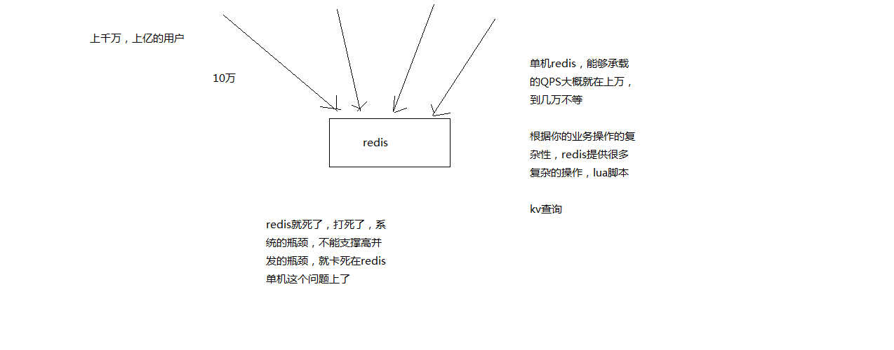
		- #### c、如果redis要支撑超过10万+的并发，那应该怎么做？
		  collapsed:: true
			- 单机的redis几乎不太可能说QPS超过10万+，除非一些特殊情况，比如你的机器性能特别好，配置特别高，物理机，维护做的特别好，而且你的整体的操作不是太复杂
			- 单机在几万
			- 读写分离
				- 一般来说，对缓存，一般都是用来支撑读高并发的，写的请求是比较少的，可能写请求也就一秒钟几千，一两千。大量的请求都是读，一秒钟二十万次读
			- 主从架构 -> 读写分离 -> 支撑10万+读QPS的架构
			- 
		- #### d、接下来要讲解的一个topic
			- redis replication
			- redis主从架构 -> 读写分离架构 -> 可支持水平扩展的读高并发架构
	- ### 2. redis replication以及master持久化对主从架构的安全意义
	  collapsed:: true
		- 课程大纲
			- 1、图解redis replication基本原理
			  2、redis replication的核心机制
			  3、master持久化对于主从架构的安全保障的意义
		- redis replication -> 主从架构 -> 读写分离 -> 水平扩容支撑读高并发
		- redis replication的最最基本的原理，铺垫
		-
		- #### 1、图解redis replication基本原理
			- 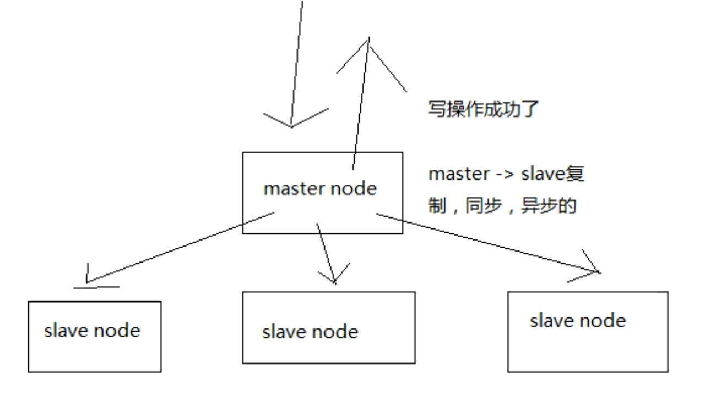{:height 335, :width 497}
		- #### 2、redis replication的核心机制
			- redis采用异步方式复制数据到slave节点，不过redis 2.8开始，slave node会周期性地确认自己每次复制的数据量
			  logseq.order-list-type:: number
			- 一个master node是可以配置多个slave node的
			  logseq.order-list-type:: number
			- slave node也可以连接其他的slave node
			  logseq.order-list-type:: number
			- slave node做复制的时候，是不会block master node的正常工作的
			  logseq.order-list-type:: number
			- slave node在做复制的时候，也不会block对自己的查询操作，它会用旧的数据集来提供服务; 但是复制完成的时候，需要删除旧数据集，加载新数据集，这个时候就会暂停对外服务了
			  logseq.order-list-type:: number
			- slave node主要用来进行横向扩容，做读写分离，扩容的slave node可以提高读的吞吐量
			  logseq.order-list-type:: number
			- slave，高可用性，有很大的关系
		- #### 3、master持久化对于主从架构的安全保障的意义
			- 如果采用了主从架构，那么建议必须开启master node的持久化！
			- 不建议用slave node作为master node的数据热备，因为那样的话，如果你关掉master的持久化，可能在master宕机重启的时候数据是空的，然后可能一经过复制，salve node数据也丢了
			- master -> RDB和AOF都关闭了 -> 全部在内存中
			- master宕机，重启，是没有本地数据可以恢复的，然后就会直接认为自己IDE数据是空的
			- master就会将空的数据集同步到slave上去，所有slave的数据全部清空
			- 100%的数据丢失
			- master节点，必须要使用持久化机制
			-
			- 第二个，master的各种备份方案，要不要做，万一说本地的所有文件丢失了; 从备份中挑选一份rdb去恢复master; 这样才能确保master启动的时候，是有数据的
			- 即使采用了后续讲解的高可用机制，slave node可以自动接管master node，但是也可能sentinal还没有检测到master failure，master node就自动重启了，还是可能导致上面的所有slave node数据清空故障
	- ### 3. redis主从复制原理、断点续传、无磁盘化复制、过期key处理
	  collapsed:: true
		- #### 1、主从架构的核心原理
			- 当启动一个slave node的时候，它会发送一个PSYNC命令给master node
			- 如果这是slave node重新连接master node，那么master node仅仅会复制给slave部分缺少的数据; 否则如果是slave node第一次连接master node，那么会触发一次full resynchronization
			- 开始full resynchronization的时候，master会启动一个后台线程，开始生成一份RDB快照文件，同时还会将从客户端收到的所有写命令缓存在内存中。RDB文件生成完毕之后，master会将这个RDB发送给slave，slave会先写入本地磁盘，然后再从本地磁盘加载到内存中。然后master会将内存中缓存的写命令发送给slave，slave也会同步这些数据。
			- slave node如果跟master node有网络故障，断开了连接，会自动重连。master如果发现有多个slave node都来重新连接，仅仅会启动一个rdb save操作，用一份数据服务所有slave node。
				- 
		- #### 2、主从复制的断点续传
			- 从redis 2.8开始，就支持主从复制的断点续传，如果主从复制过程中，网络连接断掉了，那么可以接着上次复制的地方，继续复制下去，而不是从头开始复制一份
			- master node会在内存中常见一个backlog，master和slave都会保存一个replica offset还有一个master id，offset就是保存在backlog中的。如果master和slave网络连接断掉了，slave会让master从上次的replica offset开始继续复制
			- 但是如果没有找到对应的offset，那么就会执行一次resynchronization
		- #### 3、无磁盘化复制
			- master在内存中直接创建rdb，然后发送给slave，不会在自己本地落地磁盘了
			- repl-diskless-sync
			  repl-diskless-sync-delay，等待一定时长再开始复制，因为要等更多slave重新连接过来
		- #### 4、过期key处理
			- slave不会过期key，只会等待master过期key。如果master过期了一个key，或者通过LRU淘汰了一个key，那么会模拟一条del命令发送给slave。
	- ### 4. redis replication的完整流运行程和原理的再次深入剖析
	  collapsed:: true
		- #### 1、复制的完整流程
			- 
			- slave node启动，仅仅保存master node的信息，包括master node的host和ip，但是复制流程没开始。
			  logseq.order-list-type:: number
			  master host和ip是从哪儿来的，redis.conf里面的slaveof配置的。
			- slave node内部有个定时任务，每秒检查是否有新的master node要连接和复制，如果发现，就跟master node建立socket网络连接
			  logseq.order-list-type:: number
			- slave node发送ping命令给master node
			  logseq.order-list-type:: number
			- 口令认证，如果master设置了requirepass，那么salve node必须发送masterauth的口令过去进行认证
			  logseq.order-list-type:: number
			- master node第一次执行全量复制，将所有数据发给slave node
			  logseq.order-list-type:: number
			- master node后续持续将写命令，异步复制给slave node
			  logseq.order-list-type:: number
		- #### 2、数据同步相关的核心机制
			- 指的就是第一次slave连接msater的时候，执行的全量复制，那个过程里面你的一些细节的机制
			- master和slave都会维护一个offset
			  logseq.order-list-type:: number
			  collapsed:: true
				- master会在自身不断累加offset，slave也会在自身不断累加offset。
				  slave每秒都会上报自己的offset给master，同时master也会保存每个slave的offset。
				  这个倒不是说特定就用在全量复制的，主要是master和slave都要知道各自的数据的offset，才能知道互相之间的数据不一致的情况
			- backlog
			  logseq.order-list-type:: number
			  collapsed:: true
				- master node有一个backlog，默认是1MB大小
				- master node给slave node复制数据时，也会将数据在backlog中同步写一份
				- backlog主要是用来做全量复制中断候的增量复制的
			- master run id
			  logseq.order-list-type:: number
				- info server，可以看到master run id
				- 如果根据host+ip定位master node，是不靠谱的，如果master node重启或者数据出现了变化，那么slave node应该根据不同的run id区分，run id不同就做全量复制
				- 如果需要不更改run id重启redis，可以使用redis-cli debug reload命令
				- 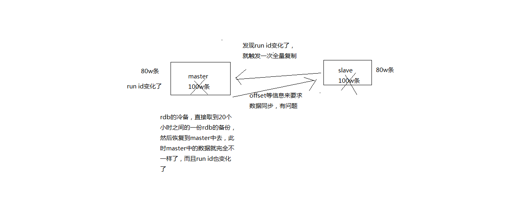
			- psync
			  logseq.order-list-type:: number
			- 从节点使用psync从master node进行复制，psync runid offset
			  master node会根据自身的情况返回响应信息，可能是FULLRESYNC runid offset触发全量复制，可能是CONTINUE触发增量复制
		- #### 3、全量复制
			- master执行bgsave，在本地生成一份rdb快照文件
			  logseq.order-list-type:: number
			- master node将rdb快照文件发送给salve node，如果rdb复制时间超过60秒（repl-timeout），那么slave node就会认为复制失败，可以适当调节大这个参数
			  logseq.order-list-type:: number
			- 对于千兆网卡的机器，一般每秒传输100MB，6G文件，很可能超过60s
			  logseq.order-list-type:: number
			- master node在生成rdb时，会将所有新的写命令缓存在内存中，在salve node保存了rdb之后，再将新的写命令复制给salve node
			  logseq.order-list-type:: number
			- client-output-buffer-limit slave 256MB 64MB 60，如果在复制期间，内存缓冲区持续消耗超过64MB，或者一次性超过256MB，那么停止复制，复制失败
			  logseq.order-list-type:: number
			- slave node接收到rdb之后，清空自己的旧数据，然后重新加载rdb到自己的内存中，同时基于旧的数据版本对外提供服务
			  logseq.order-list-type:: number
			- 如果slave node开启了AOF，那么会立即执行BGREWRITEAOF，重写AOF
			  logseq.order-list-type:: number
			- rdb生成、rdb通过网络拷贝、slave旧数据的清理、slave aof rewrite，很耗费时间
			- 如果复制的数据量在4G~6G之间，那么很可能全量复制时间消耗到1分半到2分钟
		- #### 4、增量复制
			- （1）如果全量复制过程中，master-slave网络连接断掉，那么salve重新连接master时，会触发增量复制
			  （2）master直接从自己的backlog中获取部分丢失的数据，发送给slave node，默认backlog就是1MB
			  （3）msater就是根据slave发送的psync中的offset来从backlog中获取数据的
		- #### 5、heartbeat
			- 主从节点互相都会发送heartbeat信息
			- master默认每隔10秒发送一次heartbeat，salve node每隔1秒发送一个heartbeat
		- #### 6、异步复制
			- master每次接收到写命令之后，现在内部写入数据，然后异步发送给slave node
	- ### 5. redis主从架构下如何才能做到99.99%的高可用性？
	  collapsed:: true
		- #### 1、什么是99.99%高可用？
			- 什么是系统不可用
				- 
			- 什么是系统高可用
				- 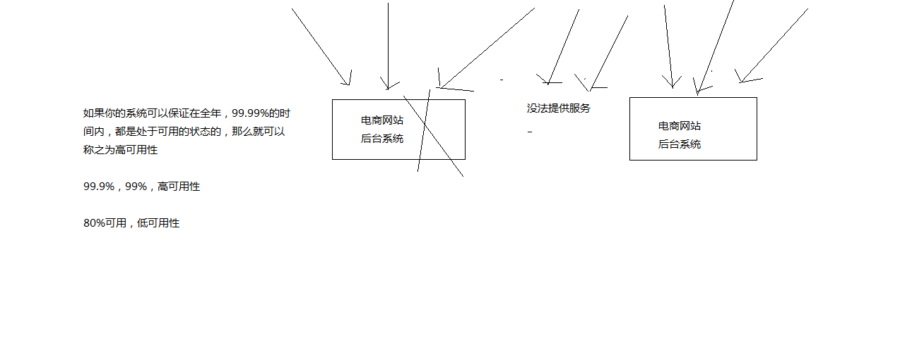
			- 架构上，高可用性，99.99%的高可用性
			- 讲的学术，99.99%，公式，
			- `系统可用的时间 / 系统故障的时间`
			- ，365天，在365天 * 99.99%的时间内，你的系统都是可以哗哗对外提供服务的，那就是高可用性，99.99%
			- 系统可用的时间 / 总的时间 = 高可用性，然后会对各种时间的概念，说一大堆解释
		- #### 2、redis不可用是什么？单实例不可用？主从架构不可用？不可用的后果是什么？
			- 
		- #### 3、redis怎么才能做到高可用？
			- 
	- ### 6. redis哨兵架构的相关基础知识的讲解
	  collapsed:: true
		- #### 1、哨兵的介绍
			- sentinal，中文名是哨兵
			- 哨兵是redis集群架构中非常重要的一个组件，主要功能如下
			- （1）集群监控，负责监控redis master和slave进程是否正常工作
			  （2）消息通知，如果某个redis实例有故障，那么哨兵负责发送消息作为报警通知给管理员
			  （3）故障转移，如果master node挂掉了，会自动转移到slave node上
			  （4）配置中心，如果故障转移发生了，通知client客户端新的master地址
			- 哨兵本身也是分布式的，作为一个哨兵集群去运行，互相协同工作
			- （1）故障转移时，判断一个master node是宕机了，需要大部分的哨兵都同意才行，涉及到了分布式选举的问题
			  （2）即使部分哨兵节点挂掉了，哨兵集群还是能正常工作的，因为如果一个作为高可用机制重要组成部分的故障转移系统本身是单点的，那就很坑爹了
			- 目前采用的是sentinal 2版本，sentinal 2相对于sentinal 1来说，重写了很多代码，主要是让故障转移的机制和算法变得更加健壮和简单
		- #### 2、哨兵的核心知识
			- （1）哨兵至少需要3个实例，来保证自己的健壮性
			  （2）哨兵 + redis主从的部署架构，是不会保证数据零丢失的，只能保证redis集群的高可用性
			  （3）对于哨兵 + redis主从这种复杂的部署架构，尽量在测试环境和生产环境，都进行充足的测试和演练
		- #### 3、为什么redis哨兵集群只有2个节点无法正常工作？
			- 哨兵集群必须部署2个以上节点
			- 如果哨兵集群仅仅部署了个2个哨兵实例，quorum=1
			- ```
			  +----+         +----+
			  | M1 |---------| R1 |
			  | S1 |         | S2 |
			  +----+         +----+
			  ```
			- Configuration: quorum = 1
			- master宕机，s1和s2中只要有1个哨兵认为master宕机就可以还行切换，同时s1和s2中会选举出一个哨兵来执行故障转移
			- 同时这个时候，需要majority，也就是大多数哨兵都是运行的，2个哨兵的majority就是2（2的majority=2，3的majority=2，5的majority=3，4的majority=2），2个哨兵都运行着，就可以允许执行故障转移
			- 但是如果整个M1和S1运行的机器宕机了，那么哨兵只有1个了，此时就没有majority来允许执行故障转移，虽然另外一台机器还有一个R1，但是故障转移不会执行
		- #### 4、经典的3节点哨兵集群
			- ```apl
			         +----+
			         | M1 |
			         | S1 |
			         +----+
			            |
			  +----+    |    +----+
			  | R2 |----+----| R3 |
			  | S2 |         | S3 |
			  +----+         +----+
			  ```
			- Configuration: quorum = 2，majority
			- 如果M1所在机器宕机了，那么三个哨兵还剩下2个，S2和S3可以一致认为master宕机，然后选举出一个来执行故障转移
			- 同时3个哨兵的majority是2，所以还剩下的2个哨兵运行着，就可以允许执行故障转移
	- ### 7. redis哨兵主备切换的数据丢失问题：异步复制、集群脑裂
	  collapsed:: true
		- 课程大纲
			- 1、两种数据丢失的情况
			  2、解决异步复制和脑裂导致的数据丢失
		- ------------------------------------------------------------------
		- #### 1、两种数据丢失的情况
			- 主备切换的过程，可能会导致数据丢失
			- （1）异步复制导致的数据丢失
				- 因为master -> slave的复制是异步的，所以可能有部分数据还没复制到slave，master就宕机了，此时这些部分数据就丢失了
				- 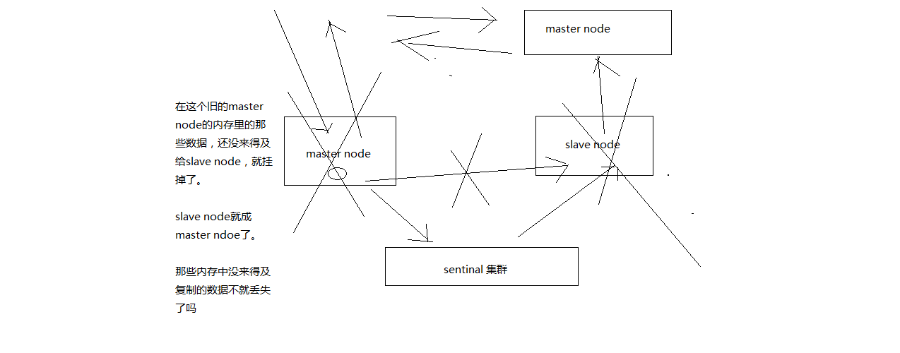{:height 428, :width 1069}
			- （2）脑裂导致的数据丢失
				- 脑裂，也就是说，某个master所在机器突然脱离了正常的网络，跟其他slave机器不能连接，但是实际上master还运行着
				- 此时哨兵可能就会认为master宕机了，然后开启选举，将其他slave切换成了master
				- 这个时候，集群里就会有两个master，也就是所谓的脑裂
				- 此时虽然某个slave被切换成了master，但是可能client还没来得及切换到新的master，还继续写向旧master的数据可能也丢失了
				- 因此旧master再次恢复的时候，会被作为一个slave挂到新的master上去，自己的数据会清空，重新从新的master复制数据
				- 
		- ------------------------------------------------------------------
		- #### 2、解决异步复制和脑裂导致的数据丢失
			- min-slaves-to-write 1
			  min-slaves-max-lag 10
			- 要求至少有1个slave，数据复制和同步的延迟不能超过10秒
			- 如果说一旦所有的slave，数据复制和同步的延迟都超过了10秒钟，那么这个时候，master就不会再接收任何请求了
			- 上面两个配置可以减少异步复制和脑裂导致的数据丢失
			- （1）减少异步复制的数据丢失
				- 有了min-slaves-max-lag这个配置，就可以确保说，一旦slave复制数据和ack延时太长，就认为可能master宕机后损失的数据太多了，那么就拒绝写请求，这样可以把master宕机时由于部分数据未同步到slave导致的数据丢失降低的可控范围内
				- 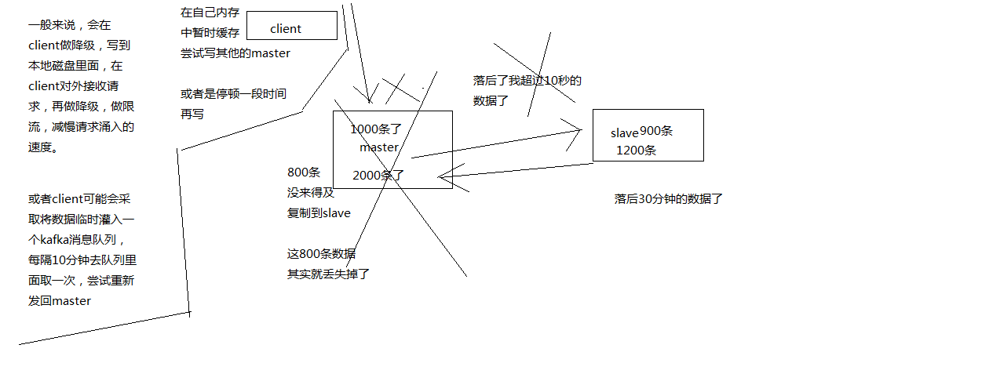
			- （2）减少脑裂的数据丢失
				- 如果一个master出现了脑裂，跟其他slave丢了连接，那么上面两个配置可以确保说，如果不能继续给指定数量的slave发送数据，而且slave超过10秒没有给自己ack消息，那么就直接拒绝客户端的写请求
				- 这样脑裂后的旧master就不会接受client的新数据，也就避免了数据丢失
				- 上面的配置就确保了，如果跟任何一个slave丢了连接，在10秒后发现没有slave给自己ack，那么就拒绝新的写请求
				- 因此在脑裂场景下，最多就丢失10秒的数据
				- 
	- ### 8. redis哨兵的多个核心底层原理的深入解析（包含slave选举算法）
		- #### 1、sdown和odown转换机制
			- sdown和odown两种失败状态
			- **sdown**是主观宕机，就一个哨兵如果自己觉得一个master宕机了，那么就是主观宕机
				- sdown达成的条件很简单，如果一个哨兵ping一个master，超过了`is-master-down-after-milliseconds` 指定的毫秒数之后，就主观认为master宕机
			- **odown**是客观宕机，如果`quorum`数量的哨兵都觉得一个master宕机了，那么就是客观宕机
				- sdown到odown转换的条件很简单，如果一个哨兵在指定时间内，收到了quorum指定数量的其他哨兵也认为那个master是sdown了，那么就认为是odown了，客观认为master宕机
		- #### 2、哨兵集群的自动发现机制
			- 哨兵互相之间的发现，是通过redis的pub/sub系统实现的，每个哨兵都会往`__sentinel__:hello`这个channel里发送一个消息，这时候所有其他哨兵都可以消费到这个消息，并感知到其他的哨兵的存在
			- 每隔两秒钟，每个哨兵都会往自己监控的某个master+slaves对应的`__sentinel__:hello channel`里发送一个消息，内容是自己的host、ip和runid还有对这个master的监控配置
			- 每个哨兵也会去监听自己监控的每个master+slaves对应的`__sentinel__:hello channel`，然后去感知到同样在监听这个master+slaves的其他哨兵的存在
			- 每个哨兵还会跟其他哨兵交换对master的监控配置，互相进行监控配置的同步
		- #### 3、slave配置的自动纠正
			- 哨兵会负责自动纠正slave的一些配置，比如slave如果要成为潜在的master候选人，哨兵会确保slave在复制现有master的数据; 如果slave连接到了一个错误的master上，比如故障转移之后，那么哨兵会确保它们连接到正确的master上
		- #### 4、slave->master选举算法
			- 如果一个master被认为odown了，而且majority哨兵都允许了主备切换，那么某个哨兵就会执行主备切换操作，此时首先要选举一个slave来
			- 会考虑slave的一些信息
			- （1）跟master断开连接的时长
			  collapsed:: true
				- (down-after-milliseconds * 10) + milliseconds_since_master_is_in_SDOWN_state
				- 如果一个slave跟master断开连接已经超过了down-after-milliseconds的10倍，外加master宕机的时长，那么slave就被认为不适合选举为master
			- （2）slave优先级
			- （3）复制offset
			- （4）run id
			- 接下来会对slave进行排序
			- （1）按照slave优先级进行排序，slave priority越低，优先级就越高
			  （2）如果slave priority相同，那么看replica offset，哪个slave复制了越多的数据，offset越靠后，优先级就越高
			  （3）如果上面两个条件都相同，那么选择一个run id比较小的那个slave
		- #### 5、quorum和majority
			- 每次一个哨兵要做主备切换，首先需要quorum数量的哨兵认为odown，然后选举出一个哨兵来做切换，这个哨兵还得得到majority哨兵的授权，才能正式执行切换
			- 如果quorum < majority，比如5个哨兵，majority就是3，quorum设置为2，那么就3个哨兵授权就可以执行切换
			- 但是如果quorum >= majority，那么必须quorum数量的哨兵都授权，比如5个哨兵，quorum是5，那么必须5个哨兵都同意授权，才能执行切换
		- #### 6、configuration epoch
			- 哨兵会对一套redis master+slave进行监控，有相应的监控的配置
			- 执行切换的那个哨兵，会从要切换到的新master（salve->master）那里得到一个configuration epoch，这就是一个version号，每次切换的version号都必须是唯一的
			- 如果第一个选举出的哨兵切换失败了，那么其他哨兵，会等待failover-timeout时间，然后接替继续执行切换，此时会重新获取一个新的configuration epoch，作为新的version号
		- #### 7、configuraiton传播
			- 哨兵完成切换之后，会在自己本地更新生成最新的master配置，然后同步给其他的哨兵，就是通过之前说的pub/sub消息机制
			- 这里之前的version号就很重要了，因为各种消息都是通过一个channel去发布和监听的，所以一个哨兵完成一次新的切换之后，新的master配置是跟着新的version号的
			- 其他的哨兵都是根据版本号的大小来更新自己的master配置的
	-
	- ### 本课总结
	-
	-
- ## 22 怎么保证redis挂掉之后再重启数据可以进行恢复？
  collapsed:: true
	- 课程大纲
	- 1、故障发生的时候会怎么样
	  2、如何应对故障的发生
	- 很多同学，自己也看过一些redis的资料和书籍，当然可能也看过一些redis视频课程
	- 所有的资料，其实都会讲解redis持久化，但是有个问题，我到目前为止，没有看到有人很仔细的去讲解，redis的持久化意义
	- redis的持久化，RDB，AOF，区别，各自的特点是什么，适合什么场景
	- redis的企业级的持久化方案是什么，是用来跟哪些企业级的场景结合起来使用的？？？
	- redis持久化的意义，在于故障恢复
	- 比如你部署了一个redis，作为cache缓存，当然也可以保存一些较为重要的数据
	- 如果没有持久化的话，redis遇到灾难性故障的时候，就会丢失所有的数据
	- 如果通过持久化将数据搞一份儿在磁盘上去，然后定期比如说同步和备份到一些云存储服务上去，那么就可以保证数据不丢失全部，还是可以恢复一部分数据回来的
- ## 23_你能聊聊redis cluster集群模式的原理吗？
- ## 24 你能说说我们一般如何应对缓存雪崩以及穿透问题吗？
  collapsed:: true
	- ### 1、面试题
		- 了解什么是redis的雪崩和穿透？redis崩溃之后会怎么样？系统该如何应对这种情况？如何处理redis的穿透？
	-
	- ### 2、面试官心里分析
		- 其实这是问到缓存必问的，因为缓存雪崩和穿透，那是缓存最大的两个问题，要么不出现，一旦出现就是致命性的问题。所以面试官一定会问你。
	-
	- ### 3、面试题剖析
		- 缓存雪崩发生的现象
			- 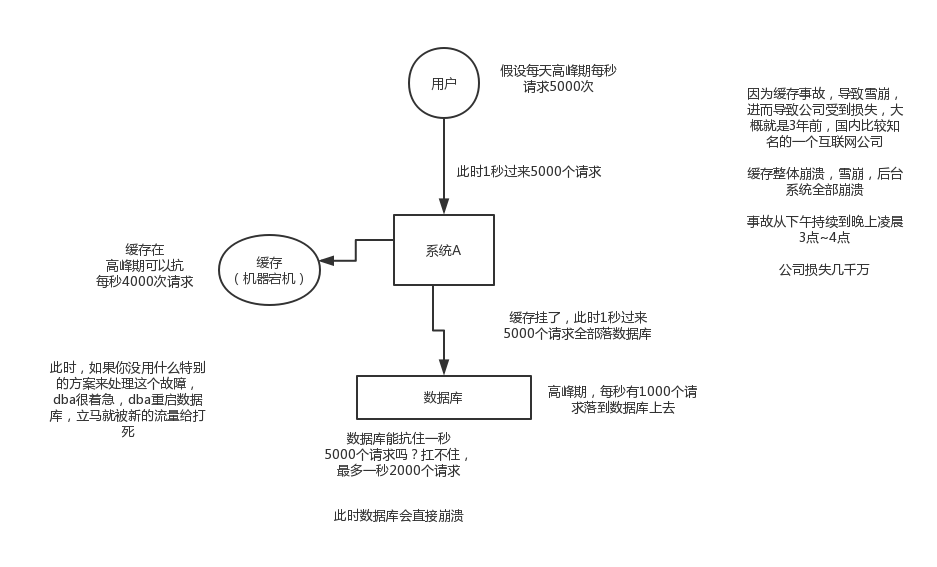
		- 缓存雪崩的事前事中事后的解决方案
			- 
		-
		- 事前：redis高可用，主从+哨兵，redis cluster，避免全盘崩溃
		- 事中：本地ehcache缓存 + hystrix限流&降级，避免MySQL被打死
		- 事后：redis持久化，快速恢复缓存数据
		-
		- 缓存穿透的现象
		- 缓存穿透的解决方法
		- 
- ## 25 如何保证缓存与数据库双写时的数据一致性？
  collapsed:: true
	- ### 1、面试题
		- 如何保证缓存与数据库的双写一致性？
	-
	- ### 2. 面试官心里分析
		- 你只要用缓存，就可能会涉及到缓存与数据库双存储双写，你只要是双写，就一定会有数据一致性的问题，那么你如何解决一致性问题？
	-
	- ### 3、面试题剖析
		- 一般来说，就是如果你的系统不是严格要求缓存+数据库必须一致性的话，缓存可以稍微的跟数据库偶尔有不一致的情况，最好不要做这个方案，读请求和写请求串行化，串到一个内存队列里去，这样就可以保证一定不会出现不一致的情况
		-
		- 串行化之后，就会导致系统的吞吐量会大幅度的降低，用比正常情况下多几倍的机器去支撑线上的一个请求。
	-
	- ### cache aside pattern
	  collapsed:: true
		- 最经典的缓存+数据库读写的模式，cache aside pattern
		- 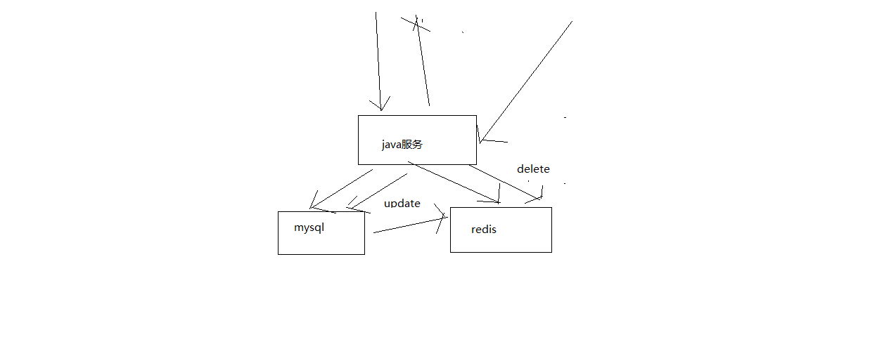
		- #### 1、Cache Aside Pattern
		- （1）读的时候，先读缓存，缓存没有的话，那么就读数据库，然后取出数据后放入缓存，同时返回响应
		- （2）更新的时候，先删除缓存，然后再更新数据库
		- #### 2、为什么是删除缓存，而不是更新缓存呢？
			- 原因很简单，很多时候，复杂点的缓存的场景，因为缓存有的时候，不简单是数据库中直接取出来的值
			- 商品详情页的系统，修改库存，只是修改了某个表的某些字段，但是要真正把这个影响的最终的库存计算出来，可能还需要从其他表查询一些数据，然后进行一些复杂的运算，才能最终计算出
			- 现在最新的库存是多少，然后才能将库存更新到缓存中去
			- 比如可能更新了某个表的一个字段，然后其对应的缓存，是需要查询另外两个表的数据，并进行运算，才能计算出缓存最新的值的
			- 更新缓存的代价是很高的
			- 是不是说，每次修改数据库的时候，都一定要将其对应的缓存去跟新一份？也许有的场景是这样的，但是对于比较复杂的缓存数据计算的场景，就不是这样了
			- 如果你频繁修改一个缓存涉及的多个表，那么这个缓存会被频繁的更新，频繁的更新缓存
			- 但是问题在于，这个缓存到底会不会被频繁访问到？？？
			- 举个例子，一个缓存涉及的表的字段，在1分钟内就修改了20次，或者是100次，那么缓存跟新20次，100次; 但是这个缓存在1分钟内就被读取了1次，有大量的冷数据
			- 28法则，黄金法则，20%的数据，占用了80%的访问量
			- 实际上，如果你只是删除缓存的话，那么1分钟内，这个缓存不过就重新计算一次而已，开销大幅度降低
			- 每次数据过来，就只是删除缓存，然后修改数据库，如果这个缓存，在1分钟内只是被访问了1次，那么只有那1次，缓存是要被重新计算的，用缓存才去算缓存
			- 其实删除缓存，而不是更新缓存，就是一个lazy计算的思想，不要每次都重新做复杂的计算，不管它会不会用到，而是让它到需要被使用的时候再重新计算
			- mybatis，hibernate，懒加载，思想
			- 查询一个部门，部门带了一个员工的list，没有必要说每次查询部门，都里面的1000个员工的数据也同时查出来啊
			- 80%的情况，查这个部门，就只是要访问这个部门的信息就可以了
			- 先查部门，同时要访问里面的员工，那么这个时候只有在你要访问里面的员工的时候，才会去数据库里面查询1000个员工
	- ### 高并发场景下的缓存+数据库双写不一致问题分析与解决方案设计
	  collapsed:: true
		- 马上开始去开发业务系统
		- 从哪一步开始做，从比较简单的那一块开始做，实时性要求比较高的那块数据的缓存去做
		- 实时性比较高的数据缓存，选择的就是库存的服务
		- 库存可能会修改，每次修改都要去更新这个缓存数据; 每次库存的数据，在缓存中一旦过期，或者是被清理掉了，前端的nginx服务都会发送请求给库存服务，去获取相应的数据
		- 库存这一块，写数据库的时候，直接更新redis缓存
		- 实际上没有这么的简单，这里，其实就涉及到了一个问题，数据库与缓存双写，数据不一致的问题
		- 围绕和结合实时性较高的库存服务，把数据库与缓存双写不一致问题以及其解决方案，给大家讲解一下
		- 数据库与缓存双写不一致，很常见的问题，大型的缓存架构中，第一个解决方案
		- 大型的缓存架构全部讲解完了以后，整套架构是非常复杂，架构可以应对各种各样奇葩和极端的情况
		- 也有一种可能，不是说，来讲课的就是超人，万能的
		- 讲课，就跟写书一样，很可能会写错，也可能有些方案里的一些地方，我没考虑到
		- 也可能说，有些方案只是适合某些场景，在某些场景下，可能需要你进行方案的优化和调整才能适用于你自己的项目
		- 大家觉得对这些方案有什么疑问或者见解，都可以找我，沟通一下
		- 如果的确我觉得是我讲解的不对，或者有些地方考虑不周，那么我可以在视频里补录，更新到网站上面去
		- 多多包涵
		- #### 1、最初级的缓存不一致问题以及解决方案
		  collapsed:: true
			- 问题：先修改数据库，再删除缓存，如果删除缓存失败了，那么会导致数据库中是新数据，缓存中是旧数据，数据出现不一致
				- 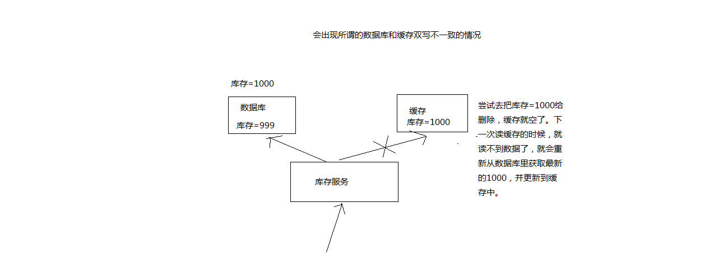
			- 解决思路
				- 先删除缓存，再修改数据库，如果删除缓存成功了，如果修改数据库失败了，那么数据库中是旧数据，缓存中是空的，那么数据不会不一致
				- 因为读的时候缓存没有，则读数据库中旧数据，然后更新到缓存中
				- 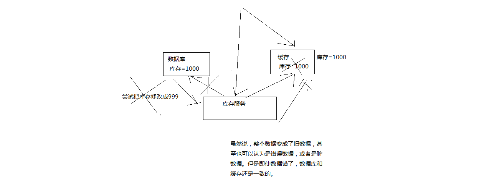
		- #### 2、比较复杂的数据不一致问题分析
			- 数据发生了变更，先删除了缓存，然后要去修改数据库，此时还没修改
			- 一个请求过来，去读缓存，发现缓存空了，去查询数据库，查到了修改前的旧数据，放到了缓存中
			- 数据变更的程序完成了数据库的修改
			- 完了，数据库和缓存中的数据不一样了。。。。
			- 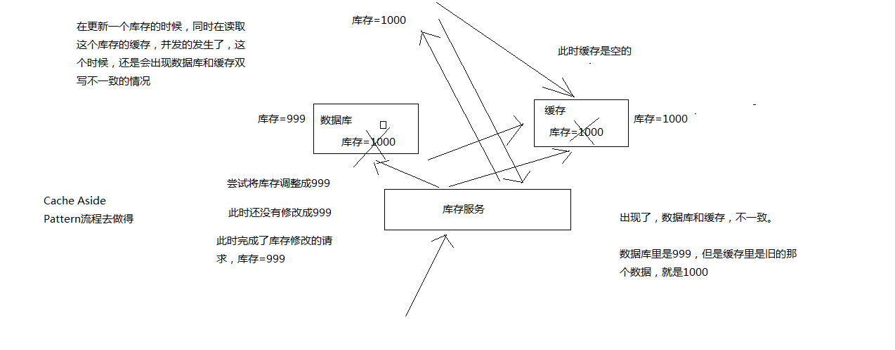
		- #### 3、为什么上亿流量高并发场景下，缓存会出现这个问题？
			- 只有在对一个数据在并发的进行读写的时候，才可能会出现这种问题
			- 其实如果说你的并发量很低的话，特别是读并发很低，每天访问量就1万次，那么很少的情况下，会出现刚才描述的那种不一致的场景
			- 但是问题是，如果每天的是上亿的流量，每秒并发读是几万，每秒只要有数据更新的请求，就可能会出现上述的数据库+缓存不一致的情况
			- 高并发了以后，问题是很多的
		- #### 4、数据库与缓存更新与读取操作进行异步串行化
			- 更新数据的时候，根据数据的唯一标识，将操作路由之后，发送到一个jvm内部的队列中
			- 读取数据的时候，如果发现数据不在缓存中，那么将重新读取数据+更新缓存的操作，根据唯一标识路由之后，也发送同一个jvm内部的队列中
			- 一个队列对应一个工作线程
			- 每个工作线程串行拿到对应的操作，然后一条一条的执行
			- 这样的话，一个数据变更的操作，先执行，删除缓存，然后再去更新数据库，但是还没完成更新
			- 此时如果一个读请求过来，读到了空的缓存，那么可以先将缓存更新的请求发送到队列中，此时会在队列中积压，然后同步等待缓存更新完成
			- 这里有一个优化点，一个队列中，其实多个更新缓存请求串在一起是没意义的，因此可以做过滤，如果发现队列中已经有一个更新缓存的请求了，那么就不用再放个更新请求操作进去了，直接等待前面的更新操作请求完成即可
			- 待那个队列对应的工作线程完成了上一个操作的数据库的修改之后，才会去执行下一个操作，也就是缓存更新的操作，此时会从数据库中读取最新的值，然后写入缓存中
			- 如果请求还在等待时间范围内，不断轮询发现可以取到值了，那么就直接返回; 如果请求等待的时间超过一定时长，那么这一次直接从数据库中读取当前的旧值
			- 
		- #### 5、高并发的场景下，该解决方案要注意的问题
			- （1）读请求长时阻塞
				- 由于读请求进行了非常轻度的异步化，所以一定要注意读超时的问题，每个读请求必须在超时时间范围内返回
				- 该解决方案，最大的风险点在于说，可能数据更新很频繁，导致队列中积压了大量更新操作在里面，然后读请求会发生大量的超时，最后导致大量的请求直接走数据库
				- 务必通过一些模拟真实的测试，看看更新数据的频繁是怎样的
				- 另外一点，因为一个队列中，可能会积压针对多个数据项的更新操作，因此需要根据自己的业务情况进行测试，可能需要部署多个服务，每个服务分摊一些数据的更新操作
				- 如果一个内存队列里居然会挤压100个商品的库存修改操作，每隔库存修改操作要耗费10ms区完成，那么最后一个商品的读请求，可能等待10 * 100 = 1000ms = 1s后，才能得到数据
				- 这个时候就导致读请求的长时阻塞
				- 一定要做根据实际业务系统的运行情况，去进行一些压力测试，和模拟线上环境，去看看最繁忙的时候，内存队列可能会挤压多少更新操作，可能会导致最后一个更新操作对应的读请求，会hang多少时间，如果读请求在200ms返回，如果你计算过后，哪怕是最繁忙的时候，积压10个更新操作，最多等待200ms，那还可以的
				- 如果一个内存队列可能积压的更新操作特别多，那么你就要加机器，让每个机器上部署的服务实例处理更少的数据，那么每个内存队列中积压的更新操作就会越少
				- 其实根据之前的项目经验，一般来说数据的写频率是很低的，因此实际上正常来说，在队列中积压的更新操作应该是很少的
				- 针对读高并发，读缓存架构的项目，一般写请求相对读来说，是非常非常少的，每秒的QPS能到几百就不错了
				- 一秒，500的写操作，5份，每200ms，就100个写操作
				- 单机器，20个内存队列，每个内存队列，可能就积压5个写操作，每个写操作性能测试后，一般在20ms左右就完成
				- 那么针对每个内存队列中的数据的读请求，也就最多hang一会儿，200ms以内肯定能返回了
				- 写QPS扩大10倍，但是经过刚才的测算，就知道，单机支撑写QPS几百没问题，那么就扩容机器，扩容10倍的机器，10台机器，每个机器20个队列，200个队列
				- 大部分的情况下，应该是这样的，大量的读请求过来，都是直接走缓存取到数据的
				- 少量情况下，可能遇到读跟数据更新冲突的情况，如上所述，那么此时更新操作如果先入队列，之后可能会瞬间来了对这个数据大量的读请求，但是因为做了去重的优化，所以也就一个更新缓存的操作跟在它后面
				- 等数据更新完了，读请求触发的缓存更新操作也完成，然后临时等待的读请求全部可以读到缓存中的数据
			- （2）读请求并发量过高
				- 这里还必须做好压力测试，确保恰巧碰上上述情况的时候，还有一个风险，就是突然间大量读请求会在几十毫秒的延时hang在服务上，看服务能不能抗的住，需要多少机器才能抗住最大的极限情况的峰值
				- 但是因为并不是所有的数据都在同一时间更新，缓存也不会同一时间失效，所以每次可能也就是少数数据的缓存失效了，然后那些数据对应的读请求过来，并发量应该也不会特别大
				- 按1:99的比例计算读和写的请求，每秒5万的读QPS，可能只有500次更新操作
				- 如果一秒有500的写QPS，那么要测算好，可能写操作影响的数据有500条，这500条数据在缓存中失效后，可能导致多少读请求，发送读请求到库存服务来，要求更新缓存
				- 一般来说，1:1，1:2，1:3，每秒钟有1000个读请求，会hang在库存服务上，每个读请求最多hang多少时间，200ms就会返回
				- 在同一时间最多hang住的可能也就是单机200个读请求，同时hang住
				- 单机hang200个读请求，还是ok的
				- 1:20，每秒更新500条数据，这500秒数据对应的读请求，会有20 * 500 = 1万
				- 1万个读请求全部hang在库存服务上，就死定了
			- （3）多服务实例部署的请求路由
				- 可能这个服务部署了多个实例，那么必须保证说，执行数据更新操作，以及执行缓存更新操作的请求，都通过nginx服务器路由到相同的服务实例上
				- 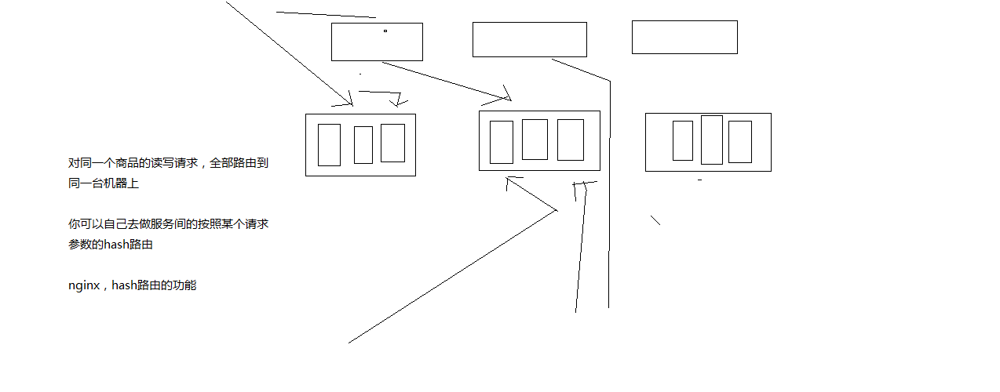
			- （4）热点商品的路由问题，导致请求的倾斜
				- 万一某个商品的读写请求特别高，全部打到相同的机器的相同的队列里面去了，可能造成某台机器的压力过大
				- 就是说，因为只有在商品数据更新的时候才会清空缓存，然后才会导致读写并发，所以更新频率不是太高的话，这个问题的影响并不是特别大
				- 但是的确可能某些机器的负载会高一些
- ## 26 你能说说redis的并发竞争问题该如何解决吗？
  collapsed:: true
	- ### 1、面试题
		- redis的并发竞争问题是什么？如何解决这个问题？了解Redis事务的CAS方案吗？
	- ### 2、面试官心里分析
		- 这个也是线上非常常见的一个问题，就是多客户端同时并发写一个key，可能本来应该先到的数据后到了，导致数据版本错了。或者是多客户端同时获取一个key，修改值之后再写回去，只要顺序错了，数据就错了。
		- 而且redis自己就有天然解决这个问题的CAS类的乐观锁方案
	- ### 3、面试题剖析
		- 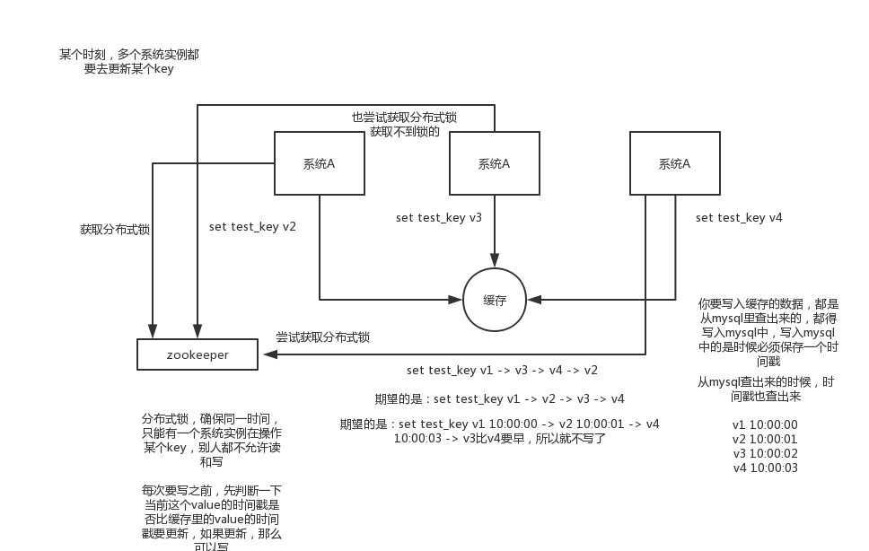
- ## 27 你们公司生产环境的redis集群的部署架构是什么样的？
  collapsed:: true
	- ### 1、面试题
		- 生产环境中的redis是怎么部署的？
	- ### 2、面试官心里分析
		- 看看你了解不了解你们公司的redis生产集群的部署架构，如果你不了解，那么确实你就很失职了，你的redis是主从架构？集群架构？用了哪种集群方案？有没有做高可用保证？有没有开启持久化机制确保可以进行数据恢复？线上redis给几个G的内存？设置了哪些参数？压测后你们redis集群承载多少QPS？
		- 兄弟，这些你必须是门儿清的，否则你确实是没好好思考过
	- ### 3、面试题剖析
		- redis cluster，10台机器，5台机器部署了redis主实例，另外5台机器部署了redis的从实例，每个主实例挂了一个从实例，5个节点对外提供读写服务，每个节点的读写高峰qps可能可以达到每秒5万，5台机器最多是25万读写请求/s。
		-
		- 机器是什么配置？32G内存+8核CPU+1T磁盘，但是分配给redis进程的是10g内存，一般线上生产环境，redis的内存尽量不要超过10g，超过10g可能会有问题。
		-
		- 5台机器对外提供读写，一共有50g内存。
		-
		- 因为每个主实例都挂了一个从实例，所以是高可用的，任何一个主实例宕机，都会自动故障迁移，redis从实例会自动变成主实例继续提供读写服务
		-
		- 你往内存里写的是什么数据？每条数据的大小是多少？商品数据，每条数据是10kb。100条数据是1mb，10万条数据是1g。常驻内存的是200万条商品数据，占用内存是20g，仅仅不到总内存的50%。
		-
		- 目前高峰期每秒就是3500左右的请求量
		-
		- 比如我们吧，大型的公司，其实基础架构的team，会负责缓存集群的运维
- ## 28 分布式缓存相关面试题的回答技巧总结
  collapsed:: true
	- 说实话，这一套东西基本构成了缓存这块你必须知道的基础性的知识，如果你不知道，那么说明你有点失职，确实平时没好好积累。
	- 因为这些问题确实不难，如果我往深了问，可以问的很细，结合项目扣的很细，比如你们公司线上系统高峰QPS 3000？那请求主要访问哪些接口？redis抗了多少请求？mysql抗了多少请求？你到底是怎么实现高并发的？咱们聊聊redis的内核吧，看看你对底层了解的多么？如果要缓存几百GB的数据会有什么坑该这么弄？如果缓存出现热点现象该这么处理？某个value特别大把网卡给打死了怎么办？等等等等，可以深挖的东西其实有很多。。。。。
	- 但是如果你掌握好了这套东西的回答，那么你在面试的时候，如果面试官没有全都问到，你可以自己主动合盘脱出。比如你可以说，我们线上的缓存，做了啥啥机制，防止雪崩、防止穿透、保证双写时的数据一致性、保证并发竞争时的数据一致性，我们线上咋部署的，啥架构，怎么玩儿的。这套东西你可以自己说出来，展示一下你对缓存这块的掌握。
- ## 29 体验一下面试官可能会对分布式系统发起的一串连环炮
  collapsed:: true
	- 我之前有一些同学，之前呢主要是做传统行业，外包项目，互联网公司，一直是那种小的公司，技术一直都搞的比较简单。共同的一个问题，就是都没怎么搞过分布式系统，现在互联网公司，一般都是做分布式的系统，大家都不是做底层的分布式系统，分布式存储系统，hadoop hdfs，分布式计算系统，hadoop mapreduce，spark，分布式流式计算系统，storm。
	  
	  分布式业务系统，把原来用java开发的一个大块系统，给拆分成多个子系统，多个子系统之间互相调用，形成一个大系统的整体。假设原来你做了一个OA系统，里面包含了权限模块、员工模块、请假模块、财务模块，一个工程，里面包含了一堆模块，模块与模块之间会互相去调用，1台机器部署。 
	  现在如果你把他这个系统给拆开，权限系统，员工系统，请假系统，财务系统，4个系统，4个工程，分别在4台机器上部署
	  
	  一个请求过来，完成这个请求，这个员工系统，调用权限系统，调用请假系统，调用财务系统，4个系统分别完成了一部分的事情，最后4个系统都干完了以后，才认为是这个请求已经完成了。
	  
	  老师，我就搞不懂，到底什么是分布式系统？
	- 
	- ### 1.1 为什么要进行系统拆分
		- （1）为什么要进行系统拆分？如何进行系统拆分？拆分后不用dubbo可以吗？dubbo和thrift有什么区别呢？
	- ### 1.2 分布式服务框架
		- （1）说一下的dubbo的工作原理？注册中心挂了可以继续通信吗？
		- （2）dubbo支持哪些序列化协议？说一下hessian的数据结构？PB知道吗？为什么PB的效率是最高的？
		- （3）dubbo负载均衡策略和高可用策略都有哪些？动态代理策略呢？
		- （4）dubbo的spi思想是什么？
		- （5）如何基于dubbo进行服务治理、服务降级、失败重试以及超时重试？
		- （6）分布式服务接口的幂等性如何设计（比如不能重复扣款）？
		- （7）分布式服务接口请求的顺序性如何保证？
		- （8）如何自己设计一个类似dubbo的rpc框架？
		  
		  但是这两年开始兴起和流行了spring cloud，但是我们这里就不讲了，spring cloud刚开始流行，还没有普及，目前普及的是dubbo，出去面试，大部分面试官都是问你dubbo的一些问题
	- ### 1.3 分布式锁
		- （1）使用redis如何设计分布式锁？使用zk来设计分布式锁可以吗？这两种分布式锁的实现方式哪种效率比较高？
	- ### 1.4 分布式事务
		- （1）分布式事务了解吗？你们如何解决分布式事务问题的？TCC如果出现网络连不通怎么办？XA的一致性如何保证？
	- ### 1.5 分布式会话
		- （1）集群部署时的分布式session如何实现？
- ## 30 为什么要把系统拆分成分布式的？为啥要用dubbo？
  collapsed:: true
	- ### 1、面试题
		- 为什么要进行系统拆分？如何进行系统拆分？拆分后不用dubbo可以吗？
	- ### 2、面试官心里分析
		- 从这个问题开始就进行分布式系统环节了，好多同学给我反馈说，现在出去分布式成标配了，没有哪个公司不问问你分布式的事儿。你要是不会分布式的东西，简直这简历没法看，没人会让你去面试。
		- 其实为啥会这样呢？这就是因为整个大行业技术发展的原因
		- 早些年，我印象中在2010年初的时候，整个IT行业，很少有人谈分布式，更不用说微服务，虽然很多BAT等大型公司，因为系统的复杂性，很早就是分布式架构，大量的服务，只不过微服务大多基于自己搞的一套框架来实现而已。
		-
		- 但是确实，那个年代，大家很重视ssh2，很多中小型公司几乎大部分都是玩儿struts2、spring、hibernate，稍晚一些，才进入了spring mvc、spring、mybatis的组合。那个时候整个行业的技术水平就是那样，当年oracle很火，oracle管理员很吃香，oracle性能优化啥的都是IT男的大杀招啊。连大数据都没人提，当年OCP、OCM等认证培训机构，火的不行。
		-
		- 但是确实随着时代的发展，慢慢的，很多公司开始接受分布式系统架构了，这里面尤为对行业有至关重要影响的，是阿里的dubbo，某种程度上而言，阿里在这里推动了行业技术的前进。
		-
		- 正是因为有阿里的dubbo，很多中小型公司才可以基于dubbo，来把系统拆分成很多的服务，每个人负责一个服务，大家的代码都没有冲突，服务可以自治，自己选用什么技术都可以，每次发布如果就改动一个服务那就上线一个服务好了，不用所有人一起联调，每次发布都是几十万行代码，甚至几百万行代码了。
		-
		- 直到今日，我很高兴的看到分布式系统都成行业面试标配了，任何一个普通的程序员都该掌握这个东西，其实这是行业的进步，也是所有IT码农的技术进步。所以既然分布式都成标配了，那么面试官当然会问了，因为很多公司现在都是分布式、微服务的架构，那面试官当然得考察考察你了。
	- ### 3、友情提示
		- 如果有个同学看到这里说，我天，我不知道啥是分布式系统？我也不知道啥是dubbo？那你赶紧百度啊，搜个dubbo入门，去里面体验一下。
		- 分布式系统，我用一句话给你解释一下，实在没时间多唠了，就是原来20万行代码的系统，现在拆分成20个小系统，每个小系统1万行代码。原本代码之间直接就是基于spring调用，现在拆分开来了，20个小系统部署在不同的机器上，得基于dubbo搞一个rpc调用，接口与接口之间通过网络通信来请求和响应。就这个意思。
	- ### 4、面试题剖析
		- #### （1）为什么要将系统进行拆分？
			- 网上查查，答案极度零散和复杂，很琐碎，原因一大坨。但是我这里给大家直观的感受：
			- 1）要是不拆分，一个大系统几十万行代码，20个人维护一份代码，简直是悲剧啊。
			  collapsed:: true
				- 代码经常改着改着就冲突了，各种代码冲突和合并要处理，非常耗费时间；经常我改动了我的代码，你调用了我，导致你的代码也得重新测试，麻烦的要死；然后每次发布都是几十万行代码的系统一起发布，大家得一起提心吊胆准备上线，几十万行代码的上线，可能每次上线都要做很多的检查，很多异常问题的处理，简直是又麻烦又痛苦；而且如果我现在打算把技术升级到最新的spring版本，还不行，因为这可能导致你的代码报错，我不敢随意乱改技术。
				- 假设一个系统是20万行代码，其中小A在里面改了1000行代码，但是此时发布的时候是这个20万行代码的大系统一块儿发布。就意味着20万上代码在线上就可能出现各种变化，20个人，每个人都要紧张地等在电脑面前，上线之后，检查日志，看自己负责的那一块儿有没有什么问题。
				- 小A就检查了自己负责的1万行代码对应的功能，确保ok就闪人了；结果不巧的是，小A上线的时候不小心修改了线上机器的某个配置，导致另外小B和小C负责的2万行代码对应的一些功能，出错了
				- 几十个人负责维护一个几十万行代码的单块应用，每次上线，准备几个礼拜，上线 -> 部署 -> 检查自己负责的功能
				-
				- 最近从2013年到现在，5年的时间里，2013年以前，基本上都是BAT的天下；2013年开始，有几个小巨头开始快速的发展，上市，几百亿美金，估值都几百亿美金；2015年，出现了除了BAT以外，又有几个互联网行业的小巨头出现。
				-
				- BAT工作，在市值几百亿美金的小巨头工作
				- 有某一个小巨头，现在估值几百亿美金的小巨头，5年前刚开始搞的时候，核心的业务，几十个人，维护一个单块的应用
				- 维护单块的应用，在从0到1的环节里，是很合适的，因为那个时候，是系统都没上线，没什么技术挑战，大家有条不紊的开发。ssh + mysql + tomcat，可能会部署几台机器吧。
				-
				- 结果不行了，后来系统上线了，业务快速发展，10万用户 -> 100万用户 -> 1000万用户 -> 上亿用户了。
			- 2）拆分了以后，整个世界清爽了，几十万行代码的系统，拆分成20个服务，平均每个服务就1~2万行代码，每个服务部署到单独的机器上。
			  collapsed:: true
				- 20个工程，20个git代码仓库里，20个码农，每个人维护自己的那个服务就可以了，是自己独立的代码，跟别人没关系。再也没有代码冲突了，爽。每次就测试我自己的代码就可以了，爽。每次就发布我自己的一个小服务就可以了，爽。技术上想怎么升级就怎么升级，保持接口不变就可以了，爽。
				- 所以简单来说，一句话总结，如果是那种代码量多达几十万行的中大型项目，团队里有几十个人，那么如果不拆分系统，开发效率极其低下，问题很多。但是拆分系统之后，每个人就负责自己的一小部分就好了，可以随便玩儿随便弄。分布式系统拆分之后，可以大幅度提升复杂系统大型团队的开发效率。
				- 但是同时，也要提醒的一点是，系统拆分成分布式系统之后，大量的分布式系统面临的问题也是接踵而来，所以后面的问题都是在围绕分布式系统带来的复杂技术挑战在说。
		- #### （2）如何进行系统拆分？
			- 这个问题说大可以很大，可以扯到领域驱动模型设计上去，说小了也很小，我不太想给大家太过于学术的说法，因为你也不可能背这个答案，过去了直接说吧。还是说的简单一点，大家自己到时候知道怎么回答就行了。
			-
			- 系统拆分分布式系统，拆成多个服务，拆成微服务的架构，拆很多轮的。上来一个架构师第一轮就给拆好了，第一轮；团队继续扩大，拆好的某个服务，刚开始是1个人维护1万行代码，后来业务系统越来越复杂，这个服务是10万行代码，5个人；第二轮，1个服务 -> 5个服务，每个服务2万行代码，每人负责一个服务
			-
			- 如果是多人维护一个服务，<=3个人维护这个服务；最理想的情况下，几十个人，1个人负责1个或2~3个服务；某个服务工作量变大了，代码量越来越多，某个同学，负责一个服务，代码量变成了10万行了，他自己不堪重负，他现在一个人拆开，5个服务，1个人顶着，负责5个人，接着招人，2个人，给那个同学带着，3个人负责5个服务，其中2个人每个人负责2个服务，1个人负责1个服务
			-
			- 我个人建议，一个服务的代码不要太多，1万行左右，两三万撑死了吧
			-
			- 大部分的系统，是要进行多轮拆分的，第一次拆分，可能就是将以前的多个模块该拆分开来了，比如说将电商系统拆分成订单系统、商品系统、采购系统、仓储系统、用户系统，等等吧。
			-
			- 但是后面可能每个系统又变得越来越复杂了，比如说采购系统里面又分成了供应商管理系统、采购单管理系统，订单系统又拆分成了购物车系统、价格系统、订单管理系统。
			-
			- 扯深了实在很深，所以这里先给大家举个例子，你自己感受一下，核心意思就是根据情况，先拆分一轮，后面如果系统更复杂了，可以继续分拆。你根据自己负责系统的例子，来考虑一下就好了。
		- #### （3）拆分后不用dubbo可以吗？
			- 当然可以了，大不了最次，就是各个系统之间，直接基于spring mvc，就纯http接口互相通信呗，还能咋样。但是这个肯定是有问题的，因为http接口通信维护起来成本很高，你要考虑超时重试、负载均衡等等各种乱七八糟的问题，比如说你的订单系统调用商品系统，商品系统部署了5台机器，你怎么把请求均匀地甩给那5台机器？这不就是负载均衡？你要是都自己搞那是可以的，但是确实很痛苦。
			-
			- 所以dubbo说白了，是一种rpc框架，就是本地就是进行接口调用，但是dubbo会代理这个调用请求，跟远程机器网络通信，给你处理掉负载均衡了、服务实例上下线自动感知了、超时重试了，等等乱七八糟的问题。那你就不用自己做了，用dubbo就可以了。
- ## 31 dubbo的工作原理是啥？注册中心挂了可以继续通信吗？
  collapsed:: true
	- ### 1、面试题
		- 说一下的dubbo的工作原理？注册中心挂了可以继续通信吗？说说一次rpc请求的流程？
	- ### 2、面试官心里分析
		- MQ、ES、Redis、Dubbo，上来先问你一些思考的问题，原理（kafka高可用架构原理、es分布式架构原理、redis线程模型原理、Dubbo工作原理），生产环境里可能会碰到的一些问题（每种技术引入之后生产环境都可能会碰到一些问题），系统设计（设计MQ，设计搜索引擎，设计一个缓存，设计rpc框架）
		- 当然比如说，hard面试官，死扣，结合项目死扣细节，百度（深入底层，基础性），阿里（结合项目死扣细节，扣很深的技术底层），小米（数据结构和算法）。
		- 那既然开始聊分布式系统了，自然重点先聊聊dubbo了，毕竟dubbo是目前事实上大部分公司的分布式系统的rpc框架标准，基于dubbo也可以构建一整套的微服务架构。但是需要自己大量开发。
		- 当然去年开始spring cloud非常火，现在大量的公司开始转向spring cloud了，spring cloud人家毕竟是微服务架构的全家桶式的这么一个东西。但是因为很多公司还在用dubbo，所以dubbo肯定会是目前面试的重点，何况人家dubbo现在重启开源社区维护了，未来应该也还是有一定市场和地位的。
		- 既然聊dubbo，那肯定是先从dubbo原理开始聊了，你先说说dubbo支撑rpc分布式调用的架构师啥，然后说说一次rpc请求dubbo是怎么给你完成的，对吧。
	- ### 3、面试题剖析
		- （1）dubbo工作原理
			- 第一层：service层，接口层，给服务提供者和消费者来实现的
			- 第二层：config层，配置层，主要是对dubbo进行各种配置的
			- 第三层：proxy层，服务代理层，透明生成客户端的stub和服务单的skeleton
			- 第四层：registry层，服务注册层，负责服务的注册与发现
			- 第五层：cluster层，集群层，封装多个服务提供者的路由以及负载均衡，将多个实例组合成一个服务
			- 第六层：monitor层，监控层，对rpc接口的调用次数和调用时间进行监控
			- 第七层：protocol层，远程调用层，封装rpc调用
			- 第八层：exchange层，信息交换层，封装请求响应模式，同步转异步
			- 第九层：transport层，网络传输层，抽象mina和netty为统一接口
			- 第十层：serialize层，数据序列化层
			- 工作流程：
			- 1）第一步，provider向注册中心去注册
			- 2）第二步，consumer从注册中心订阅服务，注册中心会通知consumer注册好的服务
			- 3）第三步，consumer调用provider
			- 4）第四步，consumer和provider都异步的通知监控中心
			- 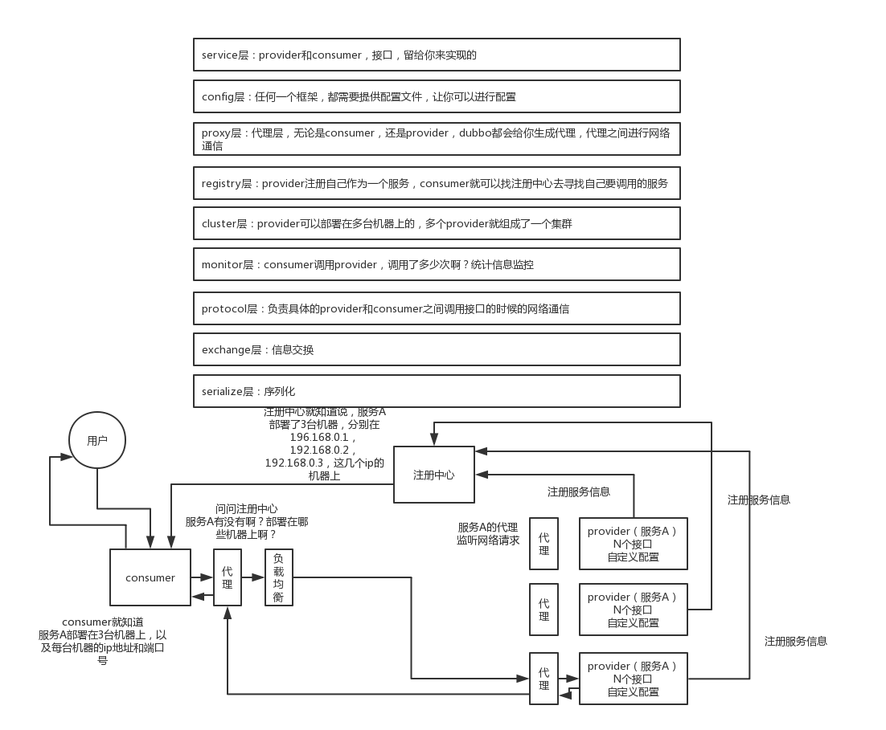{:height 917, :width 1102}
		- （2）注册中心挂了可以继续通信吗？
			- 可以，因为刚开始初始化的时候，消费者会将提供者的地址等信息拉取到本地缓存，所以注册中心挂了可以继续通信
- ## 34_dubbo都支持哪些通信协议以及序列化协议？
- ## 35_dubbo支持哪些负载均衡、高可用以及动态代理的策略？
- ## 36_SPI是啥思想？dubbo的SPI机制是怎么玩儿的？
- ## 37_基于dubbo如何做服务治理、服务降级以及重试？
- ## 38_分布式系统中接口的幂等性该如何保证？比如不能重复扣款？
- ## 39_分布式系统中的接口调用如何保证顺序性？
- ## 40_如何设计一个类似dubbo的rpc框架？架构上该如何考虑？
- ## 41_说说zookeeper一般都有哪些使用场景？
- ## 42_分布式锁是啥？对比下redis和zk两种分布式锁的优劣？
- ## 43_说说你们的分布式session方案是啥？怎么做的？
- ## 44_了解分布式事务方案吗？你们都咋做的？有啥坑？
- ## 45_说说一般如何设计一个高并发的系统架构？
- ## 46_体验一下面试官对于分库分表这个事儿的一个连环炮
- ## 47_来来来！咱们聊一下你们公司是怎么玩儿分库分表的？
- ## 48_你们当时是如何把系统不停机迁移到分库分表的？
- ## 49_好啊！那如何设计可以动态扩容缩容的分库分表方案？
- ## 50_一个关键的问题！分库分表之后全局id咋生成？
- ## 51_说说MySQL读写分离的原理？主从同步延时咋解决？
- ## 52_如何设计高可用系统架构？限流？熔断？降级？什么鬼！
-
- # 2. 分布式系统
	-
-
- # 3. 高并发架构
-
- # 4. 高可用架构