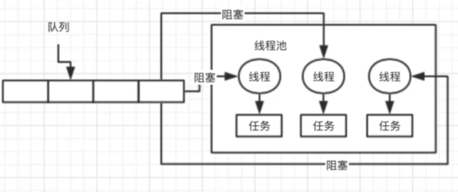

# 开篇词
collapsed:: true
	- ## 01、先一起来看看阿里、美团、滴滴、京东等一线大厂的面试真题
	  collapsed:: true
		- 一般大厂怎么问？
		- redis连环炮、mq连环炮、dubbo连环炮、分布式连环炮、elasticsearch连环炮
		-
		- Java并发连环炮、mysql连环炮、网络连环炮、JDK集合连环炮、jvm连环炮、spring源码连环炮、tomcat连环炮、linux连环炮、系统设计连环炮、生产实践连环炮
		-
		- 互联网Java工程师面试突击第一季
		-
		- 反过来去考虑一下，站在一个公司面试官的角度，你会怎么去考察候选人呢？
		-
		- 主要就是用dubbo来写的，mysql分库分表 -> 不匹配
		-
		- 三轮面试 -> 考察各种技术广度，技术基础 -> 考察一下技术的深度，还有项目经验 -> 看看你聊聊人生和理想，综合性的考察，技术到项目 -> HR，学历，履历，薪资
	- ## 02、面试突击第一季、第二季以及第三季各自的侧重点是什么？
	  collapsed:: true
		- 面试突击第一季：2018年的4月份，在全网免费公开的
		-
		- 面试突击第二季：2019年的8月份，在我的几个好朋友的公众号，儒猿技术窝，我在上面发售的一季课程，《互联网Java工程师面试训练营（分布式篇）》
		-
		- 面试突击第三季：2019年的12月初，我同样是在儒猿技术窝（公众号）上发售的
		-
		- redis连环炮、mq连环炮、dubbo连环炮、分布式连环炮、elasticsearch连环炮
		-
		- Java并发连环炮、mysql连环炮、网络连环炮、JDK集合连环炮、jvm连环炮、spring源码连环炮、tomcat连环炮、linux连环炮、系统设计连环炮、生产实践连环炮
		-
		- 面试突击第一季：面试官基本上是必考，而且会问很多比较实践性的一些问题
		-
		- 面试突击第二季：针对分布式架构这个专题，做了一个专题性的讲解，偏重于一些生产上的一些实践问题，展开性的、带一点点小深度、带一些生产实践的问题，基本上都是很多同学出去面试，回来问我
		-
		- 你们有几台服务器，都是什么配置的，每个服务部署几台机器，多少访问量，为什么要如此部署，类似这样的一些问题还是比较多的
		-
		- 面试突击第三季：对于每一个小专题，我们都会挑选几个最最高频的问题出来，给大家来讲解一下，尤其是并发、mysql优化、jvm优化，一些常规性的问题
		-
		- 分布式专题、微服务专题、海量数据专题、高性能专题、高并发专栏、高可用专题
		-
		- 救火队队长，《从0开始带你成为JVM实战高手》，将近3000个人买了这个专栏
		-
		- 原子弹大侠，《从0开始带你成为消息中间件实战高手》，将近1500个人买了这个专栏，用故事的手法引入，专门MQ这个技术，RocketMQ，项目里的技术问题场景切入，集群部署和运维管理，核心原理以及初步的使用，底层原理的剖析，高阶功能的案例实战，生产优化实践
		-
		- 救火队队长，2019年12月底，《从0开始带你成为MySQL优化实战高手》，文字专栏
		-
		- 面试突击系列，面试突击第四季，第五季，第六季，第七季，都会从每个专题抽取一些最新、最热门、最流行、现在面试最常问、最基础、大家最需要掌握的一些高频的问题和知识点，组成一季
		-
		- 间歇性的，偶尔出一个其他讲某个技术的小视频课程
	- ## 03、来看几个并发、JVM和MySQL的面试连环炮
	- ## 04、学习完三季面试突击课程之后，你能拿下什么样的Offer？
	  collapsed:: true
		- 从技术角度而言：技术广度（面试突击一二三季）、技术深度（阅读源码、项目深度、开源社区）、项目经验（2C、2B、政企、金融、电信、CRUD）、架构设计（负责过的架构有多大，你能设计多大多复杂的架构）、基础知识（数据结构和算法、计算机组成原理、操作系统、网路协议）
		-
		- 从综合角度而言：管理能力，学历，履历，软素质（表达能力、沟通能力、团队协作、价值观、性格），薪资要求
		-
		- 面试突击三季都学完 + 自己在面试过程中如果发现有一些问题是自己不会，要额外看一些书籍、或者别的课程、或者别的资料做一些补充
		-
		- 学历是211的本科、软素质、履历（之前就待过较为知名的公司），进BAT都可以
		-
		- 学历不是太出彩，软素质也较为一般，履历都是在一些小公司，起码就是说帮你面试中小型公司拿下offer，绝对是有很大的帮助的
		-
		- 学历不错，211、985之类的，软素质一般，履历之前反而是在国企、小公司，技术还可以，可能可以进一个独角兽企业
		-
		- 一线城市，20k+，20多k都是可以的
		- 二线城市，十多k是可以的
		-
	- ## 05、除了学习面试突击课程之外，为了面试你还应该做哪些准备呢？
	  collapsed:: true
		- 面试，比较多的一些新的热门和行情，无法涉及到
		-
		- 数据结构和算法，知识付费的平台，文字专栏、视频课程，踏踏实实的找两个专栏或者课程，都学好了，出去面试
		-
		- 在业务这块，DDD，领域驱动进行业务模型的设计，BAT大厂，美团之类的大厂，都在用DDD做复杂业务的设计，比较难，找到好的资料
		-
		- 目前得益于很多的一些在线教育机构，会把spring源码作为核心去讲解，外面很多公司都会拷问你的spring源码有没有读过，把这个spring源码自己找一些书籍，去看一下，做一点积累
		-
		- 设计秒杀系统，大路货，网上的文章和资料太多了
		-
		- 紧跟行业趋势和热点走向，平时多看一些书，多做一些积累，狸猫技术窝，大白话的视频课程，文字专栏，几十篇干货文章，几千个字，大白话一些，专栏设计出来一些别的地方没有的一些实战性的内容
- # Java集合包
  collapsed:: true
	- ## 06、为什么在Java面试中一定会深入考察HashMap？
	  collapsed:: true
		- HashMap的深入考察，必然是面试中的一个核心的点
		- 都是写Java代码，基于Java都是来构建各种各样的系统的，软件的，基于Java写出来一大堆的代码，可能会访问很多其他的东西，数据库，缓存，消息中间件，核心还是来写Java代码实现一些逻辑的运转
		- 接收到一个请求，可能会创建一些数据结构，来存放一些数据，做一些循环、跳转、判断、加加减减，数据处理，逻辑，通过一大堆的逻辑就可以完成一些系统功能，或者是软件的功能
		- HashMap，数据结构，进行一定的逻辑的处理
		- 一句话总结：你是Java工程师，你写代码的时候必然会用到一些数据结构，其中尤为经典的就是HashMap，别人必然会考察你
	- ## 07、你知道HashMap底层的数据结构是什么吗？
	  collapsed:: true
		- 数组+最简单的原理
		- ```java
		  HashMap<String, String> map = new HashMap<String, String>();
		  map.put(“张三”, “测试数据”);
		  map.put(“李四”, “测试数据”);
		  {
		  “张三”: “测试数据”,
		   “李四”: “测试数据”  
		  }
		  ```
		- 底层最核心的数据结构并不是你想的这样的
		- 底层最核心的数据结构是数组
		- 对张三计算出来一个hash值，根据这个hash值对数组进行取模，就会定位到数组里的一个元素中去
		- ```apl
		  [<>, <>, <>, <>,<张三, 测试数据>, <>,<>,<李四, 测试数据>,<>, <>, <>, <>,<>, <>, <>, <>]
		  ```
		- 假设可以放16个元素，取模，index
		- ```java
		  array[4] = <张三, 测试数据>
		  map.get(“张三”) -> hash值 -> 对数组长度进行取模 -> return array[4]
		  ```
	- ## 08、JDK 1.8中对hash算法和寻址算法是如何优化的？
	  collapsed:: true
		- hash & (n-1) 和n取模,效果一样(要求数组的长度是2的n次方),但与运算性能好
		- 低16位融合了高16位和低16位的特征,避免了hash冲突
		- ```
		  map.put(“张三”, “测试数据”)
		  ```
		- 对“张三”这个key计算他的hash值，是有一定的优化的，hash算法优化（相当于==高16位和低16位进行异或==，高16位不变，使其低16位融合了高16位的信息）：
		- ```
		  // JDK 1.8以后的HashMap里面的一段源码
		  static final int hash(Object key) {
		  int h;
		  return (key == null) ? 0 : (h = key.hashCode()) ^ (h >>> 16);
		  }
		  ```
		- 比如说：
		- ```
		  // 有一个key的hash值
		  1111 1111 1111 1111 1111 1010 0111 1100
		  
		  // 右移16位（相当于高16位推到了低16位）
		  0000 0000 0000 0000 1111 1111 1111 1111
		  
		  // 异或运算(得到的结果高16位没有变)
		  1111 1111 1111 1111 0000 0101 1000 0011
		  
		  // 转换成int值，因为int的二进制是32位的
		  ```
		-
		- hash值一样 -> 他们其实都会在数组里放在一个位置，进行复杂的hash冲突的处理
		- [16个元素] -> hash值对数组长度取模，定位到数组的一个位置，塞进去就ok了
		- ==高低16位都参与运算==
		- **寻址算法优化**
		- `(n - 1) & hash -> 算出数组里的一个位置`
		- 如：
		- ```
		  // 没有经过优化的hash值
		  1111 1111 1111 1111 1111 1010 0111 1100
		  // n - 1
		  0000 0000 0000 0000 0000 0000 0000 1111
		  // 经过优化和二进制位运算的新的hash值
		  1111 1111 1111 1111 0000 0101 1000 0011
		  ```
		- 取模运算，他是性能比较差一些，为了优化这个数组寻址的过程
		- hash & (n - 1) -> 效果是跟hash对n取模，效果是一样的，但是与运算的性能要比hash对n取模要高很多，数学问题，数组的长度会一直是2的n次方，只要他保持数组长度是2的n次方
		- hash对n取模的效果 -> hash & (n - 1)，效果是一样的，后者的性能更高
		- 1111 1111 1111 1111 1111 1010 0111 1100（没有经过优化的hash值）
		- 0000 0000 0000 0000 0000 0000 0000 1111
		- 相当于，经过优化和没有优化得到的hash值与（n-1）进行与运算，高16位之间的与运算，是可以忽略的，核心点在于低16位的与运算，hash值的高16位没有参与到与运算里来啊
		- 假设有两个hash值，将其高16位和低16位进行异或。
		- ```apl
		  1111 1111 1111 1111 1111 1010 0111 1100 -（异或）-> 1111 1111 1111 1111 0000 0101 1000 0011
		  1111 1111 1111 1110 1111 1010 0111 1100 -（异或）-> 1111 1111 1111 1110 0000 0101 1000 0010
		  1111 1111 1111 1111 0000 0101 1000 0011（经过优化和二进制位运算的新的hash值）
		  0000 0000 0000 0000 0000 0000 0000 1111
		  ```
		-
		- 配合起来讲
		- ==hash算法的优化==：
			- 对每个hash值，在他的低16位中，让高低16位进行了异或，让他的==低16位同时保持了高低16位的特征==，尽量避免一些hash值后续出现冲突，大家可能会进入数组的同一个位置
		- ==寻址算法的优化==：
			- 用与运算替代取模，提升性能
	- ## 09、你知道HashMap是如何解决hash碰撞问题的吗？
	  collapsed:: true
		- hash冲突问题，链表+红黑树，O(n)和O(logn)
		- ```apl
		  map.put和map.get -> hash算法优化（避免hash冲突），寻址性能优化
		  ```
		- 算出key的hash值，到数组中寻址，找到一个位置，把key-value对放进数组，或者从数组里取出来
		- 两个key，多个key，他们算出来的hash的值，与n-1，与运算之后，发现定位出来的数组的位置还是一样的，hash碰撞，hash冲突
		- ```apl
		  [<> -> <> -> <>, ]
		  ```
		- array[0]这个位置，就是一个链表
		- 会在这个位置挂一个链表，这个链表里面放入多个元素，让多个key-value对，同时放在数组的一个位置里
		- get，如果定位到数组里发现这个位置挂了一个链表，此时遍历链表，从里面找到自己的要找的那个key-value对就可以了
		- 假设你的链表很长，可能会导致遍历链表，性能会比较差，O(n)
		- 优化，如果链表的长度达到了一定的长度之后，其实会把链表转换为红黑树，遍历一颗红黑树找一个元素，此时O(logn)，性能会比链表高一些
	- ## 10、说说HashMap是如何进行扩容的可以吗？
	  collapsed:: true
		- 底层是一个数组，当这个数组满了之后，他就会自动进行扩容，变成一个更大的数组，让你在里面可以去放更多的元素
		- 2倍扩容：
		- ```apl
		  [16位的数组，<> -> <> -> <>]
		  [32位的数组，<> -> <>, <>]
		  ```
		-
		- 扩容之后需要进行rehash，因为数组长度变了，得到的索引位置也会变。如：
		- ```apl
		  数组长度=16
		  n - 1：     0000 0000 0000 0000 0000 0000 0000 1111
		  hash1：     1111 1111 1111 1111 0000 1111 0000 0101
		  &运算结果：  0000 0000 0000 0000 0000 0000 0000 0101    = 5（index = 5的位置）
		  
		  n - 1：     0000 0000 0000 0000 0000 0000 0000 1111
		  hash2：     1111 1111 1111 1111 0000 1111 0001 0101
		  &运算结果：  0000 0000 0000 0000 0000 0000 0000 0101 = 5（index = 5的位置）
		  ```
		- 在数组长度为16的时候，他们两个hash值的位置是一样的，用链表来处理，出现一个hash冲突的问题
		- 如果数组的长度扩容之后 = 32，重新对每个hash值进行寻址，也就是用每个hash值跟新数组的length - 1进行与操作
		- ```apl
		  n-1:       0000 0000 0000 0000 0000 0000 0001 1111
		  hash1:     1111 1111 1111 1111 0000 1111 0000 0101
		  &结果:     0000 0000 0000 0000 0000 0000 0000 0101 = 5（index = 5的位置）
		  
		  n-1:       0000 0000 0000 0000 0000 0000 0001 1111
		  hash2:     1111 1111 1111 1111 0000 1111 0001 0101
		  &结果:     0000 0000 0000 0000 0000 0000 0001 0101 = 21（index = 21的位置）
		  ```
		- oldCap：原来的数组长度
		- 判断二进制结果中是否多出一个bit的1，如果没多，那么就是原来的index，如果多了出来，那么就是index + oldCap（如：21 = 5 + 16），通过这个方式，就避免了rehash的时候，用每个hash对新数组.length取模，取模性能不高，位运算的性能比较高
		-
- # Java并发编程
  collapsed:: true
	- ## 11、BAT面试官为什么都喜欢问并发编程的问题？
	  collapsed:: true
		- synchronized 实现原理、CAS 无锁化的原理、AQS 是什么、Lock 锁、CancurentHashMap的分段加锁的原理、线程池的原理、java 内存模型、volatile说一下吗、对java并发包有什么了解?一连串的问题
		-
		- 写一些java web系统，运用一些框架和一些第三方技术，写一些类似于 crud的业务逻辑把各种技术整合一下，写一些crud 而已，没什么技术含量。很多人可能写好几年的代码。都不会用到多少java并发包下面的东西
		-
		- 如果说你要面试一些稍微好一点的公司，技术稍微好一点，你只要去做一个技术含量稍微高一点的系统，并发包下面的东西还是很容易会用到的。
	- ## 12、说说synchronized关键字的底层原理是什么？（基础篇）
	  collapsed:: true
		- 之前有一些同学去一线互联网大厂里去面试，聊并发编程这块的内容，问的比较深一点，就说synchronized 的底层原理是什么呢?他当时就答不出来了
		- ```java
		  // ***********对对象进行加锁***************/
		  // 线程1
		  synchronized(myObject) {
		  	//一大堆的代码
		      synchronized(myObject) {
		  		//一大堆的代码
		  	}
		  }
		  
		  // 线程2
		  synchronized(otherObject) {
		  
		  }
		  
		  // ***********对类进行加锁***************/
		  // 线程3
		  synchronized(otherObject.class) {
		  	//一大堆的代码
		      synchronized(myObject) {
		  		//一大堆的代码
		  	}
		  }
		  
		  // 线程4
		  synchronized(otherObject.class) {
		  
		  }
		  ```
		- 加锁一般来说是对一个对象进行加锁。
		- 如果一个线程第一次 synchronized那里，获取到了 myObject对象的 monitor的锁，计数器加1，然后第二次synchronized 那里，会再次获取 myObject 对象的 monitor的锁，这个就是重入加锁了，然后计数器会再次加1，变成2。
		-
		- 如果我要是对snchronized 往深了讲，他是可以很深很深的，内存屏障的一些东西，cpu之类的硬件级别的原理，原子性、可见性、有序性，指令重排，JDK对他实现了一些优化，偏向锁。
		- 面试突击第三季，快速过一下常见的高频面试题而已。
		-
		- 其实synchronized 底层的原理，是跟jvm指令和monitor有关系的
		- 你如果用到了 synchronized 关键字，在底层编译后的 jm 指令中，会有 monitorenter 和monitorexit 两个指令。
		- ```java
		  monitorenter：加锁
		  //代码对应的指令
		  monitorexit：释放锁
		  ```
		- 那么 monitorenter 指令执行的时候会干什么呢?
		- 每个对象都有一个关联的monitor，比如一个对象实例就有一个monitor,一个类的Class对象也有一个monitor,如果要对这个对象加锁,那么必须获取这个对象关联的 monitor的lock。
		- 
		- 他里面的原理和思路大概是这样的，monitor里面有一个计数器，从0开始的。如果一个线程要获取monitor的锁,就看看他的计数器是不是0,如果是0的话,那么说明没人获取锁他就可以获取锁了，然后对计数器加1。
		-
		- 这个monitor的锁是支持==可重入==加锁的，什么意思呢，好比下面的代码片段
		- ```java
		  synchronized(myObject) {
		  	//一大堆的代码
		      synchronized(myObject) {
		  		//一大堆的代码
		  	}
		  }
		  ```
		- 如果一个线程第一次synchronized那里，获取到了 myObject对象的monitor的锁，计数器加1，然后第二次synchronized那里，会再次获取myObject 对象的monitor的锁，这个就是重入加锁了，然后计数器会再次加1，变成2。
		- 这个时候，其他的线程在第一次sychronized那里，会发现说myObject 对象的monitor锁的计数器是大于0的，意味着被别人加锁了，然后此时线程就会进入 block阻塞状态，什么都干不了，就是等着获取锁。
		- 接着如果出了 synchronized 修饰的代码片段的范围，就会有一个 monitorexit的指令，在底层。此时获取锁的线程就会对那个对象的monitor的计数器减1，如果有多次重入加锁就会对应多次减1，直到最后，计数器是0。
		- 然后后面 block住阻塞的线程，会再次尝试获取锁，但是只有一个线程可以获取到锁。
	- ## 13、能聊聊你对CAS的理解以及其底层实现原理可以吗？（基础篇）
	  collapsed:: true
		- 取值，询问，修改*
		- 多个线程他们可能要访问同一个数据
		- ```java
		  HashMap map = new HashMap();
		  ```
		- 此时有多个线程要同时读写类似上面的这种内存里的数据，此时必然出现多线程的并发安全问题，几个月培训班的同学，都应该知道。
		- 我们可能要用到并发包下面的很多技术，synchronized
		- ```java
		  synchronized(map) {
		  	//对map里的数据进行复杂的读写处理
		  }
		  ```
		- ### 并发包下面的其他的一些技术---CAS
			- ```java
			  public class MyObject{
			    int i = 0;
			    // 对myObject 对象
			    //同一时间，只有一个线程可以进入这个方法
			    public synchronized void increment() {
			      // 在一个对象实例的方法上加 synchronized
			      i++;
			    }
			  }
			  
			  // 多个线程都同时基于 myObject 这一个对象，来执行 increment方法
			  MyObject myObject = new MyObject();
			  myObject.increment();
			  ```
			- 此时，synchronized 他的意思就是针对当前执行这个方法的 myObject对象进行加锁
			- 只有一个线程可以成功的堆 myObject 加锁，可以对他关联的 monitor 的计数器去加1，加锁，一旦多个线程并发的去进行 synchronized 加锁，串行化，效率并不是太高，很多线程都需要排队去执行。
			-
			- ### CAS 的实现原理
			- CAS：compare and set
			- 
			- ==CAS在底层的硬件级别给你保证一定是原子的，同一时间只有一个线程可以执行CAS==。先比较再设置，其他的线程的CAS同时间去执行此时会失败
			- 实现
				- ```java
				  public class MyObject{
				    int i = 0;
				    AutomicInteger i = new AutomicInteger();
				    //多个线程此时来执行这段代码
				    // 不需要synchronized 加锁，也是线程安全的
				    public void increment() {
				      // 在一个对象实例的方法上加 synchronized
				      i.incrementAndGet();
				    }
				  }
				  
				  // 多个线程都同时基于 myObject 这一个对象，来执行 increment方法
				  MyObject myObject = new MyObject();
				  myObject.increment();
				  ```
	- ## 14、ConcurrentHashMap实现线程安全的底层原理到底是什么？
	  collapsed:: true
		- JDK1.8以前，多个数组，分段加锁，一个数组一个锁4
		- JDK 1.8 以后，优化细粒度，一个数组，每个元素进行CAS，如果失败说明有人了，此时synchronized 对数组元素加锁，链表+红黑树处理，对数组每个元素加锁“。
		-
		- 多个线程要访问同一个数据，synchronized 加锁，CAS 去进行安全的累加，去实现多线程场景下的安全的更新一个数据的效果，比较多的一个场景下，可能就是多个线程同时读写一个HashMap。
		-
		- synchronized，也没这个必要，因为HashMap 的一个底层的原理，本身是一个大的一个数组，[有很多的元素]
		- ```java
		  HashMap map = new HashMap();
		  // 多个线程过来，线程1要put的位置是数组[5]，线程2要put 的位置是数组[21]“
		  synchronized(map) {
		    map.putlxXXX,XXX)
		  }
		  ```
		-
		- 明显不好，数组里有很多的元素，除非是对同一个元素执行put操作，此时呢需要多线程是需要进行同步的。JDK 并发包里推出了一个 ConcurrentHashMap,
		  他默认实现了线程安全性。
		- 在JDK1.7以及之前的版本里，分段加锁
			- 数组1,[数组2]，[数组3]-> 每个数组都对应一个锁，分段加锁
			- 多个线程过来，线程1要put的位置是数组1[5]，线程2要put的位置是数组2[21]，他们是不同的锁，互不干扰。
			- 缺点：当多个线程需要操作同一个先数组的时候，还是需要串行起来。
		-
		- JDK1.8 以及之后，做了一些优化和改进，锁粒度的细化
			- [一个大的数组]，数组里每个元素进行put操作，都是有一个不同的锁，刚开始进行put的时候，如果两个线程都是在数组[与]这个位置进行 put,这个时候,对数组[同这个位置进行 put的时候，采取的是CAS的策略
			- 同一个时间，只有一个线程能成功执行这个 CAS，就是说他刚开始先获取一下数组[5]这个位置的值，null，然后执行 CAS，线程1，比较一下，put 进去我的这条数据，同时间，其他的线程执行 CAS，都会失败。
			- 分段加锁，通过对数组每个元素执行 CAS的策略，如果是很多线程对数组里不同的元素执行put，大家是没有关系的。如果其他人失败了，其他人此时会发现说，数组5这位置，如果已经给刚才又人放进去值了，就需要在这个位置基于链表+红黑树来进行处理，synchronized(数组5)，加锁，基于链表或者是红黑树再这个位置插进去自己的数据。
			- 如果你是对数组里同一个位置的元素进行操作，才会加锁串行化处理;如果是对数组不同位置的元素操作，此时大家可以并发执行的
	- ## 15、你对JDK中的AQS理解吗？AQS的实现原理是什么？
	  collapsed:: true
		- AQS，Abstract Queue Synchronizer 抽象队列同步器
		-
		- state 变量 -> CAS -> 失败后进入队列等待 -> 释放锁后唤醒
		- 非公平锁，公平锁
		- 多线程同时访问一个共享数据，可以用这些方式来保证并发安全： sychronized, CAS, ConcurrentHashMap (并发安全的数据结构可以来用)，这些都叫Lock。
		- 和synchronized就有点不一样了，你可以自己上网看一下 => AQS。
		- AQS和Semaphore、其他一些的并发包下的API都有关联关系。
		-
		- ### AQS 原理
			- AQS 本身是一个多线程的同步器，多个线程需要对同一个对象加锁的时候，只有一个线程能获得锁，其余线程会自动加入等待队列。
			- 同一时间只有一个线程能加锁成功
			- 
		- ### 公平锁与非公平锁
			- #### 非公平锁
				- ```java
				  ReentrantLock lock = new ReentrantLack()
				  lock.lock();
				  lock.unlock();
				  ```
				- 线程1执行完了之后，把锁释放，然后通知了线程2。此时线程2还没来得及加锁，线程3突然来了，直接执行CAS，执行成功了。
				- 
			- #### 公平锁
				- 在ReentrantLack的构造器中传入参数true，就会变成公平锁
				- ```java
				  ReentrantLock lock = new ReentrantLack(true)
				  lock.lock();
				  lock.unlock();
				  ```
				- 线程3过来，发现等待队列里已经有线程2了，它会进入队列2
				- 
		-
	- ## 16、说说线程池的底层工作原理可以吗？
	  collapsed:: true
		- 但凡是参加过几个月java 就业培训的同学，都应该知道一个概念，线程池。
		- 系统是不可能说让他无限制的创建很多很多的线程的，会构建一个线程池，有一定数量的线程，让他们执行各种各样的任务，线程执行完任务之后，不要销毁掉自己，继续去等待执行下一个任务。
		-
		- 频繁的创建线程，销毁线程，创建线程，销毁线程，频繁地这样操作很费时也浪费资源。
		-
		- ```apl
		  ExecutorService threadPool = Executors.newFixedThreadPool(10);
		  	threadPool.submit(new Callable() {
		      	public void run(){
		          };
		      }
		  }
		  ```
		-
		- 提交任务，先看一下线程池里的线程数量是否小于 corePoolSize，也就是10，如果小于，直接创建一个线程出来执行你的任务。
		- 如果执行完你的任务之后，这个线程是不会死掉的，他会尝试从一个无界的LinkedBlockingQueue 里获取新的任务，如果没有新的任务，此时就会阻塞住，等待新的任务到来。
		- 你持续提交任务，上述流程反复执行，只要线程池的线程数量小于corePoolSize，都会直接创建新线程来执行这个任务，执行完了就尝试从无界队列里获取任务，直到线程池里有corePoolSize个线程。
		- 
		- 接着再次提交任务，会发现线程数量已经跟 corePoolSize一样大了，此时就直接把任务放入队列中就可以了，线程会争抢获取任务执行的，如果所有的线程此时都在执行任务，那么无界队列里的任务就可能会越来越多。
		-
		- fixed，队列，LinkedBlockingQueue，无界阻塞队列。
	- ## 17、那你再说说线程池的核心配置参数都是干什么的？平时我们应该怎么用？
	  collapsed:: true
		- ### newFixedThreadPool(3)
			- Fixed线程池的maxCorePoolSize和corePoolSize是一样大的。代表线程池的类是 ThreadPoolExecutor
			- {:height 257, :width 650}
			- 创建一个线程池就是这样子的，corePoolSize,maximumPoolSize，keepAliveTime,gueue这几个东西，如果你不用fixed之类的线程池，自己完全可以通过这个构造函数就创建自己
			  的线程池。
			- 比如说：
				- ```javascript
				  corePoolSize : 3
				  maximumPoolSize : 200
				  keepAliveTime: 60
				  queue: new ArrayBlockingQueue<Runnablez(200)
				  ```
			- 如果说你把 queue 做成有界队列，比如说 new ArrayBlockingQueue<Runnable>(200), 那么假设 corePoolSize 个线程都在繁忙的工作，大量任务进入有界队列。
				- 
			- 如果==队列满了==，此时怎么办？这个时候假设你的maximumPoolSize 是比 corePoolSize 大的，此时会继续创建额外的线程放入线程池里，来处理这些任务，然后超过 corePoolSize 数量的线程如果处理完了一个任务。这些额外的线程也会尝试从队列里去获取任务来执行。
				- 
			- 额外的线程会自己到队列里获取任务进行处理，如果队列里的任务处理完了，额外的线程可以存活keepAliveTime的时间，然后自己把自己销毁掉。
				- 
			- 如果额外线程都创建完了去处理任务，队列还是满的，此时还有新的任务来怎么办?只能reject 掉，他有几种 reject策略，可以传入RejectedExecutionHandler。
			- (1)AbortPolicy (2)DiscardPolicy (3)DiscardOldestPolicy (4)CallerRunsPolicy (5)自定义4
			- 如果后续慢慢的队列里没任务了，线程空闲了，超过corePoolSize的线程会自动释放掉，在keepAliveTime 之后就会释放。
	- ## 18、如果在线程中使用无界阻塞队列会发生什么问题？
	  collapsed:: true
		- 面试题:在远程服务异常的情况下，使用无界阻塞队列，是否会导致内存异常飙升?
		- 调用超时，队列变得越来越大，此时会导致内存飙升起来，而且还可能会导致你会 OOM内存溢出。
		- 
	- ## 19、你知道如果线程池的队列满了之后，会发生什么事情吗？
	  collapsed:: true
		- 用无界队列内存资源溢出
		- 有界队列，可以避免内存溢出。但是如果无限制地让它创建线程，也会导致cpu 负载高，也会把内存耗尽。
		- ```java
		  corePoolSize: 10
		  maximumPoalSize : Integer,MAXVALUE
		  ArrayBlockingOueue(200)
		  ```
		- 你可以无限制的不停的创建额外的线程出来，一台机器上，有几千个线程，甚至是几万个线程，每个线程都有自己的栈内存，占用一定的内存资源，会导致内存资源耗尽，系统也会崩
		  溃掉。
		- 即使内存没有崩溃，会导致你的机器的 cpu load，负载特别的高。
		-
		- 建议：
			- 自定义一个 reject策略，如果线程池无法执行更多的任务了，此时建议你可以把这个任务信息持久化写入磁盘里去，后台专门启动一个线程，后续等待你的线程池的工作负载降低了
			  他可以慢慢的从磁盘里读取之前持久化的任务，重新提交到线程池里去执行。
	- ## 20、如果线上机器突然宕机，线程池的阻塞队列中的请求怎么办？
	  collapsed:: true
		- 必然会导致==线程池里积压的==任务实际上来说都是会丢失的。
		  id:: 67bb4fc1-4893-418d-bd64-8e9536a09fbf
		- 如果说你要提交一个任务到线程池里去，在提交之前，麻烦你先在数据库里插入这个任务的信息，更新他的状态:未提交、已提交、已完成。提交成功之后，更新他的状态是已提交状态。
		- 系统重启，后台线程去扫描数据库里的未提交和态的任务，可以把任务的信息读取出来，重新提交到线程池里去，继续进行执行。
	- ## 21、谈谈你对Java内存模型的理解可以吗？
	  collapsed:: true
		- read、 Ioad、 use、assign、store、 write。
		- {:height 387, :width 1179}
		- ```java
		  public class HelloWorld {
		    private int data = 0;
		    
		    public void increment() {
		      data++;
		    }
		  }
		  
		  HelloWorld hello = new HelloWorld(); // 对象其实是在堆内存里，包含实例变量
		  // 线程1
		  new Thread() {
		    public void run() {
		      helloWorld.increment();
		    }
		  }.start();
		  
		  // 线程2
		  new Thread() {
		    public void run() {
		      helloWorld.increment();
		    }
		  }.start();
		  ```
		-
	- ## 22、你知道Java内存模型中的原子性、有序性、可见性是什么吗？
	  collapsed:: true
		- 连环炮: Java 内存模型 -> 原子性、可见性、有序性 -> volatile -> happens-before/ 内存屏障
		- ### 并发编程过程中可能会产生的三类问题
			- #### 可见性
				- 之前一直给大家代码演示，画图演示，其实说的就是并发编程中可见性问题。
				- 没有可见性：
					- 线程1已经更新主内存了，但是线程2看不见，就是没有可见性
					- ```java
					  private int data = 0;
					  new Thread() {
					    public void run() {
					      data++;
					    }
					  }.start();
					  
					  new Thread() {
					    public void run() {
					      while (data == 0) {
					        Thread.sleep(1000);
					      }
					    }
					  }.start();
					  ```
					- 
				- 有可见性
					- 线程1更新完成之后，强制线程2到主内存里去读取数据。
					- ```java
					  private volatile int data = 0;
					  new Thread() {
					    public void run() {
					      data++;
					    }
					  }.start();
					  
					  new Thread() {
					    public void run() {
					      while (data == 0) {
					        Thread.sleep(1000);
					      }
					    }
					  }.start();
					  ```
					- 
			- #### 原子性
				- 用这个java内存模型和多线程的场景，以 i++的简单操作，给大家来画图分析一下。对于一个i++的操作，只要是多个线程并发运行来执行这行代码，其实的话，他都是不保证
				  原子性的，如果保证原子性的，第一个线程i++，i=1；第二个线程，i++，i=2；经常在网上看到，有人就是 volatile，第一句话，volatile是轻量级的锁，或者是轻量级同步
				  机制，拍死。
				- 锁是什么？volatile 是轻量级的锁，误导了无数的工程师，锁那个方向去发展，开始误解volatile，i+，还有一些基本的操作，可以保证线程的并发访问的安全性。
				-
				- 没有原子性
					- 同一时刻有多个线程在操作data，线程1还没执行完，另一个线程2也在执行。
					- 
				- 有原子性
					- data++必须是独立执行的，没有人影响我的，一定是我自己执行成功之后，别人才能来进行下一次 data++的执行
			- #### 有序性
				- 对于代码，同时还有一个问题是指令重排序，编译器和指令器，有的时候为了提高代码执行效率，会将指令重排序，就是说比如下面的代码：
				- ```java
				  // 线程1
				  prepare(); //准备资源
				  flag = true;
				  
				  // 线程2
				  while(!flag) {
				    Thread.sleep(1000);
				  }
				  execute(); // 基于准备好的资源执行操作
				  ```
				- 重排序之后，让fag=true先执行了，会导致线程2直接跳过while等待，执行某段代码结果 prepare(方法还没执行，资源还没准备好呢，此时就会导致代码逻辑出现异常。
				- ```java
				  // 线程1
				  flag = true;
				  prepare(); //准备资源
				  // 线程2
				  while(!flag) {
				  Thread.sleep(1000);
				  }
				  execute(); // 基于准备好的资源执行操作
				  ```
				- 具备有序性，不会发生指令重排导致我们的代码异常;不具备有序性，可能会发生一些指令重排，导致代码出现异常。
			-
		-
	- ## 23、能聊聊volatile关键字的原理吗？
	  collapsed:: true
		- 内存模型->原子性、可见性、有序性 ->volatile
		- 讲清楚volatile关键字，直接问你 volatile关键字的理解，对前面的一些问题，这个时候你就应该自己去主动从内存模型开始讲起，原子性、可见性、有序性的理解，volatile 关键字的
		  原理
		- volatile 关键字是用来解决可见性和有序性，在有些罕见的条件之下，可以有限的保证原子性，他主要不是用来保证原子性的
		- ```java
		  private volatile int data = 0;
		  new Thread() {
		    public void run() {
		      data++;
		    }
		  }.start();
		  
		  new Thread() {
		    public void run() {
		      while (data == 0) {
		        Thread.sleep(1000);
		      }
		    }
		  }.start();
		  ```
		- 
		- 
		- 可见性，概念进行了加强和深化，volatile在可见性上的作用和原理，有一个很清晰的了解*
		- 在很多的开源中间件系统的源码里，大量的使用了 volatlie，每一个开源中间件系统，或者是大数据系统，都多线程并发，都会用到volatile。
		- ```java
		  public class Kafka {
		    private volatile boolean running = true;
		    public static void main() {
		      // 启动kafka、rocketMQ，会运行一大堆代码，不能直接退出
		      public void shutdown() {
		        // 关闭这个系统了，shutdown.sh脚本，来调用shutdown这个接口
		        running = false;
		      }
		    }
		  }
		  
		  Kafka kafka = new Kafka();
		  while (kafka.running) {
		    Thread.spleep(1000);
		  }
		  ```
	- ## 深入讲解 volatile关键字的说明【深入到硬件级别】
	- ## 24、你知道指令重排以及happens-before原则是什么吗？
	- ## 25、volatile底层是如何基于内存屏障保证可见性和有序性的？
- # Spring
  collapsed:: true
	- ## 26、说说你对Spring的 IOC 机制的理解可以吗？
	  collapsed:: true
		- spring核心框架里面，最关键的两个机制,就是ioc和aop。
		- ### IoC
			- 根据xml配置或者注解，去实例化我们所有的bean，管理bean之间的依赖注入，让类与类之间解耦，维护代码的时候可以更加的轻松便利。
			- spring已经管理了我们代码里所有的这个类的对象实例，bean。
		- ### AOP
		  collapsed:: true
			- 假设有如下两个类及其方法如下：
			  collapsed:: true
				- ```java
				  @Service
				  public class MyServiceA {
				    public void doServiceA() {
				      // insert 语句
				      // update 语句
				      // update 语句
				      // delete 语句
				    }
				  }
				  
				  @Service
				  public class MyServiceB {
				    public void doServiceB() {
				      // update 语句
				      // update 语句
				      // insert 语句
				    }
				  }
				  ```
			- #### 事务
			  collapsed:: true
				- mysql数据库里都提供一个事务机制，我们如果开启一个事务，在这个事务里执行多条增删改的sql语句。这个过程中，如果任何一个sql语句失败了，会导致这个事务的回滚，把其他sql做的数据更改都恢复回去。
				- 加上事务后，代码如下：
				- ```java
				  @Service
				  public class MyServiceA {
				    public void doServiceA() {
				      // 开启事务
				      
				      // insert 语句
				      // update 语句
				      // update 语句
				      // delete 语句
				      
				      // 如果有任何一个语句失败了，回滚事务。如果大家都成功了，则提交事务
				    }
				  }
				  
				  @Service
				  public class MyServiceB {
				    public void doServiceB() {
				      // 开启事务
				      
				      // update 语句
				      // update 语句
				      // insert 语句
				      
				      // 如果有任何一个语句失败了，回滚事务。如果大家都成功了，则提交事务
				    }
				  }
				  
				  
				  
				  @Service
				  public class MyServiceBImpl implements MyServiceB {
				    public void doServiceB() {
				      // update 语句
				      // update 语句
				      // insert 语句
				    }
				  }
				  ```
			- #### 优化
			  collapsed:: true
				- 事务这个操作其实是通用的，很多方法可能都需要回滚这个操作，如果每个方法里都去写提交事务或者回滚事务这个操作，每次都去写重复的代码的话，不优雅。
				- Spring AOP机制出马了。他有几个概念，可以做一个切面，语法、用法、术语和概念,完整、详细的了解,上网再去搜一些资料。思路如下：
				- 做一个切面,如何定义呢?MyServiceXXXX的这种类，在这些类的所有方法中，都去织入一些代码，在所有这些方法刚开始运行的时候,都先去开启一个事务,在所有这些方法运行完
				  毕之后，去根据是否抛出异常来判断一下，如果抛出异常,就回滚事务；如果没有异常，就提交事务。
				- spring 在运行的时候，会使用动态代理技术。AOP的核心技术，就是动态代理。Spring会给你的那些类生成动态代理
				- ```java
				  @Service
				  public class MyServiceAImpl implements MyServiceA {
				    public void doServiceA() {
				      // insert 语句
				      // update 语句
				      // update 语句
				      // delete 语句
				    }
				  }
				  
				  public class ProxyMyServiceA implements MyServiceA {
				    private MyServiceAImpl myServiceA;
				    
				    public void doServiceA() {
				      // 开启事务
				      //直接调用依赖的MyServiceA对象的方法
				      myServiceA.doServiceA();
				      // 根据他是否抛出异常，回滚事务，or，提交事务
				    }
				  }
				  
				  @Controller
				  public class MyController {
				    @Resource
				    private MyServiceA myServiceA; // 注入的是动态代理的对象实例，ProxyMyServiceA
				    
				    public void doServiceA() {
				      // 直接调用动态代理的对象实例的方法
				    }
				  }
				  ```
				-
			- 总结：
				- 假如有多个类都实现了一个接口，他们里面可能都要加事务。事务的代码都是重复的，这时可以把重复的代码都抽象出来，定义一个切面。然后这个切面针对符合某些要求的类，去织入一些增强代码，这里的增强代码就是开启、提交、回滚事务。在真正运行的时候，Spring会针对需要增强的类去生成动态代理，由动态代理去实现增强和调用业务代码。所谓的动态代理，在这个代理类里会注入增强类，然后实现和增强类一样的方法，然后在方法里织入增强代码。
				- 建议大家看完这个视频，自己百度一下，spring aop代码示例，基于spring aop切面如何来做，如何来定义增强的代码，如何来限定对哪些类的哪些方法进行增强。
			-
		-
	- ## 27、说说你对Spring的AOP机制的理解可以吗？
	  collapsed:: true
		- 比如在我们的一个 tomcat+servlet 的这样的一个很low的系统里，有几十个地方，都是直接用 `MyService myService = new MyServiceImpl()` ，直接创建、引用和依赖了一个 MyServicelmpl
		  这样的一个类的对象。
		- 我们这个low系统里，有几十个地方，都跟MyServicelmpl类直接耦合在一起了。我现在不想要用MyServicelmpl了，我们希望用的是 NewServiceManagerlmpl, implements
		  MyService 这个接口的所有的实现逻辑都不同了，此时我们很麻烦，我们需要在很low的系统里，几十个地方，都去修改对应的MySemicelmpl这个类，切换为
		  NewSericeManagerlmpl 这个类。
		- 改动代码成本很大，改动完以后的测试的成本很大，改动的过程中可能很复杂，出现一些bug，此时就会很痛苦，归根结底，代码里，各种类之间完全耦合在一起，出现任何一丁点
		  的变动，都需要改动大量的代码，重新测试，可能还会有bug。
		- 然后就出现了Spring IOC框架，控制反转，依赖注入。
	- ## 28、了解过cglib动态代理吗？他跟jdk动态代理的区别是什么？
	  collapsed:: true
		- 优先是jdk动态代理，其次是cglib动态代理,网上搜一下两种动态代理的代码示例。
		- 其实就是动态的创建一个代理类出来，创建这个代理类的实例对象，在这个里面引用你真正自己写的类,所有的方法的调用,都是先走代理类的对象,他负责做一些代码上的增强，再
		  去调用你写的那个类。
		- spring里使用aop，比如说你对一批类和他们的方法做了一个切面，定义好了要在这些类的方法里增强的代码，spring必然要对那些类生成动态代理,在动态代理中去执行你定义的一
		  些增强代码。
		- 如果你的类是实现了某个接口的，spring aop会使用jdk动态代理，生成一个跟你实现同样接口的一个代理类，构造一个实例对象出来。jdk动态代理，他其实是在你的类有接口的时候，就会来使用。
		- 很多时候我们可能某个类是没有实现接口的，spring aop会改用cgib来生成动态代理，他是生成你的类的一个子类,他可以动态生成字节码，覆盖你的一些方法，在方法里加入增强的代码。
		- 百度：jdk动态代理代码示例,cglib动态代理代码示例
	- ## 29、额外加餐：能说说Spring中的Bean是线程安全的吗？
	  collapsed:: true
		- 答案是否定的，绝对不可能是线程安全的，spring bean默认来说，singleton，都是线程不安全的，java web系统，一般来说很少在java bean里放一些实例变量，一般来说他们都是多个组件相互调用，最终去访问数据库。
		- Spring容器中的bean可以分为5个范围：
		- (1) singleton：默认,每个容器中只有一个bean的实例
		- (2) prototype：为每一个bean请求提供一个实例
		- (3) request：为每一个网络请求创建一个实例,在请求完成以后后,bean会失效并被垃圾回收器回收
		- (4) session：与request范围类似,确保每个session中有一个bean的实例,在session过期后,bean会随之失效
		- (5) global-session
		- {:height 294, :width 740}
		- {:height 543, :width 760}
		- ```java
		  @Service
		  public class My
		  ```
	- ## 30、Spring的事务实现原理是什么？能聊聊你对事务传播机制的理解吗？
	  collapsed:: true
		- Spring ioc和aop， 动态代理技术，bean的线程安全问题，事务问题。
		- 事务的实现原理，事务传播机制，如果说你加了一个@Transacticonal注解，此时就spring会使用AOP思想，对你的这个方法在执行之前，先去开启事务，执行完毕之后，根据你方法
		  是否报错，来决定回滚还是提交事务。
		- ```Java
		  @Transactional(propagation = Propagation.REQUIRED)
		  public void methodA() {
		    methodA();
		    // do something
		  }
		  
		  @Transactional(propagation = Propagation.REQUIRED)
		  public void methodB() {
		    // do something
		  }
		  
		  //开启一个事务
		  //执行方法A的代码,接着执行方法B的代码
		  //提交或者回滚事务
		  ```
		- ### 事务的传播机制
			- PROPAGATION_REQUIRED：如果当前没有事务，就创建一个新事务；如果当前存在事务，就加入该事务，该设置是最常用的设置。
			  logseq.order-list-type:: number
			- PROPAGATION_SUPPORTS：支持当前事务，如果当前存在事务，就加入该事务；如果当前不存在事务，就以非事务执行。
			  logseq.order-list-type:: number
			- PROPAGATION_MANDATORY：支持当前事务，如果当前存在事务，就加入该事务；如果当前不存在事务，就抛出异常。
			  logseq.order-list-type:: number
			- PROPAGATION_REQUIRES_NEW：创建新事务，无论当前存不存在事务，都创建新事务。
			  logseq.order-list-type:: number
			- PROPAGATION_NOT_SUPPORTED：以非事务方式执行操作，如果当前存在事务，就把当前事务挂起。
			  logseq.order-list-type:: number
			- PROPAGATION_NEVER：以非事务方式执行，如果当前存在事务，则抛出异常。
			  logseq.order-list-type:: number
			- PROPAGATION_NESTED：如果当前存在事务，则在嵌套事务内执行。如果当前没有事务，则按REQUIRED属性执行。嵌套事务的外层的事务如果回滚，会导致内层的事务也回滚；但是内层的事务如果回滚，仅仅是回滚自己的代码。
			  logseq.order-list-type:: number
	- ## 31、额外加餐：能画一张图说说Spring Boot的核心架构吗？
	  collapsed:: true
		- spring的时候,带一下spring boot,有时候出去面试,也会问到spring boot,提的一个点,springboot启动的时候一个流程图，本身他是Spring这个项目发展到一定阶段之后的一个产物。
		- spring框架，mybatis,spring mvc，去做一些开发，打包部署到线上的tomcat里去，tomcat启动了，他就会接收http请求，转发给spring mvc框架，调用controller -> service -> dao
		  ->mybatis(sql语句)
		-
	- ## 32、额外加餐：能画一张图说说Spring的核心架构吗？
	- ## 33、能说说Spring中都使用了哪些设计模式吗？
	- ## 34、额外加餐：能画一张图说说Spring Web MVC的核心架构吗？
	- ## 35、额外加餐：能画一张图说说Spring Cloud的核心架构吗？
- # JVM
	- ## 36、JVM中有哪几块内存区域？Java 8之后对内存分代做了什么改进？
	  collapsed:: true
		- 执行我们的一些对象的方法，执行代码的时候肯定会有很多的线程，tomcat里就有很多自己的工作线程，去执行我们写的代码，每个工作线程都会有有自己的一块数据结构：栈内存,
		  这个里面是存放一些东西。
		- java8以后的内存分代的改进，永久代里放了一些常量池+类信息，常量池->堆里面，类信息 -> metaspace(元区域)
		- {:height 309, :width 422}
	- ## 37、你知道JVM是如何运行起来的吗？我们的对象是如何分配的？
	  collapsed:: true
		- 比如说我们有一个类里面包含了一个main方法，你去执行这个main方法。此时会启动一个jvm进程，他会默认就会有一个main线程。这个main线程就负责执行这个main方法的
		  代码，进而创建各种对象。
		- tomcat也是一样， 类都会加载到jvm里去，spring容器而言都会对我们的类进行实例化成bean，有工作线程会来执行我们的bean实例对象里的方法和代码，进而也会创建其他的各种对象,
		  实现业务逻辑。
		- ```javascript
		  public void doRequest() {
		    MyService myService = new MyService();
		    myService.doService();
		  }
		  ```
		- {:height 784, :width 1032}
	- ## 38、说说JVM在哪些情况下会触发垃圾回收？
	  collapsed:: true
		- 我们的jvm的内存其实是有限制的，不可能是无限的，昂贵的资源。2核4G的机器，堆内存也就2GB左右，4核8G的机器，堆内存可能也就4G左右，栈内存也需要空间，metaspace 区域放类信息也需要空间。
		- 在JVM里必然有一个内存分代模型，年轻代和老年代统称为堆。
		- 比如说给年轻代一共是2GB内存，给老年代是2GB内存，默认情况下eden和2个s的比例：8:1:1。eden是1.6GB,S是0.2GB。
		- 如果说eden区域满了，此时必然触发垃圾回收，young gc，简写：ygc。
		- 谁是可以回收的垃圾对象呢？就是没有人引用的对象就是垃圾对象。
		- {:height 676, :width 483}
		- 年轻代
			- Eden区满的时候，就会出发young gc。此时除了类的引用对象和类的静态变量（因为如果我这个类还在被引用，但是类里的静态变量被回收了，肯定不行）不能被回收，其余基本都能被回收。
		- 老年代
			-
	- ## 39、说说JVM的年轻代垃圾回收算法？对象什么时候转移到老年代？
		- 如果说你让代码一边运行，一边有变动，一边判断哪些对象是可以回收的，这个是不现实的。
		- 垃圾回收的时候有一个概念，叫做stop the world，停止你的jvm里的工作线程的运行，然后扫描所有的对象，判断哪些可以回收,哪些不可以回收的。
		- 年轻代，大部分情况下，对象生存周期是很短的，可能在0.01ms之内，线程执行了3个方法，创建了几个对象，0.01ms之后就方法都执行结束了，1此时那几个对象就会在0.01ms之
		  内变成垃圾，可以回收的。
		-
	- ## 40、说说老年代的垃圾回收算法？常用的垃圾回收器都有什么？
	- ## 41、你们生产环境中的Tomcat是如何设置JVM参数的？如何检查JVM运行情况？
	- ## 42、你在实际项目中是否做过JVM GC优化，怎么做的？
	- ## 43、你知道发生OOM之后，应该如何排查和处理线上系统的OOM问题？
- # 网络
- 44、你能聊聊TCP/IP四层网络模型吗？OSI七层网络模型也说一下！(上)
  45、你能聊聊TCP/IP四层网络模型吗？OSI七层网络模型也说一下！(中)
  46、你能聊聊TCP/IP四层网络模型吗？OSI七层网络模型也说一下！(下)
  47、浏览器请求百度的全过程大概是怎么样的？（上）
  48、浏览器请求百度的全过程大概是怎么样的？（下）
  49、画一下TCP三次握手流程图？为啥是三次而不是二次或者四次呢？
  50、聊聊HTTP协议的工作原理！
  51、聊聊HTTPS的工作原理？为啥用HTTPS就可以加密通信？
  52、聊聊http的长连接的工作原理到底是啥？
  53、MySQL、MyISAM和InnoDB存储引擎的区别是啥？（上）
  54、MySQL、MyISAM和InnoDB存储引擎的区别是啥？（下）
  55、聊聊MySQL的索引实现原理？各种索引你们平时都怎么用的？（上）
  56、聊聊MySQL的索引实现原理？各种索引你们平时都怎么用的？（下）
  MySQl
  57、你能说说事务的几个特性是啥？有哪几种隔离级别？（上）
  58、你能说说事务的几个特性是啥？有哪几种隔离级别？（下）
  59、你能说说MySQL数据库锁的实现原理吗？如果死锁了咋办？
  60、MySQL的SQL调优一般都有哪些手段？你们一般怎么做？
  61、聊聊Socket的工作原理？Socket跟TCP IP之间是啥关系？
  62、进程间是如何通信的？线程间又如何切换呢？
  63、你能聊聊BIO、NIO、AIO分别都是啥？有什么区别？（上）
  64、你能聊聊BIO、NIO、AIO分别都是啥？有什么区别？（下）
  线上生产实践
  65、线上服务器CPU 100%了！该怎么排查、定位和解决？
  66、线上机器的一个进程用kill命令杀不死该怎么办？磁盘空间快满了又该怎么处理？
  JAVA并发(高阶部分)后续深入硬件级讲解volatile、synchronized、CAS底层原理的说明
  67、再谈原子性：Java规范规定所有变量写操作都是原子的
  68、32位Java虚拟机中的long和double变量写操作为何不是原子的？
  69、volatile原来还可以保证long和double变量写操作的原子性
  70、到底有哪些操作在Java规范中是不保证原子性的呢？
  71、可见性涉及的底层硬件概念：寄存器、高速缓存、写缓冲器（上）
  72、可见性涉及的底层硬件概念：寄存器、高速缓存、写缓冲器（下）
  73、深入探秘有序性：Java程序运行过程中发生指令重排的几个地方
  74、JIT编译器对创建对象的指令重排以及double check单例实践
  75、现代处理器为了提升性能的指令乱序和猜测执行的机制！
  76、高速缓存和写缓冲器的内存重排序造成的视觉假象
  77、synchronized锁同时对原子性、可见性以及有序性的保证
  78、深入分析synchronized是如何通过加锁保证原子性的？
  79、synchronized是如何使用内存屏障保证可见性和有序性的？
  80、再看volatile关键字对原子性、可见性以及有序性的保证
  81、高速缓存的数据结构：拉链散列表、缓存条目以及地址解码（上）
  82、高速缓存的数据结构：拉链散列表、缓存条目以及地址解码（下）
  83、结合硬件级别的缓存数据结构深入分析缓存一致性协议（上）
  84、结合硬件级别的缓存数据结构深入分析缓存一致性协议（下）
  85、采用写缓冲器和无效队列优化MESI协议的实现性能
  86、硬件层面的MESI协议为何会引发有序性和可见性的问题？
  87、内存屏障在硬件层面的实现原理以及如何解决各种问题
  88、在复杂的硬件模型之上的Java内存模型是如何大幅简化的？
  89、面试的时候如何从内存屏障、硬件层面的原理来震慑面试官
  90、Java虚拟机对锁的优化：锁消除、锁粗化、偏向锁、自旋锁（上）
  91、Java虚拟机对锁的优化：锁消除、锁粗化、偏向锁、自旋锁（下）
  系统安全性
  92、再来看看CAS是如何基于MESI协议在底层硬件层面实现加锁的？
  93、为什么越来越多的公司面试的时候，喜欢问安全相关的连环炮？
  94、能不能说说一般黑客常用的XSS网络攻击的原理是什么？
  95、能不能说说我们经常听到的SQL注入攻击背后的原理是什么？
  96、听说过CSRF攻击吗？你知道他背后的原理是什么吗？
  97、如果你们的系统允许用户上传文件，可能会遭到什么样的黑客攻击？
  98、让所有工程师闻声色变的DDoS攻击到底是什么东西？
  网络和IO
  99、基于SYN Flood模式的DDoS攻击，背后的原理是什么呢？
  100、再来看看基于DNS Query Flood和HTTP Flood的DDoS攻击
  101、在分布式架构中，Zuul网关是如何防止网络攻击的？
  102、一个对技术有追求的面试官，是怎么深挖网络与IO的面试连环炮的？
  103、Netty的架构原理图能画一下吗，他是如何体现Reactor架构思想的？
  104、能说说你对堆外内存的理解吗？堆外内存的优势在哪里？
  105、JDK是如何对堆外内存进行分配和回收的？会发生堆外内存溢出吗？
  106、如果不使用零拷贝技术，普通的IO操作在OS层面是如何执行的？
  分布式架构
  107、听说过mmap吗？内存映射技术为什么可以提升IO性能？
  108、零拷贝技术到底是什么，他是如何提升IO性能的？
  109、一起来看一个难度升级之后的分布式架构面试连环炮
  110、你们的分布式系统是如何进行链路监控的？都监控什么？
  111、对分布式系统进行核心链路追踪的时候，链路id是怎么管理的？
  112、聊过两阶段提交了，那么分布式事务三阶段提交的思想能说一下吗？
  113、唯一id生成机制中的snowflake算法的时钟回拨问题如何解决？
  114、实施灰度发布的时候，网关是可以灰度了，可是Dubbo服务如何进行灰度呢？
  115、除了常见服务注册中心之外，你觉得Redis能作为服务注册中心吗?以及怎么做？
  中间件系统
  116、我们一般到底用ZooKeeper来干什么事儿？
  117、有哪些开源的分布式系统中使用了ZooKeeper？
  118、为什么我们在分布式系统架构中需要使用 ZooKeeper 集群？
  119、ZooKeeper为了满足分布式系统的需求要有哪些特点？
  120、为了满足分布式系统的需求，ZooKeeper的架构设计有哪些特点？
  121、ZooKeeper集群的三种角色：Leader、Follower、Observer
  122、客户端与ZooKeeper之间的长连接和会话是什么？
  123、ZooKeeper的数据模型：znode和节点类型
  124、ZooKeeper最核心的一个机制：Watcher监听回调
  125、一个关键的问题：zk到底通过什么协议在集群间进行数据一致性同步？
  126、ZAB的核心思想介绍：主从同步机制和崩溃恢复机制
  127、从zk集群启动到数据同步再到崩溃恢复的ZAB协议流程
  128、采用了2PC两阶段提交思想的ZAB消息广播流程
  129、停一下脚步：ZooKeeper到底是强一致性还是最终一致性？
  130、ZAB协议下一种可能存在的数据一致性问题
  131、崩溃恢复时选举出来的Leader是如何跟其他Follower进行同步的？
  132、对于需要丢弃的消息是如何在ZAB协议中进行处理的？
  133、现在再来看看ZooKeeper的Observer节点是用来干什么的？
  134、ZooKeeper为什么只能是小集群部署？为什么适合读多写少场景？
  135、一清二楚：再次回头对ZooKeeper特性的总结
  系统架构优化与设计
  136、一个身经百战的互联网面试官的系统设计优化连环炮发问！
  137、说说高并发场景下的数据库连接池应该如何进行优化？
  138、如果压测的时候发现系统的TPS不达标，此时应该如何优化系统？
  139、为什么有了HDFS之后，还需要HBase呢？
  140、到底为什么把 HBase 叫做NoSQL数据库呢？
  141、HBase作为一个NoSQL数据库，有哪些架构上的特点？（上）
  142、HBase作为一个NoSQL数据库，有哪些架构上的特点？（下）
  143、HBase作为NoSQL数据库，到底适用于哪些场景？
  144、HBase的数据模型是什么样的？（上）
  145、HBase的数据模型是什么样的？（下）
  146、HBase的物理存储格式：为啥说他是列式存储？
  147、假设让你来负责微信朋友圈这样的社交系统，应该如何设计？（上）
  148、假设让你来负责微信朋友圈这样的社交系统，应该如何设计？（下）
  149、微信朋友圈是如何对好友显示权限进行控制的？
  150、如何设计高并发的朋友圈点赞系统架构？
  151、关于重复点赞问题以及点赞查看时效性的方案设计