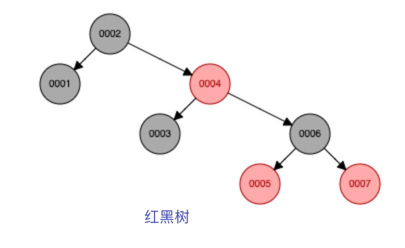
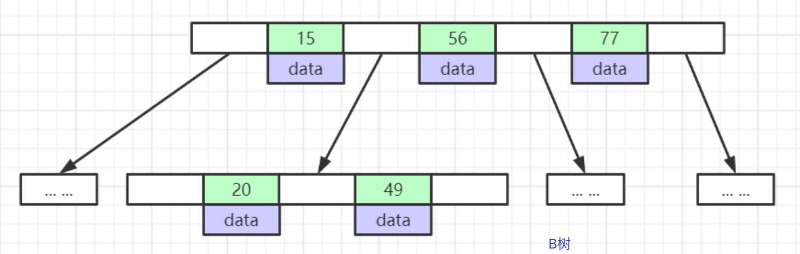
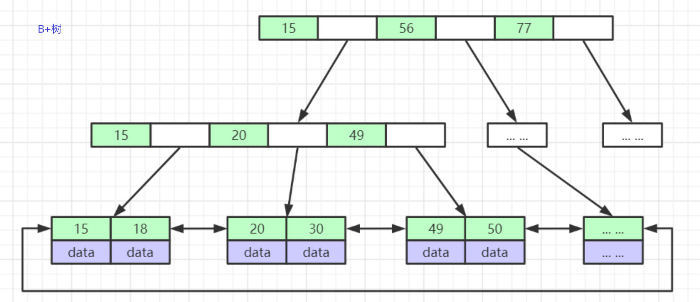
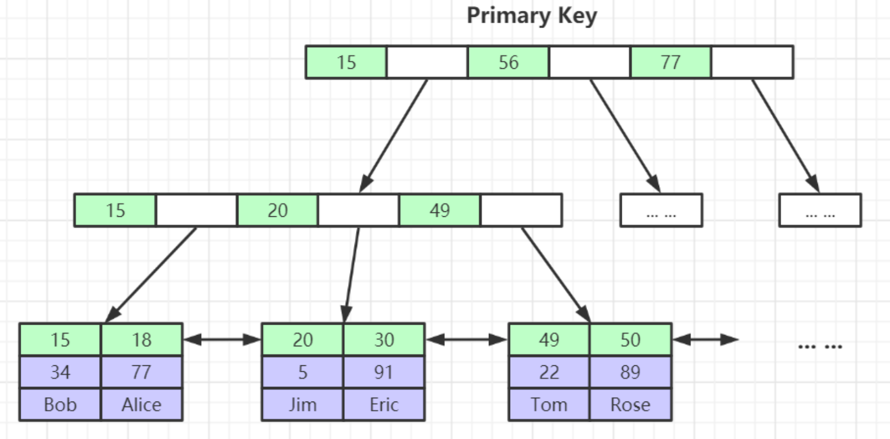
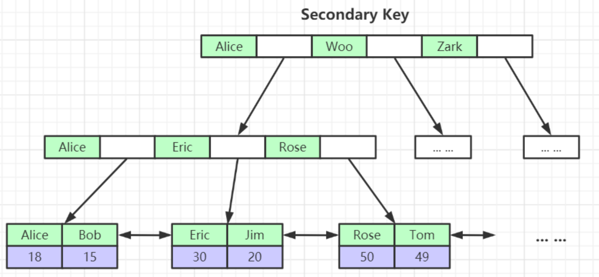
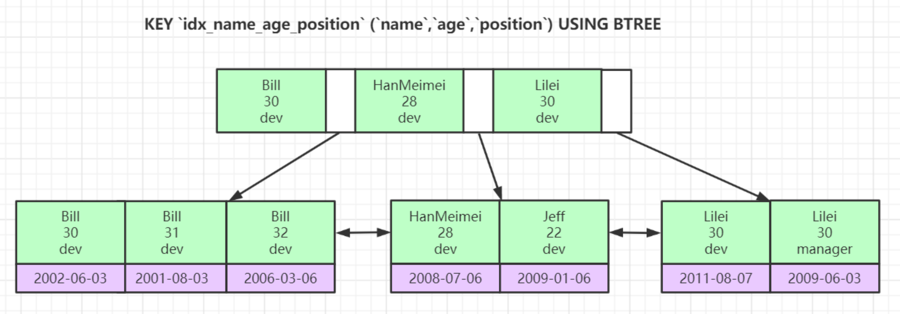

# 1.1 深入理解Mysql索引底层数据结构与算法
collapsed:: true
	- 索引是帮助MySQL高效获取数据的排好序的数据结构。表的数据是存在磁盘里的，不同的表对应不同的数据库文件。存储引擎是形容数据库表的，数据库上也会有存储引擎，但是是针对表的。一页有多个节点
	- 索引是帮助MySQL高效获取数据的排好序的数据结构。表的数据是存在磁盘里的，不同的表对应不同的数据库文件。存储引擎是形容数据库表的，数据库上也会有存储引擎，但是是针对表的。一页有多个节点
	- {:height 358, :width 531}
	- {:height 482, :width 345}
	- 二叉平衡，比二叉树好，但是树的高度太高。假设有500万条数据，树的高度需要很高。假设树的高度是20，如果我们需要找的数据在叶子节点，则查找这个数据至少要二十次磁盘IO。
	- {:height 414, :width 346}
	-
	- {:height 148, :width 440} {:height 178, :width 476}
	- {:height 408, :width 417}
	- 对于sql来说，影响sql查找的速度的主要原因是树的高度。
	- B+树：假设用bigint数据类型主键，bigint占8byte。还需要空间存下一个节点的地址，通常是6byte。那一页可以存的节点数为：$16KB/(8+6)Byte=1170$ 。一个节点用一页来存储，一页是16KB，存的数据量一般不超过1KB，也就是一页可以存16个节点。深度为3的B+树的所有叶子节点能存的索引元素个数最大为：$1170*1170*16=2190$ w，可以存储千万级别的数据。千万级别的数据，只需要寻址3次（h=3）。
	- B树：如果使用B树存储2000万条数据，一个节点存1K，可以存16个索引元素$16^n = 20000000$，n远大于3
	-
	- ## InnoDB索引实现(聚集)
	  collapsed:: true
		- 表数据文件本身就是按B+Tree组织的一个索引结构文件
		- 聚集索引-叶节点包含了完整的数据记录
		- ### 为什么建议InnoDB表必须建主键，并且推荐使用整型的自增主键？
			- ==为什么必须建主键==
				- InnoDB 引擎要求每个表必须有唯一的聚簇索引(需要构建索引树)，没有主键会导致性能暴雷、运维失控（无法定位到具体某一行数据）！如果用户未显式定义主键，引擎会按以下规则选择：
					- 1. 优先使用第一个 `UNIQUE NOT NULL` 的索引
					- 2. 若无满足条件的索引，则自动创建隐藏的 `row_id` 列作为聚簇索引。
			- ==为什么推荐使用自增主键==
			  collapsed:: true
				- 自增主键保证所有新数据**严格递增**，永远插入到B+树的**最大键值之后**，使存储引擎只需做两件事：
					- 1. 定位到最后一个数据页
					- 2. 在页尾部追加新记录（若页满则申请全新空页追加，无分裂）。InnoDB 的 B+ 树必须维持键值有序性，如果不使用自增主键的话，新数据插入位置 = 键值在有序序列中的**精确位点**（非尾部），从而引起列分裂。
			- ==为什么推荐使用整型主键==
				- 因为整型比字符串更节省空间
		- ### 为什么非主键索引结构叶子节点存储的是主键值？(一致性和节省存储空间)
			- 为了保持数据一致性和存储灵活性，同时避免维护两套物理地址带来的灾难性成本。
			- 一张表可能有多个索引，如果每个索引都有一份数据，那这些数据的一致性不能保证，并且也浪费空间。
			- {:height 144, :width 313} {:height 187, :width 346}
			-
			-
		-
	- ## 联合索引的底层存储结构长什么样？
	  collapsed:: true
		-
		- 
		-
		-
-
- # 1. 2 Explain详解与索引最佳实践
	-
	-
- # 1.3 Mysql索引优化实战
- Mysql事务原理与优化最佳实践.mp4
  │      06、Mysql锁机制与优化实践以及MVCC底层原理剖析.mp4
  │      07、Innodb底层原理与Mysql日志机制深入剖析.mp4
  │      08、MySQL全局优化与Mysql 8.0新增特性详解.mp4
  │      09、从JDK源码级别彻底剖析JVM类加载机制.mp4
  │      10、JVM内存模型深度剖析与优化.mp4
  │      11、JVM对象创建与内存分配机制深度剖析.mp4
  │      12、JVM字节码文件结构深度剖析.mp4
  │      13、垃圾收集器ParNew&CMS与底层三色标记算法详解.mp4
  │      14、垃圾收集器G1&ZGC详解.mp4
  │      15、JVM调优工具详解及调优实战.mp4
  │      16、JVM调优实战及常量池详解.mp4
  │      17、为Java开疆拓土的ZGC深度剖析.mp4
  │      18、让Java性能提升的JIT深度剖析.mp4
  │      19、GraalVM云原生时代的Java虚拟机.mp4
  │      20、Tomcat整体架构及其设计精髓分析.mp4
  │      21、Tomcat线程模型分析及其性能调优.mp4
  │      22、Tomcat类加载机制及其热部署热加载原理剖析.