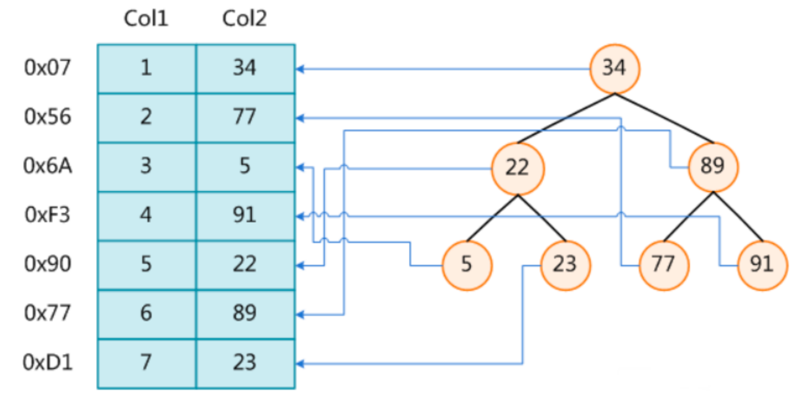
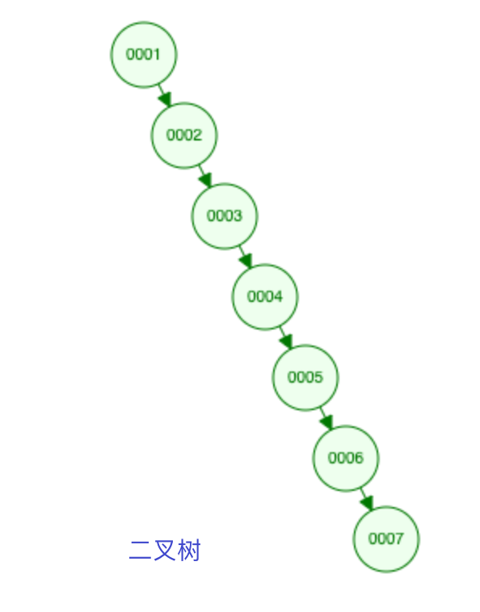
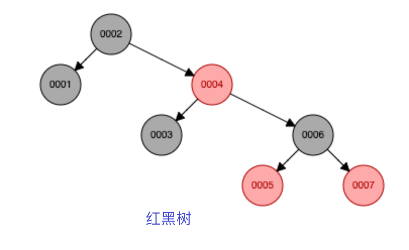
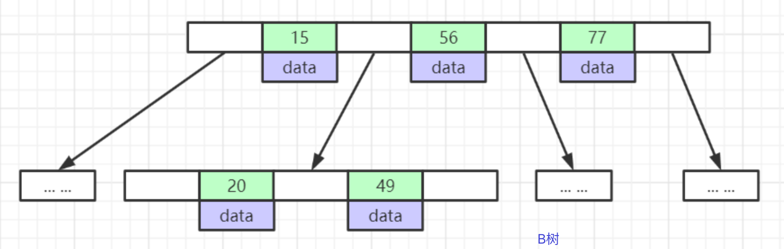
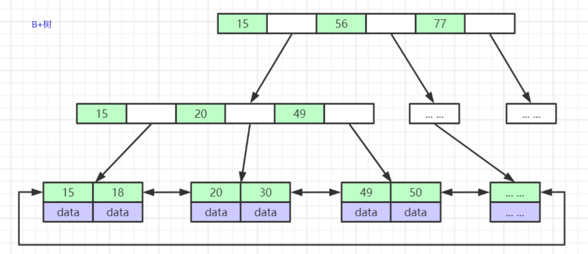
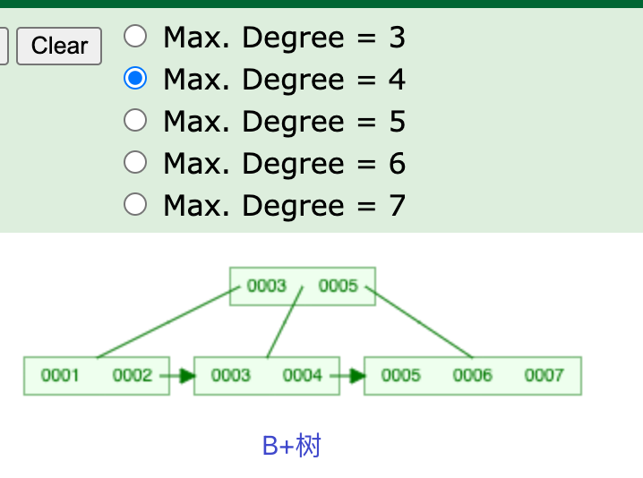
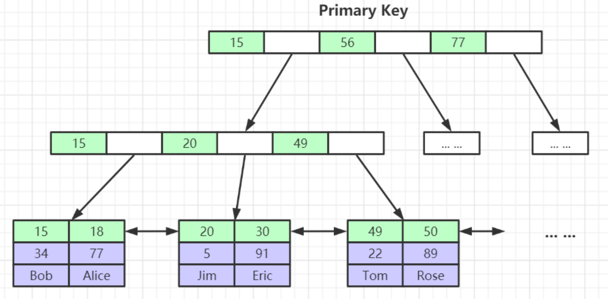
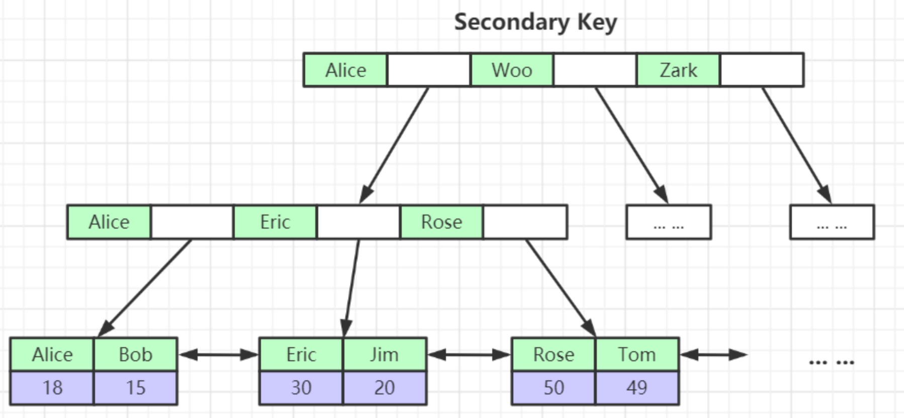
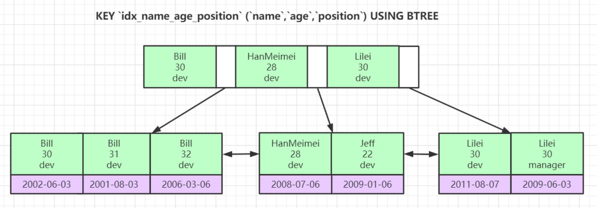
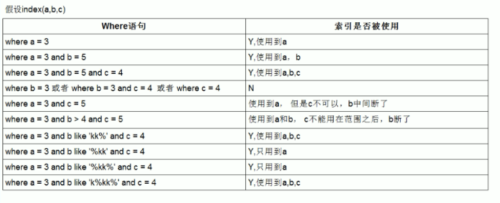

# 1.1 深入理解Mysql索引底层数据结构与算法
collapsed:: true
	- 索引是帮助MySQL高效获取数据的排好序的数据结构。表的数据是存在磁盘里的，不同的表对应不同的数据库文件。存储引擎是形容数据库表的，数据库上也会有存储引擎，但是是针对表的。一页有多个节点
	- 索引是帮助MySQL高效获取数据的排好序的数据结构。表的数据是存在磁盘里的，不同的表对应不同的数据库文件。存储引擎是形容数据库表的，数据库上也会有存储引擎，但是是针对表的。一页有多个节点
	- {:height 358, :width 531}
	- {:height 482, :width 345}
	- 二叉平衡，比二叉树好，但是树的高度太高。假设有500万条数据，树的高度需要很高。假设树的高度是20，如果我们需要找的数据在叶子节点，则查找这个数据至少要二十次磁盘IO。
	- {:height 414, :width 346}
	-
	- {:height 148, :width 440} {:height 178, :width 476}
	- {:height 408, :width 417}
	- 对于sql来说，影响sql查找的速度的主要原因是树的高度。
	- B+树：假设用bigint数据类型主键，bigint占8byte。还需要空间存下一个节点的地址，通常是6byte。那一页可以存的节点数为：$16KB/(8+6)Byte=1170$ 。一个节点用一页来存储，一页是16KB，存的数据量一般不超过1KB，也就是一页可以存16个节点。深度为3的B+树的所有叶子节点能存的索引元素个数最大为：$1170*1170*16=2190$ w，可以存储千万级别的数据。千万级别的数据，只需要寻址3次（h=3）。
	- B树：如果使用B树存储2000万条数据，一个节点存1K，可以存16个索引元素$16^n = 20000000$，n远大于3
	-
	- ## InnoDB索引实现(聚集)
		- 表数据文件本身就是按B+Tree组织的一个索引结构文件
		- 聚集索引-叶节点包含了完整的数据记录
		- ### 为什么建议InnoDB表必须建主键，并且推荐使用整型的自增主键？
			- ==为什么必须建主键==
				- InnoDB 引擎要求每个表必须有唯一的聚簇索引(需要构建索引树)，没有主键会导致性能暴雷、运维失控（无法定位到具体某一行数据）！如果用户未显式定义主键，引擎会按以下规则选择：
					- 1. 优先使用第一个 `UNIQUE NOT NULL` 的索引
					- 2. 若无满足条件的索引，则自动创建隐藏的 `row_id` 列作为聚簇索引。
			- ==为什么推荐使用自增主键==
				- 自增主键保证所有新数据**严格递增**，永远插入到B+树的**最大键值之后**，使存储引擎只需做两件事：
					- 1. 定位到最后一个数据页
					- 2. 在页尾部追加新记录（若页满则申请全新空页追加，无分裂）。InnoDB 的 B+ 树必须维持键值有序性，如果不使用自增主键的话，新数据插入位置 = 键值在有序序列中的**精确位点**（非尾部），从而引起列分裂。
			- ==为什么推荐使用整型主键==
				- 因为整型比字符串更节省空间
		- ### 为什么非主键索引结构叶子节点存储的是主键值？(一致性和节省存储空间)
			- 为了保持数据一致性和存储灵活性，同时避免维护两套物理地址带来的灾难性成本。
			- 一张表可能有多个索引，如果每个索引都有一份数据，那这些数据的一致性不能保证，并且也浪费空间。
			- {:height 144, :width 313} {:height 187, :width 346}
			-
			-
		-
	- ## 联合索引的底层存储结构长什么样？
		-
		- 
		-
		-
-
- # 1. 2 Explain详解与索引最佳实践
	- 最左匹配原则：如果索引了多列，要遵守最左前缀法则。指的是查询从索引的最左前列开始并且不跳过索引中的列。
	- **5. possible_keys列**
	- 这一列显示查询可能使用哪些索引来查找。
	- explain 时可能出现 possible_keys 有列，而 key 显示 NULL 的情况，这种情况是因为表中数据不多，mysql认为索引对此查询帮助不大，选择了全表查询。
	- 如果该列是NULL，则没有相关的索引。在这种情况下，可以通过检查 where 子句看是否可以创造一个适当的索**6. key列**
	- 这一列显示mysql实际采用哪个索引来优化对该表的访问。
	- 如果没有使用索引，则该列是 NULL。如果想强制mysql使用或忽视possible_keys列中的索引，在查询中使用 force index、ignore index。
	-
	- **7. key_len列**
	- 这一列显示了mysql在索引里使用的字节数，通过这个值可以算出具体使用了索引中的哪些列。
	- 引来提高查询性能，然后用 explain 查看效果。
	- **ref列**：这一列显示了在key列记录的索引中，表查找值所用到的列或常量，常见的有：const（常量），字段名（例：film.id）
	- ```sql
	  CREATE TABLE `employees` (
	    `id` int(11) NOT NULL AUTO_INCREMENT,
	    `name` varchar(24) NOT NULL DEFAULT '' COMMENT '姓名',
	    `age` int(11) NOT NULL DEFAULT '0' COMMENT '年龄',
	    `position` varchar(20) NOT NULL DEFAULT '' COMMENT '职位',
	    `hire_time` timestamp NOT NULL DEFAULT CURRENT_TIMESTAMP COMMENT '入职时间',
	    PRIMARY KEY (`id`),
	    KEY `idx_name_age_position` (`name`,`age`,`position`) USING BTREE
	  ) ENGINE=InnoDB AUTO_INCREMENT=4 DEFAULT CHARSET=utf8 COMMENT='员工记录表';
	  
	  INSERT INTO employees(name,age,position,hire_time) VALUES('LiLei',22,'manager',NOW());
	  INSERT INTO employees(name,age,position,hire_time) VALUES('HanMeimei', 23,'dev',NOW());
	  INSERT INTO employees(name,age,position,hire_time) VALUES('Lucy',23,'dev',NOW());
	  
	  -- 2.最左前缀法则: 如果索引了多列，要遵守最左前缀法则。指的是查询从索引的最左前列开始并且不跳过索引中的列。
	  -- KEY:idx_name_age_position
	  EXPLAIN SELECT * FROM employees WHERE name = 'Bill' and age = 31;
	  -- KEY:NULL
	  EXPLAIN SELECT * FROM employees WHERE age = 30 AND position = 'dev';
	  -- KEY:NULL
	  EXPLAIN SELECT * FROM employees WHERE position = 'manager';
	  
	  -- 3.不在索引列上做任何操作（计算、函数、（自动or手动）类型转换），会导致索引失效而转向全表扫描
	  -- KEY:idx_name_age_position
	  EXPLAIN SELECT * FROM employees WHERE name = 'LiLei';
	  -- KEY:NULL
	  EXPLAIN SELECT * FROM employees WHERE left(name,3) = 'LiLei';
	  
	  -- 转化为日期范围查询，有可能会走索引：
	  ALTER TABLE `employees` ADD INDEX `idx_hire_time` (`hire_time`) USING BTREE ;
	  -- KEY:NULL
	  EXPLAIN  select * from employees where date(hire_time) ='2018-09-30';
	  -- KEY:idx_hire_time
	  EXPLAIN  select * from employees where hire_time >='2018-09-30 00:00:00'  and  hire_time <='2018-09-30 23:59:59';
	  
	  -- 还原最初索引状态
	  ALTER TABLE `employees` DROP INDEX `idx_hire_time`;
	  
	  -- 4.存储引擎不能使用索引中范围条件右边的列
	  EXPLAIN SELECT * FROM employees WHERE name= 'LiLei' AND age = 22 AND position ='manager';
	  -- position 没有走索引
	  EXPLAIN SELECT * FROM employees WHERE name= 'LiLei' AND age > 22 AND position ='manager';
	  
	  -- 5.尽量使用覆盖索引（只访问索引的查询（索引列包含查询列）），减少 select * 语句
	  EXPLAIN SELECT name,age FROM employees WHERE name= 'LiLei' AND age = 23 AND position ='manager';
	  EXPLAIN SELECT * FROM employees WHERE name= 'LiLei' AND age = 23 AND position ='manager';
	  
	  -- 6.mysql在使用不等于（！=或者<>），not in ，not exists 的时候无法使用索引会导致全表扫描 < 小于、 > 大于、 <=、>= 这些，mysql内部优化器会根据检索比例、表大小等多个因素整体评估是否使用索引
	  EXPLAIN SELECT * FROM employees WHERE name != 'LiLei';
	  
	  -- 7.is null,is not null 一般情况下也无法使用索引
	  EXPLAIN SELECT * FROM employees WHERE name is null
	  
	  -- 8.like以通配符开头（'$abc...'）mysql索引失效会变成全表扫描操作
	  EXPLAIN SELECT * FROM employees WHERE name like '%Lei'
	  EXPLAIN SELECT * FROM employees WHERE name like 'Lei%'
	  
	  -- 问题：解决like'%字符串%'索引不被使用的方法？
	  -- a）使用覆盖索引，查询字段必须是建立覆盖索引字段 b）如果不能使用覆盖索引则可能需要借助搜索引擎
	  EXPLAIN SELECT name,age,position FROM employees WHERE name like '%Lei%';
	  
	  -- 9.字符串不加单引号索引失效
	  EXPLAIN SELECT * FROM employees WHERE name = '1000';
	  EXPLAIN SELECT * FROM employees WHERE name = 1000;
	  
	  -- 10.少用or或in，用它查询时，mysql不一定使用索引，mysql内部优化器会根据检索比例、表大小等多个因素整体评估是否使用索引，详见范围查询优化
	  EXPLAIN SELECT * FROM employees WHERE name = 'LiLei' or name = 'HanMeimei';
	  
	  ALTER TABLE `employees` ADD INDEX `idx_age` (`age`) USING BTREE ;
	  explain select * from employees where age >=1 and age <=2000;
	  ALTER TABLE `employees` DROP INDEX `idx_age`;
	  
	  ```
	- 
	- 这里给大家补充一个概念，索引下推（Index Condition Pushdown，ICP）, like KK%其实就是用到了索引下推优化
	  什么是索引下推了？
	  对于辅助的联合索引(name,age,position)，正常情况按照最左前缀原则，SELECT * FROM employees WHERE name like 'LiLei%'  AND age = 22 AND position ='manager'  这种情况只会走name字段索引，因为根据name字段过滤完，得到的索引行里的age和 position是无序的，无法很好的利用索引。
	  在MySQL5.6之前的版本，这个查询只能在联合索引里匹配到名字是 'LiLei' 开头的索引，然后拿这些索引对应的主键逐个回表，到主键索 引上找出相应的记录，再比对age和position这两个字段的值是否符合。
	  MySQL 5.6引入了索引下推优化，可以在索引遍历过程中，对索引中包含的所有字段先做判断，过滤掉不符合条件的记录之后再回表，可 以有效的减少回表次数。使用了索引下推优化后，上面那个查询在联合索引里匹配到名字是 'LiLei' 开头的索引之后，同时还会在索引里过 滤age和position这两个字段，拿着过滤完剩下的索引对应的主键id再回表查整行数据。
	- 索引下推会减少回表次数，对于innodb引擎的表索引下推只能用于二级索引，innodb的主键索引（聚簇索引）树叶子节点上保存的是全 行数据，所以这个时候索引下推并不会起到减少查询全行数据的效果。
	  为什么范围查找Mysql没有用索引下推优化？
	  估计应该是Mysql认为范围查找过滤的结果集过大，like KK% 在绝大多数情况来看，过滤后的结果集比较小，所以这里Mysql选择给 like  KK% 用了索引下推优化，当然这也不是绝对的，有时like KK% 也不一定就会走索引下推。
-
- # 1.3 Mysql索引优化实战
- # 1.4 Mysql事务原理与优化最佳实践
	- 我们的数据库一般都会并发执行多个事务，多个事务可能会并发的对相同的一批数据进行增 删改查操作，可能就会导致我们说的脏写、脏读、不可重复读、幻读这些问题。
	  这些问题的本质都是数据库的多事务并发问题，为了解决多事务并发问题，数据库设计了事 务隔离机制、锁机制、MVCC多版本并发控制隔离机制、日志机制，用一整套机制来解决多 事务并发问题。接下来的，我们会深入讲解这些机制，让大家彻底理解数据库内部的执行原 理。
-
-
-
-
-
-
-
-
-
-
- 06、Mysql锁机制与优化实践以及MVCC底层原理剖析.mp4
  │      07、Innodb底层原理与Mysql日志机制深入剖析.mp4
  │      08、MySQL全局优化与Mysql 8.0新增特性详解.mp4
  │      09、从JDK源码级别彻底剖析JVM类加载机制.mp4
  │      10、JVM内存模型深度剖析与优化.mp4
  │      11、JVM对象创建与内存分配机制深度剖析.mp4
  │      12、JVM字节码文件结构深度剖析.mp4
  │      13、垃圾收集器ParNew&CMS与底层三色标记算法详解.mp4
  │      14、垃圾收集器G1&ZGC详解.mp4
  │      15、JVM调优工具详解及调优实战.mp4
  │      16、JVM调优实战及常量池详解.mp4
  │      17、为Java开疆拓土的ZGC深度剖析.mp4
  │      18、让Java性能提升的JIT深度剖析.mp4
  │      19、GraalVM云原生时代的Java虚拟机.mp4
  │      20、Tomcat整体架构及其设计精髓分析.mp4
  │      21、Tomcat线程模型分析及其性能调优.mp4
  │      22、Tomcat类加载机制及其热部署热加载原理剖析.