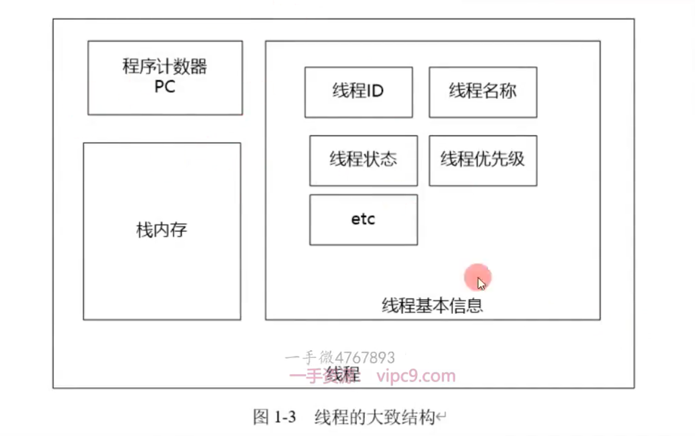
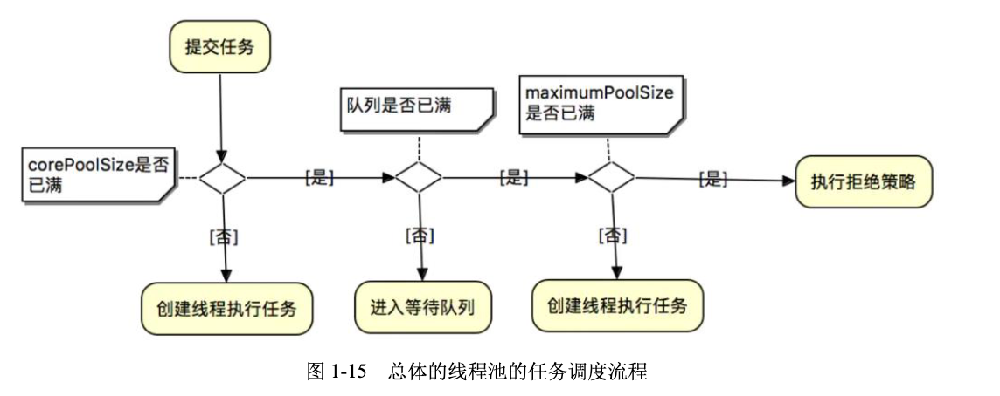

# 1. Java线程的底层原理
	- ## 1.1 进程
	  collapsed:: true
		- ### 定义
		  collapsed:: true
			- 进程的定义,一直以来没有完美的标准。进程是程序的一次执行。应用程序以进程的形式,运行于操作系统之上,享受操作系统提供的服务。
		- ### 结构
		  collapsed:: true
			- 一般来说,一个进程一般由==程序段、数据段和进程控制块== 三部分组成。
			- 
		- ### Java程序的进程
			- 什么是Java程序的进程?
			- Java编写的程序都运行在Java虚拟机(JVM)中，每当使用java命令启动一个Java应用程序时，就会启动一个JVM进程。在这个JVM进程内部，所有Java程序代码的运行都是以线程来运行的。
	- ## 1.2 线程
		- 线程是指"进程代码段"的一次的顺序执行流程。线程演进完成后，线程是CPU调度的最小单位。一条进程可以有一个或多个线程，各个线程之间共享进程的内存空间、系统资源,进程仍然是操作系统资源分配的最小的单位。
		- ### Java程序的主线程
			- JVM找到程序程序的入口点main()方法，然后运行main()方法，这样就产生了一个线程，这个线程称之为主线程。==当main()方法结束后主线程运行完成，JVM进程也随即退出==。
		-
		- ### 线程的大致结构
			- 一个标准的线程主要由以下三个部分组成，具体如图1-3所示。
				- 线程描述信息
				- 程序序计数器(PC)
				- 栈内存
			- 
		-
	- ## 1.3 进程与线程的区别
		- 线程是"进程代码段"的一次的顺序执行流程。一个进程由一个或多个线程组成，一个进程至少有一个线程。
		- ==线程是CPU调度的最小单位，进程是操作系统分配资源的最小单位==。线程的划分尺度小于进程，使得多线程程序的并发性高。
		- 线程是出于高并发的调度诉求，从进程内部演进而来。线程的出现，既充分发挥CPU的计算性能，弥补进程调度的过于笨重。
		- 进程之间是相互独立的，但进程内部各个线程之间并不完全独立。各个线程之间共享进程的方法区内存、堆内存、系统资源(文件句柄、系统信号等)。
		- 切换速度不同：线程上下文切换比进程上下文切换要快行得多。所以有的时候,线程也称之为轻量级进程。
	- ## 1.4 Java线程和os线程的关系
		- 一对一模型
		- 开销大。
		- 主要缺点:创建一个用户线程也要创建一个内核线程
		- {:height 264, :width 458}
		-
	- ## 1.5 Java线程的性能问题
		- 线程的创建、销毁、切换,进程需要切换到内核态，完成之后再切换会用户态。内核态和用户态切换的开销非常大，具体请参考。
		- > 如何解决Java线程的性能问题
			- 线程池
-
- # 2. 创建线程的四种方法
	- ## 2.1 Java的线程类-Thread
	  collapsed:: true
		- ((6779553f-a3c0-41de-b7b0-630ede966c85))
		- Thread类是Java语言一个重要的基础类，位于java.lang包中。
		- Thread类用于存储和操作线程的描述信息，有不少非常重要的属性
		- ((67795578-13a6-4a58-b5e4-5f34769e999d))
	- ## 2.2 ((67795603-dcd1-4383-b656-011114e16e8f))
	- ## 2.3 ((67796326-5303-434c-b2fa-3f32d687f5ea))
	- ## 2.4 ((677965ad-b9b8-482d-85fa-91769f369675))
	- ## 2.5 ((6779673a-a7c2-4982-a980-19ab2808f2ec))
-
- # 3. Java线程的生命周期与基本操作
  collapsed:: true
	- ## 3.1 ((677a0b5e-c366-41ce-9c00-4796653da849))
	  collapsed:: true
		-
		- ### ((677a0bf9-5f19-4418-99eb-dcda33a0a06e))
			- 
		- ### ((677a0c1b-69ee-47a7-a517-0780fff38c13))
			- ((677a4674-9a3d-4fd0-8d71-93549cd6c296))
		-
		-
		-
		-
		-
		-
	- ## 3.2 ((677a46d0-13cc-468c-9c46-9fb4bf820aa7))
		- Java 中的线程的生命周期分为 6 种状态。Thread 类有一个实例属性和一个实例方法专门用于保存和获取线程的状态。
		- ((677a4b71-5843-4700-aef4-0e82f0bd5dee))
		- ((677a4b87-132d-4604-a6db-bfa7f6714be4))
		- 3. BLOCKED 阻塞状态
		- ((677a4bce-251f-4745-93a8-f04f62bbb1d8))
		- ((677a4be4-0ef5-470d-9fb8-e9585e0ad5e5))
		-
		- 三种基础状态的转换关系
			- {:height 143, :width 562}
				- ((677a4775-9906-427b-9e90-bfd19bcec3f7))
		- 
		- 面试题：
		- ((677a491c-a108-420b-87a3-44560a4dae58))
-
- # 4. JUC线程池框架与快捷创建方法
-
- # 5. 标准线程池的创建与原理
  collapsed:: true
	- ((677a5c7c-350c-4706-aeb5-4a28e0a636af))
	- ## 5.1 线程池的任务调度流程
		- 通过execute(Runnable command)提交任务后的流程
		- ((677a5ca6-d6ce-4127-9936-fe475cc08468))
			- 
	- 
	- 
	-
	-
-
- # 6. 大厂为什么禁用Executors线程池工厂类
  collapsed:: true
	- ((677a5ee1-38c2-4029-af38-4f241aa32ea5))，而是通过ThreadPoolExecutors标准线程池创建。
	- 
	- ## 6.1 ((677a5f2b-11af-474d-880f-1f656f279a29))
		- 首先参考什么是阻塞队列：
		- ((677a6011-3d33-45ee-9eb9-84efe3021377))
		- 阻塞队列：
			- ((677a623c-54e8-4941-9bc3-38d64e2564d2))：生产者往队列里添加元素时，如果队列已经满了，需要阻塞等待，队列有空位了才能添加。
			- ((677a624f-88f0-484a-ad73-1e339cccc26f))： 消费者在队列里获取元素时，如果队列为空，需要阻塞等待，队列中有元素了才能获取。
		- 
		- newFixedThreadPool工厂的源码如下。
			- {:height 227, :width 625}
		- newFixedThreadPool 工厂方法返回一个 ThreadPoolExecutor 实例，该线程池实例的workQueue属性的值为 LinkedBlockingQueue<Runnable>() 无界阻塞队列。如果任务提交速度持续大于任务处理速度，会造成队列中大量的任务等待。如果队列很大，很有可能导致JVM出现OOM异常，甚至造成内存资源耗尽。
	-
	- ## 6.2 ((677a642f-6648-494f-9635-60c321ffa079))
		- newSingleThreadExecutor 工厂方法“单线程化线程池”的源码如下：
			- 
		- newSingleThreadExecutor工厂的实现原理是：((677a654c-6a1d-4a86-8d4c-9e4721b95efb))，是禁用setCorePoolSize方法，从而使得核心线程数只能为1。
		- 同newFixedThreadPool 工厂，newSingleThreadExecutor工厂也返回一个 ThreadPoolExecutor 实例，该线程池实例的workQueue属性的值为 LinkedBlockingQueue<Runnable>() 无界阻塞队列。如果任务提交速度持续大于任务处理速度，会造成队列中大量的任务等待。如果队列很大，很有可能导致JVM出现OOM异常，甚至造成内存资源耗尽。
	-
	- ## 6.3 ((677a663b-3e0d-4447-b3f6-838e2b076f6f))
		- 使用 newScheduledThreadPool 工厂方法“可调度线程池”的源码如下：
			- 
		- ((677a678b-947c-4caf-ac2c-2258e087e931))
		- newScheduledThreadPool线程池用的工作队列是==同步队列==，这个队列有个特点是：添加队列（offer操作）时，必须有消费者（take操作）在阻塞等待，添加才能成功。
		- 下面是ewScheduledThreadPool线程池的执行逻辑。首先当前线程池的核心线程数为0，所以不能进入第一个if。其次，对于第二个if，必须要有消费者在阻塞等待才能添加成功。如果不成功就会创建新的线程去处理任务。所以如果任务提交比较多，所有消费者在忙，就会无限创建线程，导致OOM。
			- {:height 413, :width 562}
		- ((677a68d3-800b-4bfa-a180-20bd5759102e))
		-
	-
	- ## 6.4 ((677a66a3-0651-496b-9575-33a59a129e78))
		- 使用 newScheduledThreadPool 工厂方法“可调度线程池”的源码如下：
		- 
		- ((677a723b-e014-4155-93e5-cef9f91e797c))
		- 
		-
-
- # 7. 线程池的线程数配置
	- ## 7.1 IO密集型线程池的线程数配置
		- ((67872a24-6b36-4596-bc1c-4874c77e9464))
		- ((67872a4f-c17c-480f-8e96-6f09109051b0))
		- ((67872a5d-0853-4add-98ae-0b957a8ea84e))
		- ((67872a71-acac-4ffd-b59d-a956d31d435f))
		-
		- ### 1. ((67872b06-408a-42ac-b2c1-01f40f1646cc))
			- ((67872b42-8fa9-4aaf-8df3-caa6dfeee118))
		- ### 2. ((67875290-7747-456a-aaf1-2a1e23047745))
			- ((678752c0-c114-4776-b924-35154b20aa91))
		- ### 3. ((6787530d-ae96-428f-8d5e-034cedc99f6a))
			- ((6787533c-7c9e-488a-96ef-6be14563701e))
			- 业界有一个比较成熟的估算公式，具体如下：
			- ((6787538a-e7ac-4b42-afba-81c94aa8baa3))
			- 经过简单的换算，以上公式可进一步转换为：
			- ((678753a0-685a-49b7-ae8b-b8467656661a))
			-
			- ((678753ef-fd3a-4572-91e6-edbb81b1e4ff))
			- 
		-
	- ## 7.2 CPU密集型线程池的线程数配置
-
- ## 混合型线程池的线程数配置
-
-
- # 8. ThreadLocal的使用场景
	- https://www.cnblogs.com/crazymakercircle/p/14491965.html#autoid-h3-3-9-0
	- ## 8.1 ThreadLocal的使用场景
		- ### 1. ((67878743-039f-43dc-a50e-9e29bf8d43d4))
			- 无锁编程的实现方案
			  collapsed:: true
				- "线程本地变量"可以看成专属于线程的变量，不受其他线程干扰，保存着线程的专属数
				  据。当线程结束后，每个线程所拥有的那一个本地值也会被释放。在多线程并发操作“线
				  程本地变量”时候，线程各自操作的是自己的本地值，从而规避了线程安全问题。
		- ### 2. ((67878767-d483-4e7a-b260-8a24a43d34a6))
		  collapsed:: true
			- ((678787b7-a703-499b-98e7-c0ae75283a25))
				- （1）用来传递请求过程中的用户 ID。
				- （2）用来传递请求过程中的用户会话（Session）。
				- （3）用来传递 HTTP 的用户请求实例 HttpRequest。
				- （4）其他需要在函数之间频繁传递的数据。
	- ## 8.2 为什么要用private static final修饰ThreadLocal变量
	  collapsed:: true
		- ThreadLocal变量是双刃剑
		- 虽然ThreadLocal变量是高性能无锁编程的一个重要的类,但是也是双刃剑,一定要规范使用。
		- 
		-
		- ### 1. 为什么需要使用static 修饰ThreadLocal对象
		  collapsed:: true
			- 用static，可以使key被共享
			- 
			- 
		- ### 2. 为什么需要使用final 修饰ThreadLocal对象
		  collapsed:: true
			- final的作用:
				- 1、修饰成员变量,说明该变量的值是不可变得。标注该变量只能进行一次赋值操作,且在运行过程
				  中不可改变它的值。
				- 2、修饰方法入参,说明整个方法中,参数的值是不可变的。
				  注意:当入参为对象时,是可以改变引用对象中成员变量的值。
				- 3、修饰方法,说明该方法不能被覆盖,即不能被继承该类的子类重写。
				- 4、修饰类,说明该类是无法被继承的。
			- ==防止其在使用过程中发生动态变更==
			- 但是，使用final static 带来的 一个 严重的问题：破坏了ThreadLocal的防止内存泄露的机制。
			-
			- 什么是弱引用呢?
			- 仅有弱引用(WeakReference)指向的对象，只能生存到下一次垃圾回收之前。
			- 当GC发生时,不管内存够不够，仅有弱引用所指向的对象都会被回收。
			- 而拥有其他强引用指向的对象，则不会被直接回收。
			- 
			-
		- ### 3. 为什么需要使用private 修饰ThreadLocal对象
			- 为什么ThreadLocal实例除了添加static final修饰之后,还常常力加上了private修饰呢?
			- 因为使用ThreadLocal会带来内存泄露的风险,所以需要避免ThreadLocal被外部内使用,
			  可以提供封装的方法,供外部调用
			-
	-
	-
-
-
- # 面试题
  collapsed:: true
	- # 1. start和run方法的区别
	  id:: 677a491c-a108-420b-87a3-44560a4dae58
		- id:: 677a495e-fa7f-4489-a6e3-cd17e2f92c88
		  > start()
			- 用start()来启动线程，实现了真正意义上的启动线程，此时会出现异步执行的效果，即在Thread实例所对应的内核线程，去执行run中的业务代码。
			- ==start()启动了thread实例的生命周期。==
		- > run()
			- 直接调用Thread实例的run() ,相当于当前线程直接执行一其业务逻辑，是同步执行，就不是异步执行了，不会达到使用线程的意义。
			- ==run()没有启动了thread实例的生命周期。==
	-
	-
	- # 1. 元空间会产生内存溢出么？在什么情况下会产生内存溢出？
	- java8及以后的版本使用Metaspace来代替永久代，Metaspace是方法区在HotSpot中的实现，它与永
	  久代最大区别在于：Metaspace并不在虚拟机内存中，而是使用本地内存。也就是在JDK8中，class
	  metadata(the virtual machines internal presentation of Java class)，被存储在叫做Metaspace的
	  native memory。
	- collapsed:: true
	  > 永久代(java8后被元空间Metaspace取代了)存放了以下信息：
		- 虚拟机加载的类信息
		- 常量池
		- 静态变量
		- 即时编译后的代码
	- collapsed:: true
	  > 出现问题原因
		- 错误的主要原因是加载到内存中的 class 数量太多或者体积太大。
	- collapsed:: true
	  > 解决办法：增加 Metaspace 的大小
		- ```xml
		  -XX:MaxMetaspaceSize=512m
		  ```
	- > 代码演示
		- 模拟Metaspace空间溢出，我们不断生成类往元空间灌，类占据的空间是会超过Metaspace指定的空间大小的。
		- ```xml
		  # 查看元空间大小
		  java -XX:+PrintFlagsInitial
		  ```
	-
	-
	- # 2. OOM后，JVM一定会退出吗
	-
	-